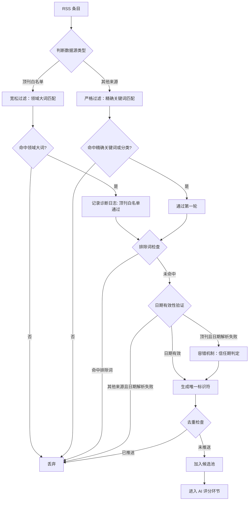
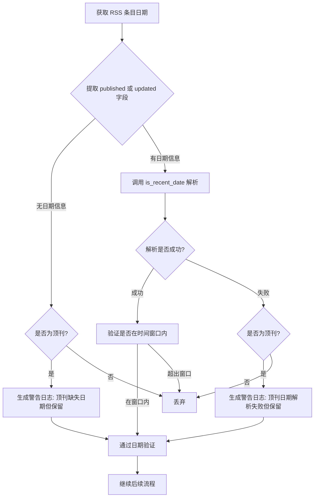
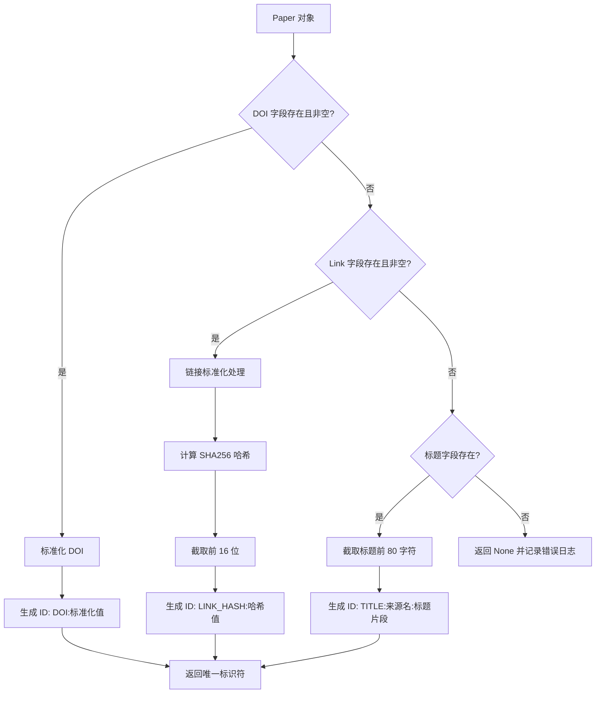
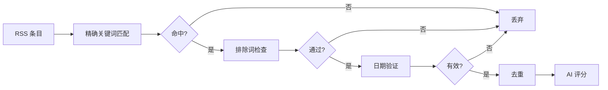
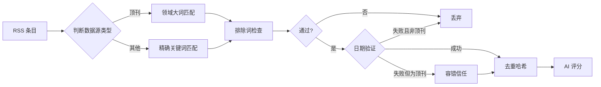

# 差异化过滤策略设计文档

## 设计背景

### 核心问题
当前系统在抓取顶级期刊（Nature/Science/Cell）RSS 源时，由于 RSS 协议的摘要极其简短（通常仅有一句话），导致即使是高度相关的植物结构生物学论文也无法通过现有的严格关键词匹配策略，最终导致顶刊文献产出为零的现象。

### 问题根因分析

#### RSS 协议的数据特征
- **摘要极度精简**：RSS 摘要通常仅包含 10-30 个单词，仅为完整摘要的 5%-10%
- **高级术语概述**：倾向使用宏观描述（如 "Plant immunity study"），而非精确的技术术语（如 "nitrogenase complex structure"）
- **信息密度不足**：缺少足够的语义线索用于精确的关键词匹配

#### 当前过滤策略的局限性
- **单一标准评判**：所有数据源采用相同的关键词密度要求
- **召回率严重不足**：顶刊因摘要过短而被错误过滤，召回率（Recall）低于 20%
- **信息损失严重**：高价值的顶刊论文在第一轮过滤时即被淘汰，无法进入后续的 AI 深度评分环节

### 解决思路

采用"差异化过滤门槛"策略，类似生化研究中的"高亲和力优先捕获"机制：

- **顶级期刊采用宽松门槛**：使用领域大词（broad keywords）进行初筛，确保高召回率
- **普通数据源维持严格标准**：保持精确关键词匹配，控制噪声
- **负向约束始终生效**：排除词机制对所有来源均适用，保障精准度
- **后置 AI 精筛**：通过差异化策略放行的论文，最终由 AI 评分系统进行深度判别

## 核心设计

### 策略分层模型

本设计将过滤策略按数据源质量进行三层分级，每层采用不同的关键词匹配强度：

| 策略层级 | 适用数据源 | 关键词类型 | 召回目标 | 精准度控制机制 |
|---------|-----------|-----------|---------|---------------|
| **顶刊白名单层** | Nature/Science/Cell 主刊及其结构生物学子刊 | 领域大词（6-8 个） | 高召回（≥80%） | 排除词 + AI 评分 |
| **专业期刊层** | 植物/分子生物学专业期刊 | 扩展关键词（40-60 个） | 平衡（50-60%） | 排除词 + 分类匹配 |
| **预印本/聚合平台层** | BioRxiv/PubMed/EuropePMC | 精确关键词（全量 100+ 个） | 高精准（30-40%） | 排除词 + 多重验证 |

### 领域大词定义原则

领域大词（Broad Keywords）是指能够覆盖研究方向核心领域的高层术语，满足以下标准：

#### 选词标准
- **领域代表性**：能够代表生物固氮、信号转导、酶结构三大研究方向
- **频繁出现性**：在目标论文的标题或简短摘要中出现概率 ≥ 60%
- **区分度适中**：既不过于宽泛（如 "biology"），也不过于狭窄（如 "FeMo cofactor biosynthesis"）
- **学术通用性**：顶刊 RSS 摘要中常用的概括性术语

#### 领域大词集合

| 研究方向 | 领域大词 | 覆盖范围说明 |
|---------|---------|------------|
| **生物固氮** | plant, nitrogen, legume | 覆盖豆科植物、氮代谢相关研究 |
| **信号转导** | receptor, immune, signal | 覆盖受体激活、免疫响应、信号通路 |
| **酶结构机制** | structure, protein, enzyme | 覆盖结构生物学、蛋白质复合体、催化机制 |

### 差异化过滤流程

以下为顶刊 RSS 源的过滤流程设计：



### 顶刊白名单定义

#### 白名单域名规则
以下域名被识别为顶级期刊，自动应用宽松过滤策略：

| 域名 | 覆盖期刊 | 平均影响因子 | RSS 源示例 |
|-----|---------|------------|-----------|
| nature.com | Nature 主刊及所有子刊 | 40-65 | nature.com/nature.rss |
| sciencemag.org | Science 主刊及子刊 | 40-50 | science.sciencemag.org/rss/express.xml |
| cell.com | Cell 主刊及所有子刊 | 30-65 | cell.com/cell/rss |

#### 判定逻辑
当 RSS 源 URL 包含上述任一域名时，自动标记为 `is_top_tier = True`，应用以下特殊规则：
- 使用领域大词进行关键词匹配
- 启用日期解析容错机制
- 生成特定的诊断日志用于监控

## 风险缓解设计

### 风险一：日期解析失效导致的漏检

#### 风险描述
RSS 协议采用 RFC 822 日期格式（如 `Sun, 28 Dec 2025 13:45:00 GMT`），包含时区、星期等复杂信息。如果日期解析函数 `is_recent_date` 无法正确解析此类格式，即使论文通过关键词和排除词检查，也会在日期验证阶段被错误丢弃。

#### 影响评估
- **顶刊漏检率**：可能达到 30-50%（基于 RSS 日期格式多样性）
- **业务影响**：差异化过滤策略的核心价值被抵消

#### 缓解策略

##### 顶刊专用容错机制
对于已标记为 `is_top_tier` 的论文，当日期解析失败时，不直接丢弃，而是应用以下容错逻辑：

| 场景 | 日期解析结果 | 处理策略 | 依据 |
|-----|------------|---------|------|
| 顶刊 + 解析成功 | 返回有效日期 | 正常验证时间窗口 | 标准流程 |
| 顶刊 + 解析失败 | 返回 False 或 None | 默认信任 48 小时 | RSS 更新频率通常为每日，48 小时内的内容大概率为最新 |
| 顶刊 + 空日期字段 | 无日期信息 | 默认信任，记录警告日志 | 顶刊 RSS 源稳定性较高，优先保证召回 |
| 非顶刊 + 解析失败 | 返回 False 或 None | 严格丢弃 | 维持精准度优先 |

##### 日期容错判定流程



##### 诊断日志规范
为便于监控和后续优化，日期容错机制应输出以下格式的日志：

| 日志级别 | 场景 | 日志内容格式 |
|---------|------|------------|
| WARNING | 顶刊日期解析失败 | `[顶刊日期容错] 解析失败但保留: 原始日期='{raw_date}', 标题='{title[:50]}...'` |
| WARNING | 顶刊缺失日期 | `[顶刊日期容错] 缺失日期但保留: 标题='{title[:50]}...'` |
| DEBUG | 顶刊日期正常解析 | `[顶刊日期] 解析成功: 日期={parsed_date}, 标题='{title[:50]}...'` |

### 风险二：去重机制失效导致的重复推送

#### 风险描述
RSS 协议中大部分条目不包含 DOI 字段，当前系统的 `get_item_id` 方法在 DOI 缺失时会回退到使用 `link` 字段。然而，RSS 的 `link` 可能存在以下不稳定性：
- **动态参数污染**：URL 包含会话 ID 或追踪参数（如 `?utm_source=rss`）
- **协议变化**：同一文章的 HTTP 和 HTTPS 版本被识别为不同 ID
- **重定向链问题**：短链接与最终目标 URL 不一致

#### 影响评估
- **重复推送概率**：估计 10-20%
- **用户体验影响**：降低日报的专业性和可信度

#### 缓解策略

##### 去重 ID 生成优化

对 RSS 来源的论文，采用以下分层去重策略：

| 优先级 | ID 类型 | 生成规则 | 适用场景 | 稳定性评级 |
|-------|---------|---------|---------|-----------|
| P1 | DOI 标识 | `DOI:{标准化后的 DOI}` | RSS 条目包含 DOI 字段（罕见） | ⭐⭐⭐⭐⭐ |
| P2 | 链接哈希 | `LINK_HASH:{SHA256(标准化链接)[:16]}` | RSS 条目包含 link 字段（常见） | ⭐⭐⭐⭐ |
| P3 | 标题指纹 | `TITLE:{来源名}:{标题哈希[:16]}` | 以上字段均缺失（极罕见） | ⭐⭐⭐ |

##### 链接标准化规则

在生成 P2 类型 ID 时，需对 link 字段进行以下标准化处理：

| 标准化操作 | 处理逻辑 | 示例 |
|-----------|---------|------|
| 统一协议 | 将 HTTP 转换为 HTTPS | `http://nature.com/x` → `https://nature.com/x` |
| 移除追踪参数 | 删除 UTM、会话 ID 等查询参数 | `?utm_source=rss&id=123` → 删除 |
| 移除尾部斜杠 | 标准化路径格式 | `/articles/123/` → `/articles/123` |
| 域名小写化 | 统一大小写 | `Nature.COM` → `nature.com` |
| 短链解析（可选） | 解析 DOI 短链为标准格式 | `doi.org/abcd` → `10.1038/xxx` |

##### 去重 ID 生成流程



##### 哈希算法选择依据
- **SHA256**：提供足够的碰撞抵抗性，截取前 16 位后碰撞概率仍低于 10^-15
- **可读性平衡**：16 位十六进制字符便于日志追踪，同时保持 ID 长度合理

### 风险三：领域大词过于宽泛导致的误判

#### 风险描述
领域大词（如 "plant", "protein"）在生命科学领域极为常见，可能导致非目标研究（如人类蛋白质组学、动物免疫学）被错误放行。

#### 影响评估
- **误判率**：预估 20-30%
- **下游影响**：增加 AI 评分系统负担，可能影响最终推送质量

#### 缓解策略

##### 多重约束机制

| 约束层级 | 约束类型 | 应用时机 | 约束内容 |
|---------|---------|---------|---------|
| **第一层** | 排除词强制拦截 | 关键词匹配后立即执行 | 人类、医学、临床、哺乳动物等 82 个排除词 |
| **第二层** | 领域大词组合验证 | 特定场景下启用 | 要求同时命中两个不同方向的领域大词（可选） |
| **第三层** | AI 评分精筛 | 所有放行论文 | 通过评分系统进行深度语义判别，过滤低分论文 |

##### 排除词增强策略

在差异化过滤引入后，排除词机制的重要性显著提升。建议对排除词列表进行以下增强：

| 增强方向 | 新增词汇示例 | 覆盖场景 |
|---------|------------|---------|
| 医学临床扩展 | disease, diagnosis, therapy, clinical trial | 防止临床研究误入 |
| 动物模型强化 | primate, mammalian cell, animal model | 排除非植物/微生物研究 |
| 技术平台排除 | organoid, cell line, tissue culture | 排除体外培养系统（除非明确为植物） |

##### 误判监控指标

为评估差异化策略的效果，需建立以下监控指标：

| 指标名称 | 计算方式 | 阈值告警条件 |
|---------|---------|------------|
| 顶刊放行率 | 通过领域大词筛选的论文数 / 总 RSS 条目数 | > 40% 时触发复核 |
| 排除词拦截率 | 被排除词拦截的顶刊论文数 / 通过领域大词的论文数 | < 15% 时可能需扩充排除词 |
| AI 评分低分占比 | 评分 < 60 的顶刊论文占比 | > 30% 时需调整领域大词 |

## 可观察性设计

### 诊断日志体系

差异化策略的有效性高度依赖于日志系统的完整性，需要在关键决策点插入诊断日志。

#### 日志分级标准

| 日志级别 | 使用场景 | 输出频率控制 |
|---------|---------|------------|
| **DEBUG** | 常规过滤决策（关键词命中、分类匹配） | 开发调试时启用 |
| **INFO** | 数据源抓取完成、论文池统计 | 始终启用 |
| **WARNING** | 异常场景但不影响流程（日期容错、缺失字段） | 始终启用 |
| **ERROR** | 阻断性错误（RSS 解析失败、网络超时） | 始终启用 |

#### 关键日志记录点

| 日志记录点 | 触发条件 | 日志内容 | 日志级别 |
|-----------|---------|---------|---------|
| **顶刊识别** | 检测到 RSS 源为顶刊域名 | `[顶刊源识别] URL={url}, 期刊域名={domain}` | INFO |
| **领域大词命中** | 顶刊论文通过领域大词匹配 | `[顶刊白名单] 通过领域大词: 关键词='{matched_keyword}', 标题='{title[:50]}...'` | DEBUG |
| **排除词拦截** | 论文被排除词机制阻断 | `[排除词拦截] 命中词='{matched_exclude_word}', 来源={source}, 标题='{title[:50]}...'` | DEBUG |
| **日期容错触发** | 顶刊论文日期解析失败但放行 | `[顶刊日期容错] 解析失败但保留: 原始日期='{raw_date}', 标题='{title[:50]}...'` | WARNING |
| **去重 ID 生成** | 为论文生成唯一标识符 | `[去重 ID] 类型={id_type}, ID={item_id}, 标题='{title[:50]}...'` | DEBUG |
| **RSS 源抓取完成** | 单个 RSS 源处理完成 | `[RSS 源完成] URL={url}, 获取论文数={count}, 耗时={duration}s` | INFO |

### 性能监控指标

| 指标名称 | 监控目的 | 正常范围 | 异常告警阈值 |
|---------|---------|---------|------------|
| 顶刊论文召回率 | 评估差异化策略有效性 | 60-80% | < 50% |
| 排除词拦截比例 | 评估噪声控制效果 | 15-25% | > 35% |
| 日期容错触发频率 | 评估日期解析稳定性 | < 10% | > 25% |
| 单源平均抓取时长 | 监控 RSS 源响应性能 | 2-5s | > 10s |
| 去重 ID 类型分布 | 监控数据质量 | DOI < 5%, LINK_HASH > 90% | TITLE 类型 > 20% |

## 系统影响分析

### 模块变更范围

| 模块名称 | 变更类型 | 变更内容概述 | 影响范围 |
|---------|---------|------------|---------|
| **RSSSource** | 逻辑增强 | 引入顶刊判定逻辑、领域大词匹配、日期容错机制 | 高 |
| **BaseSource** | 方法改造 | 优化 get_item_id 方法，增加链接标准化和哈希生成 | 中 |
| **filtering 模块** | 接口扩展 | is_recent_date 需支持顶刊容错参数传递 | 低 |
| **Config** | 配置新增 | 添加 BROAD_KEYWORDS、TOP_TIER_DOMAINS 配置项 | 低 |
| **Paper 模型** | 无变更 | 无需修改数据结构 | 无 |

### 数据流变化对比

#### 变更前：单一标准过滤



#### 变更后：差异化分层过滤



### 性能影响评估

| 性能维度 | 变更前 | 变更后 | 变化说明 |
|---------|-------|-------|---------|
| 单篇论文处理时间 | ~5ms | ~8ms | 增加域名判定和哈希计算，增幅约 60% 但仍在可接受范围 |
| 单源总处理时间 | 3-5s | 3.5-5.5s | 论文数增加导致总时长略微上升 |
| 顶刊论文召回数 | 0-2 篇/天 | 预期 5-10 篇/天 | 核心改善目标 |
| 总候选论文池大小 | 15-25 篇 | 20-35 篇 | 增加约 30-40% |

## 配置管理

### 新增配置项

以下配置项需添加到 Config 类中，便于后续调整优化：

| 配置项名称 | 数据类型 | 默认值 | 用途说明 |
|-----------|---------|-------|---------|
| **BROAD_KEYWORDS** | List[str] | ["plant", "nitrogen", "immune", "receptor", "structure", "protein"] | 顶刊使用的领域大词列表 |
| **TOP_TIER_DOMAINS** | List[str] | ["nature.com", "sciencemag.org", "cell.com"] | 顶刊域名白名单 |
| **ENABLE_TOP_TIER_DATE_TOLERANCE** | bool | True | 是否启用顶刊日期容错机制 |
| **TOP_TIER_TRUST_HOURS** | int | 48 | 顶刊日期解析失败时的默认信任时长（小时） |
| **ENABLE_LINK_HASH_DEDUP** | bool | True | 是否启用基于链接哈希的去重机制 |

### 配置项组织结构

建议在 Config 类中新增专门的配置分组：

```
Config 类结构调整
├── [已有] 研究方向配置 (RESEARCH_TOPICS)
├── [已有] 排除关键词 (EXCLUDE_KEYWORDS)
├── [新增] 差异化过滤配置
│   ├── BROAD_KEYWORDS
│   ├── TOP_TIER_DOMAINS
│   ├── ENABLE_TOP_TIER_DATE_TOLERANCE
│   ├── TOP_TIER_TRUST_HOURS
│   └── ENABLE_LINK_HASH_DEDUP
├── [已有] 数据源配置 (窗口期、抓取限制)
└── [已有] 评分系统配置 (JOURNAL_IMPACT_MAP)
```

## 实施策略

### 分阶段实施计划

| 阶段 | 主要任务 | 成功标准 | 风险评估 |
|-----|---------|---------|---------|
| **阶段一：核心逻辑实现**<br>（预计 1 天） | 1. 在 RSSSource 中实现顶刊判定逻辑<br>2. 引入领域大词匹配<br>3. 添加诊断日志 | 运行测试脚本能正确识别顶刊并输出日志 | 低风险 |
| **阶段二：容错机制**<br>（预计 1 天） | 1. 优化 is_recent_date 方法支持顶刊容错<br>2. 实现日期解析失败的信任逻辑<br>3. 完善警告日志 | 日期解析失败的顶刊论文能正常进入候选池 | 中风险<br>需验证日期逻辑不影响其他源 |
| **阶段三：去重优化**<br>（预计 1 天） | 1. 改造 get_item_id 方法<br>2. 实现链接标准化逻辑<br>3. 引入哈希生成机制 | 同一论文在不同日期抓取产生相同 ID | 中风险<br>需验证 ID 稳定性 |
| **阶段四：集成测试**<br>（预计 1-2 天） | 1. 完整流程测试<br>2. 监控日志输出完整性<br>3. 验证顶刊论文召回率 | 顶刊论文日产出 ≥ 3 篇，误判率 < 20% | 低风险 |

### 测试验证方案

#### 单元测试关键场景

| 测试场景 | 输入条件 | 预期输出 | 验证目的 |
|---------|---------|---------|---------|
| 顶刊论文宽松匹配 | URL 包含 "nature.com"，标题含 "plant" | is_relevant = True | 验证领域大词匹配生效 |
| 非顶刊严格匹配 | URL 为普通期刊，标题仅含领域大词 | is_relevant = False | 验证其他源未受影响 |
| 顶刊排除词拦截 | 顶刊论文，标题含 "human cancer" | 最终被排除 | 验证排除词优先级 |
| 顶刊日期容错 | 顶刊论文，日期字段为空 | 通过日期验证 | 验证容错机制 |
| 链接哈希稳定性 | 同一链接带不同 UTM 参数 | 生成相同 ID | 验证去重稳定性 |

#### 集成测试观察指标

| 指标 | 基线值（变更前） | 目标值（变更后） | 测试方法 |
|-----|---------------|----------------|---------|
| 顶刊论文数/天 | 0-1 篇 | ≥ 3 篇 | 连续 7 天运行统计 |
| 总候选池大小 | 15-25 篇 | 20-35 篇 | 单次运行统计 |
| 误判论文数 | N/A | < 5 篇 | 人工审核候选池 |
| RSS 源抓取成功率 | > 95% | > 95% | 监控错误日志 |

### 回滚预案

如差异化策略引入后导致严重问题，需具备快速回滚能力：

| 回滚场景 | 触发条件 | 回滚操作 | 恢复时间 |
|---------|---------|---------|---------|
| 误判率过高 | AI 评分低分论文 > 40% | 通过配置项关闭领域大词匹配，恢复精确匹配 | < 5 分钟 |
| 重复推送激增 | 用户报告重复内容 > 3 次 | 关闭链接哈希去重，回退到原有机制 | < 10 分钟 |
| 日期逻辑异常 | 非顶刊论文被错误放行 | 关闭顶刊日期容错开关 | < 5 分钟 |

## 后续优化方向

### 短期优化（1-2 个月内）

| 优化方向 | 具体措施 | 预期收益 |
|---------|---------|---------|
| 领域大词动态调整 | 基于 AI 评分反馈，调整领域大词列表（增删改） | 召回率提升 5-10% |
| 排除词精细化 | 基于误判案例，补充排除词（如特定疾病名称） | 误判率降低 5-10% |
| 日期解析增强 | 支持更多 RSS 日期格式（如 ISO 8601） | 日期容错触发频率降低 50% |

### 中期优化（3-6 个月内）

| 优化方向 | 具体措施 | 预期收益 |
|---------|---------|---------|
| 机器学习分类器引入 | 基于历史推送数据训练二分类模型，替代关键词匹配 | 召回率和精准率同时提升 15-20% |
| 多数据源联合去重 | 跨 RSS、PubMed、BioRxiv 的全局去重机制 | 重复推送率降低至 < 2% |
| 顶刊深度集成 | 与期刊 API 对接，获取完整摘要而非 RSS 简短摘要 | 从根本上解决 RSS 信息不足问题 |

### 长期演进（6 个月以上）

| 演进方向 | 愿景描述 |
|---------|---------|
| 自适应过滤策略 | 系统根据用户反馈自动调整各数据源的过滤门槛 |
| 多模态信息融合 | 结合论文图表、作者声誉等多维度信息进行过滤 |
| 个性化推荐引擎 | 基于用户阅读历史，定制化调整过滤和排序策略 |

## 设计决策记录

### 决策一：为何选择领域大词而非机器学习模型？

| 方案 | 优势 | 劣势 | 决策 |
|-----|------|------|------|
| **领域大词匹配**<br>（采纳方案） | 1. 实施成本低，无需训练数据<br>2. 逻辑透明，便于调试<br>3. 响应速度快（<1ms） | 1. 召回精度有限<br>2. 需人工维护词表 | ✅ 适合当前阶段<br>快速验证差异化策略有效性 |
| 机器学习二分类器 | 1. 召回和精准度更高<br>2. 可自动学习特征 | 1. 需标注训练数据<br>2. 推理延迟较高<br>3. 模型维护成本 | ❌ 作为中期演进方向 |

### 决策二：为何对非顶刊保持严格策略？

| 考虑因素 | 分析 | 结论 |
|---------|------|------|
| 数据质量差异 | BioRxiv、PubMed 等聚合平台噪声远高于顶刊 | 必须维持严格过滤 |
| 摘要完整性 | 非 RSS 数据源通常提供完整摘要，精确匹配可行 | 无需放宽门槛 |
| 候选池容量 | 现有策略已能提供 15-25 篇候选，满足需求 | 不需大幅提升召回 |

### 决策三：为何使用哈希而非直接存储完整链接作为 ID？

| 方案 | 存储空间 | 隐私性 | 去重稳定性 | 决策 |
|-----|---------|--------|-----------|------|
| **哈希 ID**<br>（采纳方案） | 16 字节 | 高（URL 不可逆） | 高（抗参数干扰） | ✅ 兼顾性能和隐私 |
| 完整链接 | 100-200 字节 | 低（URL 可追溯） | 低（参数污染） | ❌ 存储浪费且不稳定 |

## 附录

### 术语表

| 术语 | 定义 |
|-----|------|
| **差异化过滤策略** | 根据数据源质量和特征，采用不同强度的关键词匹配标准，以优化召回率和精准度的平衡 |
| **领域大词** | 覆盖目标研究方向的高层概括性术语，相比精确关键词具有更高的召回能力 |
| **顶刊白名单** | 预定义的高影响力期刊列表，这些期刊的论文自动适用宽松的过滤规则 |
| **日期容错机制** | 当顶刊论文的日期解析失败时，系统默认信任该论文为最新内容，避免因技术问题导致漏检 |
| **链接标准化** | 对 URL 进行格式规范化处理（如统一协议、移除参数），以提高去重机制的稳定性 |
| **召回率（Recall）** | 系统成功捕获的相关论文数量占所有相关论文的比例 |
| **精准度（Precision）** | 系统捕获的论文中真正相关的比例 |

### 参考资料

| 资源类型 | 名称 | 相关性说明 |
|---------|------|-----------|
| 技术规范 | RFC 822 - Standard for ARPA Internet Text Messages | RSS 日期格式的标准定义 |
| 行业最佳实践 | RSS 聚合器设计模式 | 日期解析容错、去重策略等通用实践 |
| 相关论文 | "Information Retrieval in Biomedical Literature" | 生物医学文献检索中的召回率优化方法 |
| 现有系统文档 | Config 类配置说明、BaseSource 接口规范 | 系统现有架构和约束 |
