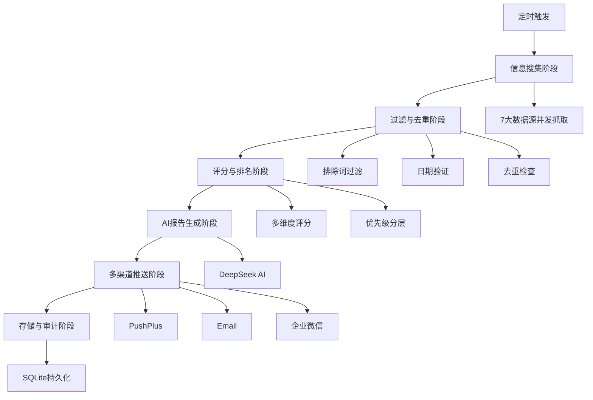
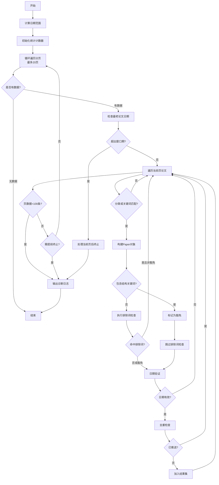
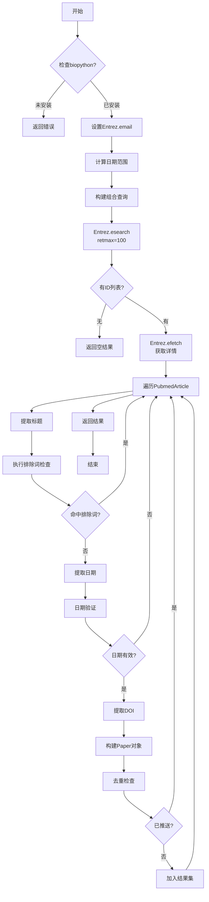
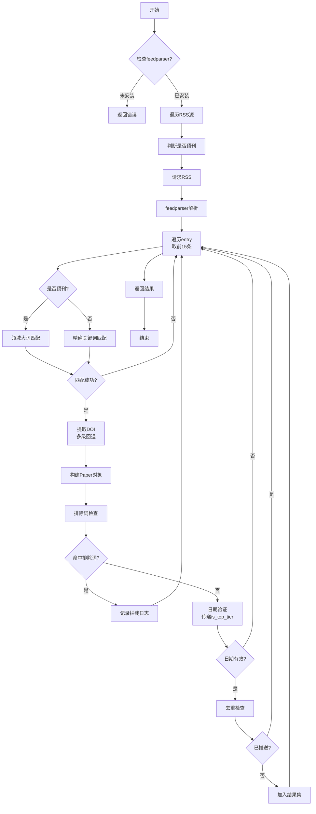
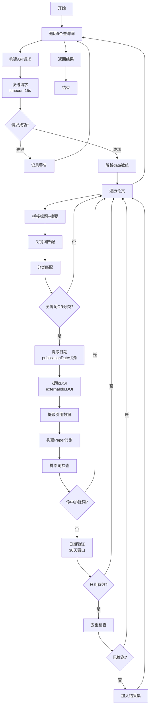
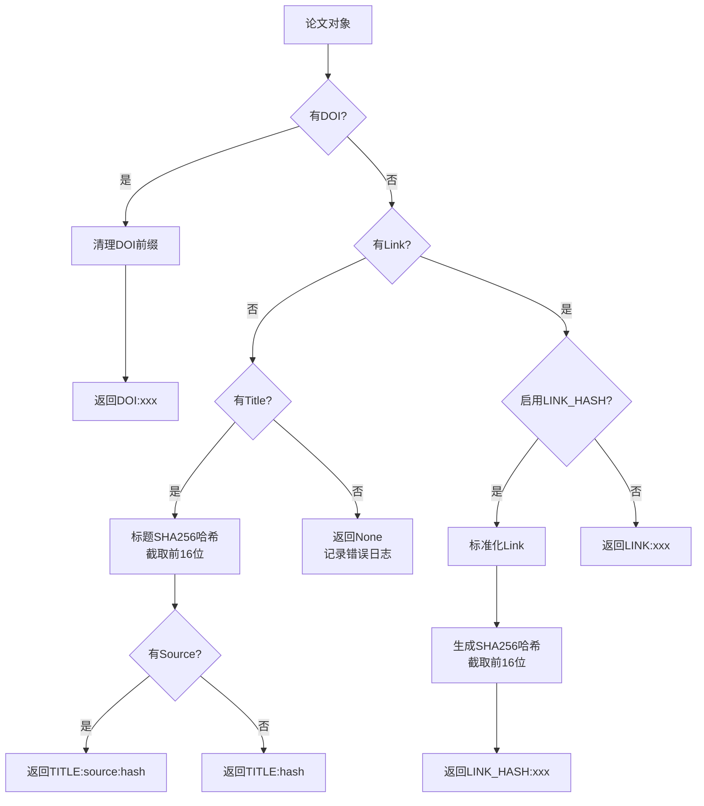
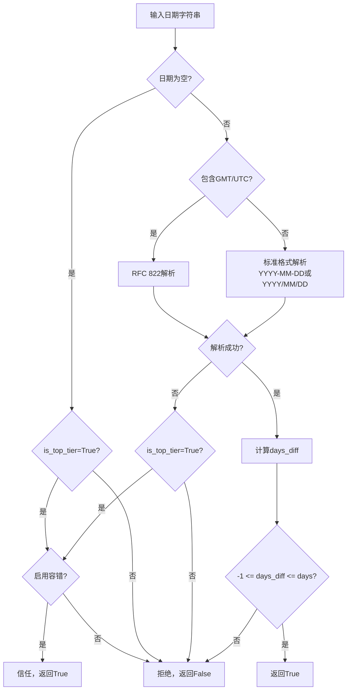
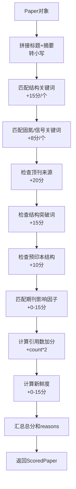

# 智能论文推送系统 - 框架梳理与设计文档

## 一、系统概述

### 1.1 系统定位
本系统是一个专注于生物化学领域的智能文献监控与推送平台，旨在从多个学术数据源自动抓取最新研究动态，通过智能评分筛选高价值论文，并利用AI生成通俗易懂的研究报告，最终通过多渠道推送给目标用户。

### 1.2 核心价值主张
- **自动化监控**：7x24小时监控7大学术数据源，无需人工检索
- **智能筛选**：多维度评分算法，自动识别高影响力研究
- **AI增强**：利用大语言模型生成深度分析报告，降低阅读门槛
- **多渠道触达**：支持微信、邮件、企业微信等多种推送方式

### 1.3 目标研究领域
系统严格聚焦于三大研究方向：
- **生物固氮**（Biological Nitrogen Fixation）
- **胞外信号感知与传递**（Extracellular Signal Perception and Transduction）
- **酶的结构与作用机制**（Enzyme Structure and Mechanism）

---

## 二、系统架构总览

### 2.1 整体流程
系统采用经典的ETL（Extract-Transform-Load）架构，结合AI增强和多渠道推送：



### 2.2 核心模块组成

| 模块名称 | 路径 | 职责 |
|---------|------|------|
| 配置管理 | app/config.py | 统一管理环境变量、研究关键词、过滤规则 |
| 数据模型 | app/models.py | 定义Paper、ScoredPaper、SourceResult等核心实体 |
| 数据源抽象 | app/sources/base.py | 定义数据源统一接口BaseSource |
| 数据源实现 | app/sources/*.py | 7大数据源具体实现 |
| 去重模块 | app/deduplication.py | 统一的去重ID生成逻辑 |
| 过滤模块 | app/filtering.py | 排除词检查、日期验证 |
| 评分模块 | app/scoring.py | 多维度可解释评分算法 |
| 排名模块 | app/ranking.py | TopK选择、优先级分层 |
| LLM生成 | app/llm/generator.py | AI报告生成 |
| 推送模块 | app/push/*.py | 多渠道推送实现 |
| 存储模块 | app/storage/*.py | SQLite数据持久化 |
| CLI入口 | app/cli.py | 命令行任务调度 |
| API入口 | app/api.py | Web管理接口 |

---

## 三、信息搜集阶段（核心重点）

### 3.1 整体策略

#### 3.1.1 并发抓取机制
- **并发模式**：使用ThreadPoolExecutor并发执行7个数据源的抓取任务
- **并发数**：固定为数据源数量（7个线程）
- **超时控制**：每个数据源独立超时设置（15-30秒不等）
- **容错机制**：单个数据源失败不影响其他源，继续执行

#### 3.1.2 时间窗口策略
| 数据源 | 默认窗口期 | 配置项 | 说明 |
|--------|-----------|--------|------|
| bioRxiv | 7天 | DEFAULT_WINDOW_DAYS | 预印本更新频繁 |
| PubMed | 7天 | DEFAULT_WINDOW_DAYS | 标准学术库 |
| RSS顶刊 | 7天 | DEFAULT_WINDOW_DAYS | 顶级期刊RSS |
| Europe PMC | 7天 | EUROPEPMC_WINDOW_DAYS | 欧洲学术库 |
| Science News | 7天 | DEFAULT_WINDOW_DAYS | 科学新闻 |
| GitHub | 7天 | DEFAULT_WINDOW_DAYS | 工具仓库 |
| Semantic Scholar | 30天 | 硬编码 | 更新较慢，扩大窗口 |

#### 3.1.3 去重前置机制
所有数据源在fetch时接收已推送ID集合（sent_ids），在本地进行初步去重过滤，避免传输冗余数据。

---

### 3.2 数据源详细设计

#### 3.2.1 bioRxiv（预印本数据源）

**基本信息**
- **数据源名称**：bioRxiv
- **API端点**：https://api.biorxiv.org/details/biorxiv/{start_date}/{end_date}/{cursor}
- **请求方式**：HTTP GET
- **返回格式**：JSON
- **频率限制**：无明确限制，需自行控制频率

**抓取参数配置**
| 参数 | 默认值 | 配置项 | 说明 |
|------|--------|--------|------|
| 窗口期 | 7天 | DEFAULT_WINDOW_DAYS | 抓取时间范围 |
| 最大页数 | 20页 | BIORXIV_MAX_PAGES | 防止无限抓取 |
| 每页数量 | 100条 | PAGE_SIZE（硬编码） | API固定值 |
| 诊断日志 | 启用 | ENABLE_DIAGNOSTIC | 输出数据漏斗分析 |
| 豁免机制 | 启用 | ENABLE_EXEMPTION | 结构生物学论文豁免排除词 |

**抓取流程**



**初筛逻辑：分类与关键词**
- **目标分类清单**（TARGET_CATEGORIES）：
  - plant biology（植物生物学）
  - biochemistry（生物化学）
  - biophysics（生物物理）
  - microbiology（微生物学）
  - structural biology（结构生物学）
  - cell biology（细胞生物学）
  - molecular biology（分子生物学）
  - 分子生物学（中文）
  - 细胞生物学（中文）

- **关键词匹配**：从Config.RESEARCH_TOPICS获取所有关键词（见3.2节）

- **通过条件**：分类匹配 OR 关键词匹配（任一满足即可）

**豁免机制（结构生物学特殊处理）**
- **目的**：保留高价值结构生物学论文，即使包含排除词（如human、mouse）
- **豁免关键词**（STRUCTURE_KEYWORDS）：
  - cryo-em
  - cryo-electron microscopy
  - crystal structure
  - x-ray crystallography
  - atomic resolution
  - angstrom resolution
  - structural biology
  - nlr structure
  - resistosome
  - inflammasome
  - receptor structure
  - protein complex structure
  - conformational change
  - active site structure

- **触发条件**：论文标题或摘要中包含任一豁免关键词
- **效果**：跳过排除词检查，直接进入日期验证阶段

**早退机制（提前终止）**
- **目的**：当检测到当前页最老论文日期已超出窗口期时，处理完当前页后立即停止
- **实现**：每页计算oldest_date，与start_date_obj比较
- **效果**：避免无效抓取，提升性能

**诊断日志（数据漏斗分析）**
当启用ENABLE_DIAGNOSTIC时，输出以下统计信息：
| 指标 | 说明 |
|------|------|
| total | 总抓取条数 |
| cat_match | 分类匹配条数 |
| kw_match | 关键词匹配条数 |
| cat_or_kw | 初筛通过条数 |
| excluded | 排除词过滤条数 |
| exempted | 豁免通过条数 |
| date_filtered | 日期过滤条数 |
| duplicate | 重复过滤条数 |
| final | 最终入选条数 |

**返回数据结构**
- **SourceResult对象**
  - source_name: "bioRxiv"
  - papers: List[Paper]
  - error: Optional[str]

---

#### 3.2.2 PubMed（生物医学文献库）

**基本信息**
- **数据源名称**：PubMed
- **API类型**：NCBI Entrez API
- **依赖库**：biopython（Bio.Entrez）
- **请求方式**：
  - 搜索：Entrez.esearch
  - 获取：Entrez.efetch
- **返回格式**：XML
- **频率限制**：需提供邮箱标识，建议<3次/秒

**前置条件**
- 必须安装biopython库
- 必须配置PUBMED_EMAIL环境变量

**查询策略**
采用三大方向的MeSH术语和自由词组合查询：

**固氮查询表达式**（q_nitro）：
```
("Nitrogen Fixation"[Mesh] OR 
 "Nitrogenase"[Mesh] OR 
 "biological nitrogen fixation" OR 
 rhizobia OR 
 "root nodule" OR 
 symbiosis OR 
 diazotroph OR 
 "nif genes")
```

**信号转导查询表达式**（q_signal）：
```
("Signal Transduction"[Mesh] OR 
 "Receptors, Cell Surface"[Mesh] OR 
 "extracellular signal perception" OR 
 "receptor kinase" OR 
 "GPCR" OR 
 "ligand binding" OR 
 "two-component system")
```

**酶机制查询表达式**（q_enzyme）：
```
("Enzymes/chemistry"[Mesh] OR 
 "Catalytic Domain"[Mesh] OR 
 "enzyme mechanism" OR 
 "cryo-EM" OR 
 "crystal structure" OR 
 "active site" OR 
 "catalytic mechanism" OR 
 "enzyme structure")
```

**组合查询**：
```
(q_nitro OR q_signal OR q_enzyme) AND 
("start_date"[Date - Publication] : "today"[Date - Publication])
```

**抓取流程**



**日期提取策略**
采用多级回退机制：
1. **优先级1**：DateCompleted字段（Year-Month-Day）
2. **优先级2**：ArticleDate数组第一个元素
3. **回退**：使用当前日期

**DOI提取策略**
从ArticleIdList中查找IdType='doi'的元素

**特殊处理**
- **摘要缺失**：PubMed可能不返回摘要，此时abstract字段为空字符串
- **链接缺失**：link字段固定为空（PubMed不提供直接链接）

---

#### 3.2.3 RSS（顶级期刊数据源）

**基本信息**
- **数据源名称**：RSS_TopJournal
- **依赖库**：feedparser
- **请求方式**：HTTP GET
- **返回格式**：RSS/Atom XML

**RSS源清单**
| 期刊 | RSS URL | 期刊等级 |
|------|---------|----------|
| Nature Plants | https://www.nature.com/nplants.rss | 顶刊 |
| Nature | https://www.nature.com/nature.rss | 顶刊 |
| Nature Chemical Biology | https://www.nature.com/nchembio.rss | 顶刊 |
| Nature Structural & Molecular Biology | https://www.nature.com/nsmb.rss | 顶刊 |
| Science | https://science.sciencemag.org/rss/express.xml | 顶刊 |
| Cell | https://www.cell.com/cell/rss | 顶刊 |
| Molecular Cell | https://www.cell.com/molecular-cell/rss | 顶刊 |

**差异化过滤策略**
系统根据期刊等级采用不同的过滤宽松度：

**顶刊白名单判断**（TOP_TIER_DOMAINS）：
- nature.com
- sciencemag.org
- cell.com

**顶刊领域大词**（BROAD_KEYWORDS）：
- plant（植物）
- nitrogen（氮）
- legume（豆科）
- receptor（受体）
- immune（免疫）
- signal（信号）
- structure（结构）
- protein（蛋白质）
- enzyme（酶）

**过滤逻辑分流**：
- **顶刊**：只需命中任一领域大词即可通过
- **普通源**：必须精确命中研究关键词或目标分类

**抓取流程**



**DOI提取多级策略**
系统采用三级回退机制提取DOI：

**优先级1**：entry.id字段
- 检查是否包含"doi.org/"
- 检查是否以"doi:"开头

**优先级2**：entry.doi字段
- 清理可能的前缀（https://doi.org/、http://doi.org/、doi:）

**优先级3**：entry.link字段
- 检查是否包含"doi.org/"

**日期容错机制（顶刊专属）**
当is_top_tier=True时，启用以下容错：
- **日期缺失**：默认信任，不过滤
- **日期解析失败**：默认信任，不过滤
- **异常情况**：默认信任，不过滤

此机制通过Config.ENABLE_TOP_TIER_DATE_TOLERANCE控制，默认启用。

---

#### 3.2.4 Europe PMC（欧洲生物医学文献库）

**基本信息**
- **数据源名称**：EuropePMC
- **API端点**：https://www.ebi.ac.uk/europepmc/webservices/rest/search
- **请求方式**：HTTP GET
- **返回格式**：JSON
- **频率限制**：无明确限制

**查询表达式**
系统构建针对三大方向的复合查询：

**固氮查询**（q_nitro）：
```
(nitrogen fixation OR 
 "biological nitrogen fixation" OR 
 nitrogenase OR 
 rhizobia OR 
 "root nodule" OR 
 symbiosis OR 
 diazotroph OR 
 "nif genes")
```

**信号转导查询**（q_signal）：
```
("extracellular signal" OR 
 "signal perception" OR 
 "signal transduction" OR 
 "receptor kinase" OR 
 "receptor-like kinase" OR 
 "G-protein coupled receptor" OR 
 GPCR OR 
 "ligand binding" OR 
 "ligand recognition" OR 
 "phosphorylation cascade" OR 
 "signaling pathway" OR 
 "two-component system" OR 
 "histidine kinase")
```

**酶机制查询**（q_enzyme）：
```
("enzyme structure" OR 
 "enzyme mechanism" OR 
 "catalytic mechanism" OR 
 "active site" OR 
 "catalytic site" OR 
 "allosteric regulation" OR 
 "enzyme kinetics" OR 
 "cryo-EM" OR 
 "cryo-electron microscopy" OR 
 "crystal structure" OR 
 "X-ray crystallography" OR 
 "substrate specificity" OR 
 "enzyme catalysis" OR 
 "catalytic domain")
```

**完整查询**：
```
FIRST_PDATE:[start_date TO today] AND (q_nitro OR q_signal OR q_enzyme)
```

**请求参数**：
- query：上述查询表达式
- format：json
- pageSize：50

**信任API结果策略**
Europe PMC采用服务端精准检索，系统不再进行二次关键词匹配，仅执行排除词检查和日期验证。

**ID级联回退机制**
系统采用三级ID回退策略：
| 优先级 | ID类型 | 字段 | 说明 |
|--------|--------|------|------|
| 1 | DOI | doi | 标准文献标识符 |
| 2 | PMID | pmid | PubMed唯一ID |
| 3 | PMCID | pmcid | PMC唯一ID |

**doi字段赋值**：doi or pmid or pmcid
**link字段赋值**：pmcid or pmid or doi（优先使用pmcid作为链接）

**日期提取策略**
- **优先**：firstPublicationDate字段
- **回退**：pubYear字段（拼接为YYYY-01-01格式）

---

#### 3.2.5 Semantic Scholar（学术搜索引擎）

**基本信息**
- **数据源名称**：SemanticScholar
- **API端点**：https://api.semanticscholar.org/graph/v1/paper/search
- **请求方式**：HTTP GET
- **返回格式**：JSON
- **频率限制**：公开API有限制，建议<1次/秒
- **特殊窗口期**：30天（更新较慢）

**查询策略**
系统采用多查询词扩展策略，针对三大方向构建9个查询：

**固氮相关**：
- Biological Nitrogen Fixation
- nitrogenase enzyme mechanism
- rhizobium legume symbiosis

**信号转导相关**：
- signal transduction pathway
- receptor kinase signaling
- plant immunity signaling

**酶结构相关**：
- enzyme structure mechanism
- cryo-EM protein structure
- crystal structure catalytic

**请求参数**
- query：上述查询词之一
- limit：10（每个查询返回10条）
- sort：year（按年份排序）
- order：desc（降序）
- fields：title,abstract,citationCount,influentialCitationCount,year,publicationDate

**抓取流程**



**引用数据提取**
- **citation_count**：citationCount字段，默认0
- **influential_count**：influentialCitationCount字段，默认0

**日期处理**
- **优先**：publicationDate字段（截取前10位）
- **回退**：year字段（拼接为YYYY-01-01）

---

#### 3.2.6 GitHub（开源工具仓库）

**基本信息**
- **数据源名称**：GitHub
- **API端点**：https://api.github.com/search/repositories
- **请求方式**：HTTP GET
- **返回格式**：JSON
- **认证**：无需Token（公开API，但有频率限制）
- **频率限制**：未认证60次/小时

**查询策略**
系统构建11个查询词，涵盖三大方向及通用生物工具：

**固氮相关**：
- nitrogen+fixation
- nitrogenase
- rhizobium+symbiosis

**信号转导相关**：
- signal+transduction+biology
- receptor+kinase+plant
- phosphorylation+signaling

**酶结构相关**：
- enzyme+structure
- protein+structure+cryo-EM
- crystal+structure+enzyme

**通用生物工具**：
- bioinformatics+protein
- structural+biology+tool

**请求参数**
- q：查询词（+号表示空格）
- sort：updated（按更新时间排序）
- order：desc（降序）
- per_page：5（每个查询返回5条）

**匹配策略**
系统采用三维匹配：
1. **name字段**：仓库名称
2. **description字段**：仓库描述
3. **topics字段**：仓库标签

满足任一维度的关键词或分类匹配即可通过。

**日期提取**
从updated_at字段提取，格式为ISO 8601，系统转换为YYYY-MM-DD。

**Paper对象特殊处理**
- **title**：固定前缀"GitHub工具: " + 仓库名称
- **abstract**：description字段
- **doi**：空字符串
- **link**：html_url字段

---

#### 3.2.7 Science News（科学新闻数据源）

**基本信息**
- **数据源名称**：ScienceNews
- **数据源平台**：EurekAlert
- **依赖库**：feedparser
- **请求方式**：HTTP GET
- **返回格式**：RSS XML

**RSS源清单**
| 分类 | RSS URL |
|------|---------|
| 农业 | https://www.eurekalert.org/rss/agriculture.xml |
| 生物 | https://www.eurekalert.org/rss/biology.xml |

**抓取策略**
- 每个RSS源取前3条
- 严格关键词匹配（标题或摘要中包含研究关键词）
- 不涉及顶刊豁免或差异化过滤

**返回数据**
- **title**：新闻标题
- **abstract**：summary字段
- **date**：published或updated字段
- **doi**：空字符串
- **link**：entry.link字段

---

### 3.3 关键词体系设计

#### 3.3.1 研究方向关键词（RESEARCH_TOPICS）

**生物固氮（Nitrogen_Fixation）**

*核心词*：
- nitrogen fixation
- biological nitrogen fixation
- nitrogenase
- rhizobia
- rhizobium
- root nodule
- nodulation
- symbiosis
- diazotroph
- nif genes
- nitrogen-fixing
- nitrogen fixing bacteria
- legume-rhizobium
- symbiosome
- nitrogenase complex
- nif cluster

*扩展词*：
- nitrogen metabolism
- ammonia
- legume
- soybean
- bradyrhizobium
- sinorhizobium
- azotobacter
- cyanobacteria
- heterocyst

**信号转导（Signal_Transduction）**

*核心词*：
- extracellular signal
- extracellular signal perception
- signal perception
- signal transduction
- receptor kinase
- receptor-like kinase
- RLK
- G-protein coupled receptor
- GPCR
- ligand binding
- ligand recognition
- phosphorylation cascade
- signal pathway
- signaling pathway
- two-component system
- histidine kinase
- response regulator
- receptor activation
- signal receptor
- membrane receptor

*扩展词*：
- kinase
- phosphorylation
- protein kinase
- MAP kinase
- MAPK
- calcium signaling
- hormone signaling
- plant immunity
- defense response
- pattern recognition
- PRR
- elicitor
- PAMP
- effector

**酶结构与机制（Enzyme_Mechanism）**

*核心词*：
- enzyme structure
- enzyme mechanism
- catalytic mechanism
- active site
- catalytic site
- allosteric regulation
- allosteric site
- enzyme kinetics
- cryo-EM structure
- cryo-EM
- cryo-electron microscopy
- crystal structure
- X-ray crystallography
- substrate specificity
- substrate binding
- transition state
- cofactor
- enzyme-substrate complex
- enzyme catalysis
- catalytic domain
- enzyme conformation
- structural biology

*扩展词*：
- protein structure
- 3D structure
- molecular structure
- binding site
- conformational change
- protein folding
- metalloenzyme
- oxidoreductase
- hydrolase
- transferase
- isomerase
- ligase
- lyase

#### 3.3.2 排除关键词（EXCLUDE_KEYWORDS）

**目的**：过滤与研究方向无关的医学临床、动物模型研究

**排除词清单**：
- human
- patient
- clinical
- mouse
- mice
- rat
- rats
- avian
- bird
- fish
- cancer
- tumor
- tumour
- carcinoma
- mammal
- vertebrate
- zebrafish
- drosophila
- drosophila melanogaster
- therapy
- treatment
- drug
- medicine
- medical
- hospital

**豁免机制**：包含结构生物学关键词的论文可豁免排除词检查（见3.2.1节）

#### 3.3.3 结构生物学豁免关键词（STRUCTURE_KEYWORDS）

**目的**：识别高价值结构生物学研究，即使包含human/mouse等排除词也保留

**关键词清单**：
- cryo-em
- cryo-electron microscopy
- crystal structure
- x-ray crystallography
- atomic resolution
- angstrom resolution
- structural biology
- nlr structure
- resistosome
- inflammasome
- receptor structure
- protein complex structure
- conformational change
- active site structure

#### 3.3.4 顶刊领域大词（BROAD_KEYWORDS）

**目的**：为顶刊RSS源提供宽松过滤，提高召回率

**关键词清单**：
- plant（植物）
- nitrogen（氮）
- legume（豆科）
- receptor（受体）
- immune（免疫）
- signal（信号）
- structure（结构）
- protein（蛋白质）
- enzyme（酶）

---

### 3.4 去重机制设计

#### 3.4.1 统一ID生成策略

系统采用四级优先级ID生成策略，确保跨数据源去重：



**优先级1：DOI标识符**
- **格式**：DOI:xxx
- **清理规则**：移除https://doi.org/、http://doi.org/、doi:前缀
- **示例**：DOI:10.1038/s41586-024-12345-6

**优先级2：链接哈希（启用ENABLE_LINK_HASH_DEDUP时）**
- **格式**：LINK_HASH:xxx
- **哈希算法**：SHA256截取前16位
- **标准化规则**：
  - 统一协议（HTTP → HTTPS）
  - 域名小写化
  - 移除尾部斜杠
  - 移除追踪参数（utm_*、fbclid、gclid、ref、source、from）
  - 查询参数字母排序
- **示例**：LINK_HASH:a1b2c3d4e5f6g7h8

**优先级3：链接原始值（未启用LINK_HASH时）**
- **格式**：LINK:xxx
- **示例**：LINK:https://www.biorxiv.org/content/10.1101/2024.01.01.123456v1

**优先级4：标题哈希**
- **格式**：TITLE:source:hash 或 TITLE:hash
- **哈希算法**：标题SHA256截取前16位
- **示例**：TITLE:bioRxiv:a1b2c3d4e5f6g7h8

#### 3.4.2 链接标准化算法

**标准化步骤**：
1. 解析URL（使用urllib.parse.urlparse）
2. 协议统一：http → https
3. 域名小写化
4. 路径尾部斜杠移除
5. 查询参数清理：
   - 移除追踪参数
   - 剩余参数按字母排序
   - 重新构建查询字符串
6. 重新组装URL

**追踪参数清单**：
- utm_source
- utm_medium
- utm_campaign
- utm_term
- utm_content
- fbclid
- gclid
- ref
- source
- from

**示例**：
- **原始链接**：http://Example.com/paper/123?utm_source=twitter&id=456/
- **标准化后**：https://example.com/paper/123?id=456

#### 3.4.3 去重时机

**第一次去重：数据源本地**
- 时机：每个数据源fetch方法内
- 输入：sent_ids集合
- 输出：已过滤的papers列表
- 目的：减少网络传输和内存占用

**第二次去重：全局合并**
- 时机：rank_and_select函数中
- 函数：deduplicate_papers
- 输入：所有数据源的papers + sent_ids
- 输出：unseen_papers + new_sent_ids
- 目的：确保跨数据源全局唯一

#### 3.4.4 已推送ID存储

**存储位置**：
- **数据库表**：dedup_keys
- **内存缓存**：PaperRepository.get_sent_ids()方法加载

**数据表结构**：
| 字段 | 类型 | 说明 |
|------|------|------|
| item_id | TEXT PRIMARY KEY | 去重ID |
| paper_id | INTEGER | 关联papers表 |
| created_at | TIMESTAMP | 创建时间 |

---

### 3.5 过滤机制设计

#### 3.5.1 排除词过滤

**函数**：should_exclude_paper(paper, exclude_keywords)

**逻辑**：
- 拼接标题和摘要转小写
- 检查是否包含任一排除关键词
- 返回True表示应排除

**触发时机**：
- 数据源fetch方法中（第一轮）
- rank_and_select前（第二轮，可选）

**豁免条件**：
bioRxiv数据源在检测到结构生物学关键词时跳过此检查

#### 3.5.2 日期验证

**函数**：is_recent_date(date_str, days, is_top_tier)

**验证流程**：



**时区容错**：
允许未来1天内的日期（-1 <= days_diff），处理时区差异

**顶刊日期容错**：
当is_top_tier=True且ENABLE_TOP_TIER_DATE_TOLERANCE=True时：
- 日期缺失：信任
- 日期解析失败：信任
- 异常情况：信任

**容错配置**：
- ENABLE_TOP_TIER_DATE_TOLERANCE：是否启用容错（默认True）
- TOP_TIER_TRUST_HOURS：容错信任时长（默认48小时，暂未使用）

---

### 3.6 数据模型设计

#### 3.6.1 Paper（论文实体）

| 字段 | 类型 | 必需 | 说明 |
|------|------|------|------|
| title | str | 是 | 论文标题 |
| abstract | str | 是 | 摘要（可为空字符串） |
| date | str | 是 | 发布日期（YYYY-MM-DD） |
| source | str | 是 | 数据源名称 |
| doi | str | 否 | DOI标识符 |
| link | str | 否 | 原文链接 |
| citation_count | int | 否 | 引用数（默认0） |
| influential_count | int | 否 | 高影响力引用数（默认0） |

**方法**：
- to_dict()：转换为字典
- from_dict(data)：从字典创建（类方法）

#### 3.6.2 SourceResult（数据源抓取结果）

| 字段 | 类型 | 必需 | 说明 |
|------|------|------|------|
| source_name | str | 是 | 数据源名称 |
| papers | List[Paper] | 是 | 抓取到的论文列表 |
| error | Optional[str] | 否 | 错误信息（成功时为None） |

**方法**：
- success()：返回是否成功（error is None）

---

### 3.7 并发控制与容错

#### 3.7.1 并发执行策略

**执行器**：ThreadPoolExecutor
**线程数**：max_workers=len(sources)（固定7个）
**提交方式**：
```
future_to_source = {
    executor.submit(source.fetch, sent_ids.copy(), Config.EXCLUDE_KEYWORDS): source
    for source in sources
}
```

**结果收集**：
使用concurrent.futures.as_completed()异步收集完成的任务

#### 3.7.2 超时控制

每个数据源在HTTP请求时设置独立超时：
| 数据源 | 超时时间 | 请求类型 |
|--------|----------|----------|
| bioRxiv | 30秒 | requests.get |
| PubMed | 无显式超时 | Entrez API |
| RSS | 30秒 | requests.get |
| Europe PMC | 30秒 | requests.get |
| Semantic Scholar | 15秒 | requests.get |
| GitHub | 15秒 | requests.get |
| Science News | 30秒 | requests.get |

#### 3.7.3 容错机制

**数据源级容错**：
- 单个数据源异常不影响其他源
- 异常时返回SourceResult(papers=[], error=str(e))
- 记录错误日志

**网络级容错**：
- 禁用代理（os.environ.pop）
- 显式设置proxies={'http': None, 'https': None}

**依赖库容错**：
- biopython未安装：PubMed返回错误
- feedparser未安装：RSS和Science News返回错误

---

### 3.8 性能优化策略

#### 3.8.1 bioRxiv早退机制

当检测到当前页最老论文日期超出窗口期时，处理完当前页后立即停止，避免无效抓取。

#### 3.8.2 本地去重前置

所有数据源在fetch时接收sent_ids，本地过滤已推送论文，减少传输和内存占用。

#### 3.8.3 诊断日志按需开启

bioRxiv的数据漏斗分析仅在ENABLE_DIAGNOSTIC=True时开启，避免生产环境日志膨胀。

#### 3.8.4 分页限制

bioRxiv设置最大页数（BIORXIV_MAX_PAGES=20），防止无限抓取。

---

## 四、过滤与去重阶段

### 4.1 整体流程


### 4.2 去重函数（deduplicate_papers）

**输入**：
- papers：List[Paper]
- sent_ids：Set[str]

**输出**：
- unseen：List[Paper]
- new_ids：Set[str]

**逻辑**：
1. 遍历papers
2. 调用get_item_id(paper)生成ID
3. 检查ID是否在sent_ids中
4. 未见过的加入unseen和new_ids

---

## 五、评分与排名阶段

### 5.1 评分系统设计

#### 5.1.1 评分维度

| 维度 | 权重 | 说明 |
|------|------|------|
| 核心关键词 | 8-15分 | 结构生物学15分，其他8分 |
| 顶刊来源 | 20分 | RSS_TopJournal来源加分 |
| 结构突破 | 15分 | NLR、cryo-EM等关键词 |
| 预印本结构 | 10分 | bioRxiv + structure |
| 期刊影响因子 | 0-15分 | 根据JOURNAL_IMPACT_MAP |
| 引用数 | citation_count * 2 | Semantic Scholar数据 |
| 新鲜度 | 0-15分 | (30-days_diff) * 0.5 |

#### 5.1.2 评分函数（score_paper）

**输入**：Paper
**输出**：ScoredPaper（paper + score + reasons）

**评分流程**：



#### 5.1.3 可解释性（ScoreReason）

每个加分项生成一个ScoreReason对象：
| 字段 | 类型 | 说明 |
|------|------|------|
| category | str | 分类（如keyword_match） |
| points | float | 加分值 |
| description | str | 描述（如"命中核心关键词: cryo-em"） |

### 5.2 优先级分层

#### 5.2.1 分层标准

| 优先级 | 分数范围 | 定义 |
|--------|----------|------|
| P0 | ≥50分 | 突破性工作，自动置顶 |
| P1 | 30-50分 | 重要研究，正常推送 |
| P2 | <30分 | 一般研究，可选推送 |

#### 5.2.2 分层函数

**get_priority_level(score)**：返回"P0"、"P1"或"P2"

**categorize_by_priority(scored_papers)**：
- 输入：List[ScoredPaper]
- 输出：{"P0": [...], "P1": [...], "P2": [...]}

### 5.3 TopK选择

#### 5.3.1 选择策略

**函数**：rank_and_select(source_results, sent_ids, top_k, min_candidates)

**流程**：
1. 合并所有papers
2. 全局去重
3. 遍历评分（score_paper）
4. 按分数降序排序
5. 选择前top_k篇
6. 提取这些论文的item_id作为new_sent_ids

**P0自动置顶**：
当enable_priority=True时，P0论文自动全部入选（即使超过top_k）

#### 5.3.2 候选不足回退（当前未实现）

**设计意图**：
- 当unseen_papers数量 < MIN_CANDIDATES时，触发回退
- 扩大窗口期到MAX_WINDOW_DAYS（30天）
- 重新抓取

**当前状态**：配置项存在，但逻辑未实现

---

## 六、AI报告生成阶段

### 6.1 报告生成器（generate_daily_report）

**输入**：List[ScoredPaper]
**输出**：str（Markdown格式报告）

### 6.2 提示词结构

**系统提示**：
"你是一位生物化学与分子生物学领域的专家，擅长用通俗易懂的语言解读学术论文。"

**用户提示**：
包含以下部分：
1. 数据源说明
2. 三大研究方向限制
3. 输出结构要求
4. 论文详细信息（标题、期刊、日期、摘要、DOI、引用数）
5. 字数要求（1000-2000字）

### 6.3 报告结构要求

#### 6.3.1 顶级论文（P0）
- 识别重磅文章
- 深度总结：研究目标、核心发现、领域意义、应用价值
- 必须标注期刊和发布日期
- 附上DOI或链接

#### 6.3.2 新工具（P1）
- GitHub工具、AlphaFold模型、生物信息学工具
- 工具名称和功能
- 潜在应用
- 来源平台和更新日期

#### 6.3.3 关联性挖掘（P2）
- 跨领域方法借鉴
- 结构生物学方法
- 信号转导机制
- 微生物组改造

#### 6.3.4 数据统计（P3）
- 新增论文数
- 来源分布
- 研究热点关键词

### 6.4 API调用

**客户端**：OpenAI(api_key, base_url, timeout=120.0)
**模型**：deepseek-chat
**参数**：
- temperature: 0.5
- max_tokens: 3000

**重试机制**：
- 最大重试次数：3次
- 等待时间：(attempt + 1) * 5秒
- 失败返回错误信息

### 6.5 空结果处理

当scored_papers为空时，返回提示信息：
"本次检索范围内未发现直接属于三大研究方向的核心更新。这可能是因为：1) 检索时间窗口内确实没有相关新论文；2) 数据源抓取存在问题。建议检查数据源连接或扩大检索范围。"

---

## 七、多渠道推送阶段

### 7.1 推送渠道

| 渠道 | 类 | 配置项 | 优先级 |
|------|---|--------|--------|
| PushPlus | PushPlusSender | PUSHPLUS_TOKENS | 1 |
| 邮件 | EmailSender | SENDER_EMAIL、SENDER_AUTH_CODE | 2 |
| 企业微信 | WeComSender | WECOM_WEBHOOK_URL | 3 |

### 7.2 PushPlus推送

**特性**：支持群发（多个token）
**API端点**：https://www.pushplus.plus/send
**请求格式**：JSON
**模板**：markdown

**请求体**：
```
{
  "token": "xxx",
  "title": "生物化学研究精选论文",
  "content": "报告内容",
  "template": "markdown"
}
```

**群发逻辑**：
- 遍历所有token
- 逐个发送
- 至少一个成功即返回True

### 7.3 邮件推送

**SMTP服务器**：根据发件邮箱自动识别
**认证方式**：授权码（SENDER_AUTH_CODE）
**内容类型**：HTML

### 7.4 企业微信推送

**API端点**：WECOM_WEBHOOK_URL
**请求格式**：JSON
**消息类型**：markdown

### 7.5 推送记录

每次成功推送后，调用repo.save_push()记录：
- run_id
- paper_id
- channel（pushplus/email/wecom）
- status（success/failed）

---

## 八、存储与审计阶段

### 8.1 数据库设计

**数据库类型**：SQLite
**路径**：DB_PATH（默认paper_push.db）

#### 8.1.1 表结构

**papers表**：论文元信息
| 字段 | 类型 | 约束 | 说明 |
|------|------|------|------|
| id | INTEGER | PRIMARY KEY | 自增ID |
| item_id | TEXT | UNIQUE NOT NULL | 去重ID |
| title | TEXT | NOT NULL | 标题 |
| abstract | TEXT | - | 摘要 |
| date | TEXT | - | 日期 |
| source | TEXT | - | 数据源 |
| doi | TEXT | - | DOI |
| link | TEXT | - | 链接 |
| citation_count | INTEGER | DEFAULT 0 | 引用数 |
| influential_count | INTEGER | DEFAULT 0 | 高影响力引用 |
| created_at | TIMESTAMP | DEFAULT CURRENT_TIMESTAMP | 创建时间 |

**runs表**：运行记录
| 字段 | 类型 | 约束 | 说明 |
|------|------|------|------|
| id | INTEGER | PRIMARY KEY | 自增ID |
| run_id | TEXT | UNIQUE NOT NULL | 运行ID |
| window_days | INTEGER | - | 窗口期 |
| start_time | TIMESTAMP | - | 开始时间 |
| end_time | TIMESTAMP | - | 结束时间 |
| total_papers | INTEGER | DEFAULT 0 | 总抓取数 |
| unseen_papers | INTEGER | DEFAULT 0 | 未见过数 |
| top_k | INTEGER | DEFAULT 0 | TopK数量 |
| status | TEXT | DEFAULT 'running' | 状态 |
| error | TEXT | - | 错误信息 |
| created_at | TIMESTAMP | DEFAULT CURRENT_TIMESTAMP | 创建时间 |

**scores表**：评分记录
| 字段 | 类型 | 约束 | 说明 |
|------|------|------|------|
| id | INTEGER | PRIMARY KEY | 自增ID |
| run_id | TEXT | FOREIGN KEY | 关联runs |
| paper_id | INTEGER | FOREIGN KEY | 关联papers |
| score | REAL | NOT NULL | 总分 |
| reasons_json | TEXT | - | 评分原因（JSON） |
| created_at | TIMESTAMP | DEFAULT CURRENT_TIMESTAMP | 创建时间 |

**pushes表**：推送记录
| 字段 | 类型 | 约束 | 说明 |
|------|------|------|------|
| id | INTEGER | PRIMARY KEY | 自增ID |
| run_id | TEXT | FOREIGN KEY | 关联runs |
| paper_id | INTEGER | FOREIGN KEY | 关联papers |
| channel | TEXT | NOT NULL | 渠道 |
| status | TEXT | DEFAULT 'pending' | 状态 |
| error | TEXT | - | 错误信息 |
| pushed_at | TIMESTAMP | - | 推送时间 |
| created_at | TIMESTAMP | DEFAULT CURRENT_TIMESTAMP | 创建时间 |

**dedup_keys表**：去重索引
| 字段 | 类型 | 约束 | 说明 |
|------|------|------|------|
| item_id | TEXT | PRIMARY KEY | 去重ID |
| paper_id | INTEGER | FOREIGN KEY | 关联papers |
| created_at | TIMESTAMP | DEFAULT CURRENT_TIMESTAMP | 创建时间 |

#### 8.1.2 索引设计

- idx_papers_item_id：papers(item_id)
- idx_papers_date：papers(date)
- idx_scores_run_id：scores(run_id)
- idx_pushes_run_id：pushes(run_id)
- idx_pushes_status：pushes(status)

### 8.2 仓库模式（PaperRepository）

**职责**：封装数据库操作，提供业务级接口

**核心方法**：
- create_run(window_days)：创建运行记录
- update_run(run_id, **kwargs)：更新运行记录
- get_sent_ids()：获取所有去重ID
- save_scores(run_id, scored_papers)：保存评分
- save_push(run_id, paper, channel, status)：保存推送记录

### 8.3 审计能力

通过数据库记录，系统支持：
- **运行历史查询**：GET /api/runs
- **评分详情查询**：GET /api/runs/{run_id}/scores
- **推送状态追踪**：pushes表记录
- **时间序列分析**：根据created_at字段

---

## 九、双入口设计

### 9.1 CLI入口（app/cli.py）

**命令**：
- `python -m app.cli run`：执行推送任务
- `python -m app.cli test-sources`：测试数据源

**参数**：
- --window-days：窗口期（默认7天）
- --top-k：TopK数量（默认5篇）

**执行流程**：
1. 设置日志
2. 验证配置
3. 禁用代理
4. 初始化数据库
5. 创建运行记录
6. 并发抓取数据源
7. 合并与筛选
8. 生成AI报告
9. 多渠道推送
10. 保存报告到文件
11. 更新运行记录

### 9.2 API入口（app/api.py）

**框架**：FastAPI
**启动**：`python -m app.api` 或 `uvicorn app.api:app`

**接口清单**：

| 方法 | 路径 | 功能 |
|------|------|------|
| POST | /api/run | 触发推送任务 |
| GET | /api/runs | 获取运行历史 |
| GET | /api/runs/{run_id}/scores | 获取评分详情 |
| POST | /api/test-sources | 测试数据源 |

---

## 十、配置管理

### 10.1 配置加载

**加载顺序**：
1. 尝试加载.env文件（python-dotenv）
2. 读取环境变量（os.getenv）
3. 使用默认值

### 10.2 核心配置项

| 配置项 | 类型 | 默认值 | 说明 |
|--------|------|--------|------|
| DEEPSEEK_API_KEY | str | 必需 | AI API密钥 |
| DEEPSEEK_BASE_URL | str | https://api.deepseek.com | API端点 |
| PUBMED_EMAIL | str | 必需 | PubMed邮箱 |
| PUSHPLUS_TOKENS | list | 必需 | PushPlus token列表 |
| SENDER_EMAIL | str | 可选 | 发件邮箱 |
| SENDER_AUTH_CODE | str | 可选 | 邮箱授权码 |
| WECOM_WEBHOOK_URL | str | 可选 | 企业微信webhook |
| DB_PATH | str | paper_push.db | 数据库路径 |
| DEFAULT_WINDOW_DAYS | int | 7 | 默认窗口期 |
| EUROPEPMC_WINDOW_DAYS | int | 7 | Europe PMC窗口期 |
| TOP_K | int | 5 | TopK数量 |
| MIN_CANDIDATES | int | 10 | 最小候选数 |
| MAX_WINDOW_DAYS | int | 30 | 最大回退窗口 |
| BIORXIV_MAX_PAGES | int | 20 | bioRxiv最大页数 |
| ENABLE_EXEMPTION | bool | True | 豁免机制 |
| ENABLE_DIAGNOSTIC | bool | True | 诊断日志 |
| ENABLE_TOP_TIER_DATE_TOLERANCE | bool | True | 顶刊日期容错 |
| ENABLE_LINK_HASH_DEDUP | bool | True | 链接哈希去重 |
| LOG_LEVEL | str | INFO | 日志级别 |
| LOG_FILE | str | paper_push.log | 日志文件 |

### 10.3 验证机制

**Config.validate()**：
- 检查必需配置项（DEEPSEEK_API_KEY、PUBMED_EMAIL）
- 返回错误列表
- CLI启动时自动调用

---

## 十一、日志与监控

### 11.1 日志配置

**日志级别**：INFO（可通过LOG_LEVEL调整）
**输出目标**：
- 控制台（StreamHandler）
- 文件（FileHandler，LOG_FILE配置）

**日志格式**：
```
%(asctime)s - %(name)s - %(levelname)s - %(message)s
```

### 11.2 关键日志节点

**信息搜集阶段**：
- 数据源抓取开始/结束
- 每个数据源抓取结果数量
- bioRxiv诊断日志（数据漏斗）
- 错误和警告

**过滤与去重阶段**：
- 总抓取论文数
- 未推送论文数
- 去重ID生成日志

**评分与排名阶段**：
- 优先级分布（P0/P1/P2）
- TopK选择结果

**AI生成阶段**：
- API调用开始/结束
- 重试次数
- 失败错误

**推送阶段**：
- 各渠道推送结果
- 群发成功数量

---

## 十二、部署与运维

### 12.1 部署方式

**方式1：Windows任务计划**
- 创建.bat脚本
- 配置定时任务（每日执行）

**方式2：Linux Cron**
- 配置crontab
- 使用setup_server.sh脚本

**方式3：Docker容器**（待实现）

### 12.2 数据迁移

**场景**：从旧版本（sent_list.txt + sent_meta.jsonl）迁移到SQLite

**脚本**：migrate_legacy_data.py

**迁移内容**：
- sent_list.txt → dedup_keys表
- sent_meta.jsonl → papers表

---

## 十三、扩展开发指南

### 13.1 添加新数据源

**步骤**：
1. 在app/sources/创建新文件（如arxiv.py）
2. 继承BaseSource类
3. 实现fetch(sent_ids, exclude_keywords)方法
4. 在cli.py的sources列表中添加实例
5. 更新文档

**必需实现**：
- 返回SourceResult对象
- 调用self.get_item_id(paper)进行去重
- 调用should_exclude_paper()和is_recent_date()过滤

### 13.2 扩展评分规则

**位置**：app/scoring.py的score_paper函数

**步骤**：
1. 添加新的关键词或匹配逻辑
2. 计算加分points
3. 创建ScoreReason对象
4. 累加到score
5. 添加到reasons列表

### 13.3 自定义推送渠道

**步骤**：
1. 在app/push/创建新文件（如dingtalk.py）
2. 实现send(title, content)方法
3. 在cli.py中实例化并调用
4. 调用repo.save_push()记录推送

---

## 十四、常见问题与优化方向

### 14.1 性能优化

**当前瓶颈**：
- bioRxiv分页抓取（最多20页）
- DeepSeek API调用（120秒超时）

**优化方向**：
- 缓存历史数据，减少重复抓取
- 异步AI生成
- 数据库索引优化

### 14.2 准确性优化

**当前问题**：
- 部分数据源返回不相关论文
- 排除词可能误杀高价值论文（已通过豁免机制缓解）

**优化方向**：
- 引入语义相似度模型
- 细化关键词体系
- 用户反馈循环

### 14.3 可靠性优化

**当前措施**：
- 数据源级容错
- API重试机制
- 数据库事务

**优化方向**：
- 健康检查接口
- 告警通知
- 自动故障恢复

---

## 十五、总结

本系统通过模块化设计，实现了从多数据源自动抓取、智能筛选、AI增强到多渠道推送的完整闭环。信息搜集阶段作为系统的第一道关口，采用并发抓取、差异化过滤、豁免机制、去重前置等策略，确保了高召回率和高精准度。后续阶段通过可解释评分、优先级分层、AI生成报告，进一步提升了推送内容的质量和用户体验。整个系统具备良好的扩展性、可维护性和可审计性，为生物化学领域研究者提供了高效的文献监控工具。
