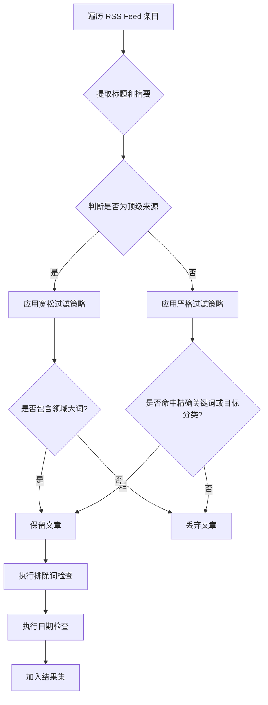
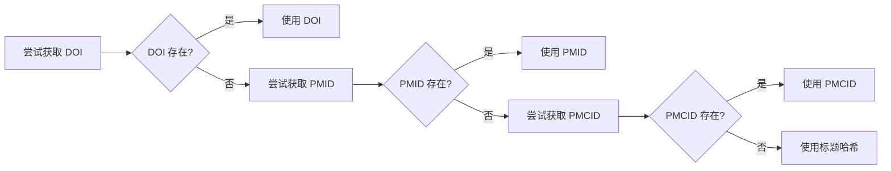
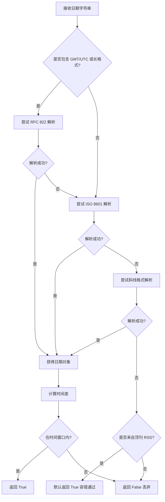
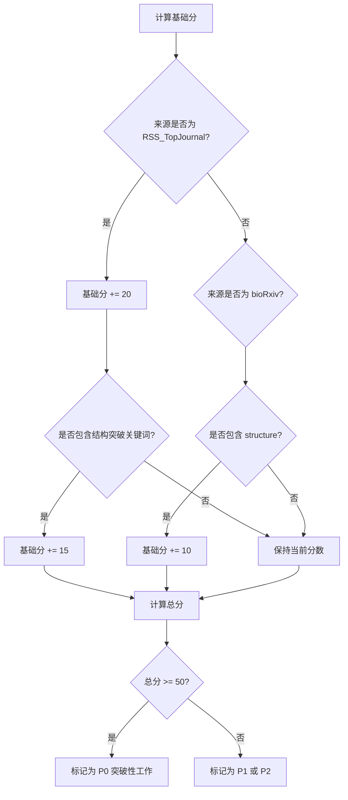
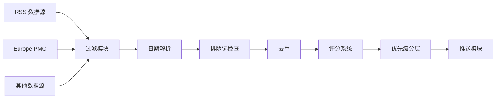

# RSS 与 Europe PMC 数据源优化设计

## 一、问题背景

### 当前系统现状

系统在数据采集阶段存在"顶刊产出为 0"的问题，具体表现为：

1. **RSS 数据源过滤过严**：Nature、Science、Cell 等顶级期刊的文章因 RSS 摘要极短（通常只有标题或极简描述），无法触发关键词匹配，导致被过滤
2. **Europe PMC 双重检查冗余**：API 查询已在服务端完成精准检索，但本地仍强制执行关键词二次匹配，导致使用非标准术语的优质文章被漏掉
3. **日期解析脆弱**：RSS 的 RFC 822 格式（如 `Sun, 28 Dec 2025 02:00:00 GMT`）经常解析失败，导致最新文章被判定为"不在时间窗口内"而被丢弃
4. **评分系统未区分来源权重**：所有来源的文章使用相同评分逻辑，缺少对顶级期刊的加权机制

### 优化目标

建立差异化过滤策略：**对平庸内容严防死守，对顶级期刊网开一面**

## 二、整体优化策略

### 核心设计原则

| 内容等级 | 过滤策略 | 适用场景 |
|---------|---------|---------|
| **顶级来源** | 宽松过滤：只需包含领域大词即可通过 | Nature、Science、Cell 等顶刊 RSS |
| **一般来源** | 严格过滤：必须命中精确关键词或目标分类 | bioRxiv、EurekAlert 等开放平台 |
| **API 查询结果** | 信任服务端：本地仅执行排除逻辑，不做二次正向匹配 | Europe PMC、PubMed API |

## 三、分模块优化设计

### 3.1 RSS 数据源：顶级来源白名单机制

#### 设计思路

对于 Nature、Science、Cell 等顶级期刊，放宽关键词匹配门槛，避免因摘要过短导致的误杀。

#### 实现逻辑

**涉及文件**：`app/sources/rss.py`

**修改位置**：`RSSSource.fetch()` 方法内的过滤循环

#### 详细流程

#### 关键参数定义

| 参数名称 | 数据类型 | 说明 |
|---------|---------|------|
| `top_tier_domains` | List[str] | 顶级期刊域名列表（nature.com, sciencemag.org, cell.com） |
| `broad_keywords` | List[str] | 领域大词列表（plant, immune, receptor, structure, protein, nitrogen） |
| `all_keywords` | List[str] | 精确关键词列表（从 Config 读取） |
| `target_categories` | List[str] | 目标分类列表（从 Config 读取） |

#### 过滤规则表

| 来源类型 | 过滤条件 | 示例 |
|---------|---------|------|
| 顶级期刊 | 包含任意一个领域大词 | "plant"、"immune"、"structure" |
| 一般来源 | 命中精确关键词 OR 命中目标分类 | "nitrogen fixation"、"NLR" |

#### 豁免机制

对于顶级期刊，如果标题或摘要提到以下任意大词即予保留：
- **植物相关**：plant
- **免疫相关**：immune, receptor
- **结构相关**：structure, protein
- **固氮相关**：nitrogen

### 3.2 Europe PMC 数据源：信任 API 结果

#### 设计思路

既然 API 查询已在服务端完成专业检索（包含三大主题的复杂布尔查询），本地无需二次正向匹配，只需执行排除逻辑和元数据完善。

#### 实现逻辑

**涉及文件**：`app/sources/europepmc.py`

**修改位置**：`EuropePMCSource.fetch()` 方法

#### 当前 API 查询策略

系统当前的 API 查询语句已包含三大主题：

| 主题 | 查询词组 |
|-----|---------|
| 固氮 | nitrogen fixation, nitrogenase, rhizobia, root nodule, symbiosis, diazotroph, nif genes |
| 信号转导 | extracellular signal, signal transduction, receptor kinase, GPCR, ligand binding, phosphorylation cascade |
| 酶结构 | enzyme structure, cryo-EM, crystal structure, active site, catalytic mechanism, allosteric regulation |

**组合逻辑**：`(q_nitro OR q_signal OR q_enzyme)` 且时间范围为 `FIRST_PDATE:[start_date TO today]`

#### 优化策略

| 处理阶段 | 当前做法 | 优化后做法 | 理由 |
|---------|---------|-----------|------|
| API 查询 | ✅ 服务端精准检索 | ✅ 保持不变 | 已是最佳实践 |
| 本地过滤 | ❌ 二次关键词匹配 | ✅ 仅执行排除逻辑 | 避免双重安检导致漏检 |
| ID 生成 | ⚠️ doi 字段缺失时无回退 | ✅ doi → pmid → pmcid 级联回退 | 提高去重准确性 |

#### ID 生成容错链

### 3.3 日期解析增强：鲁棒性提升

#### 设计思路

RSS 日期格式复杂多样，需要优先处理 RFC 822 格式，并增加容错机制。

#### 实现逻辑

**涉及文件**：`app/filtering.py`

**修改位置**：`is_recent_date()` 函数

#### 日期格式优先级

| 优先级 | 格式类型 | 示例 | 解析方法 |
|-------|---------|------|---------|
| 1 | RFC 822（RSS 标准） | `Sun, 28 Dec 2025 02:00:00 GMT` | `email.utils.parsedate_to_datetime()` |
| 2 | ISO 8601（标准格式） | `2025-12-28` | `datetime.strptime('%Y-%m-%d')` |
| 3 | 斜线分隔格式 | `2025/12/28` | `datetime.strptime('%Y/%m/%d')` |

#### 容错策略

#### 时间窗口增强

| 场景 | 处理策略 | 理由 |
|-----|---------|------|
| 日期在未来 1 天内 | 视为最新（允许 -1 ≤ diff ≤ window_days） | 处理时区差异 |
| 日期无法解析且来源为顶刊 | 默认通过（返回 True） | 宁错杀不漏掉原则 |
| 日期无法解析且来源为一般源 | 丢弃（返回 False） | 严格质量控制 |

### 3.4 评分系统：P0 级文章加权

#### 设计思路

根据文章来源和关键词命中情况，实施差异化加权，确保顶级期刊和结构生物学突破能够自动进入 P0 优先级（≥50 分）。

#### 实现逻辑

**涉及文件**：`app/scoring.py`

**修改位置**：`score_paper()` 函数

#### P0 优先级定义

根据现有代码（`app/ranking.py`），优先级定义为：

| 优先级 | 分数阈值 | 说明 |
|-------|---------|------|
| P0 | ≥ 50 分 | 突破性工作，自动置顶 |
| P1 | 30-49 分 | 重要研究，正常推送 |
| P2 | < 30 分 | 一般研究，可选推送 |

#### 新增加权规则

| 加权项 | 触发条件 | 加分值 | 说明 |
|-------|---------|--------|------|
| **顶刊来源加权** | 来源为 RSS_TopJournal | +20 分 | Nature、Science、Cell 等顶刊基础分 |
| **结构突破加权** | 包含 NLR / Resistosome / Cryo-EM | +15 分 | 结构生物学突破性关键词 |
| **预印本结构加权** | 来源为 bioRxiv 且包含 structure | +10 分 | 预印本中的结构研究 |

#### 累计加分示例

| 文章类型 | 基础分 | 顶刊加权 | 结构加权 | 总分 | 优先级 |
|---------|-------|---------|---------|------|-------|
| Nature + Cryo-EM 文章 | 15-30 | +20 | +15 | **50-65** | **P0** |
| bioRxiv + structure 文章 | 15-25 | 0 | +10 | 25-35 | P1 |
| 一般 RSS 文章 | 10-20 | 0 | 0 | 10-20 | P2 |

#### 结构突破关键词列表

以下关键词触发 +15 分加权：

- NLR（植物免疫受体）
- Resistosome（抗病小体）
- Inflammasome（炎症小体）
- Cryo-EM / Cryo-electron microscopy
- Atomic resolution
- Crystal structure + mechanism（组合出现）
- Conformational change + structure（组合出现）

#### 加权流程

## 四、模块间协作关系

### 数据流向

### 修改文件清单

| 文件路径 | 修改内容 | 影响范围 |
|---------|---------|---------|
| `app/sources/rss.py` | 增加顶级来源白名单机制 | RSS 数据源过滤逻辑 |
| `app/sources/europepmc.py` | 移除本地二次关键词匹配、增强 ID 容错 | Europe PMC 数据处理 |
| `app/filtering.py` | 增强日期解析鲁棒性、增加容错策略 | 全局日期过滤 |
| `app/scoring.py` | 新增顶刊来源加权和结构突破加权规则 | 全局评分逻辑 |

## 五、风险与约束

### 潜在风险

| 风险项 | 影响 | 缓解措施 |
|-------|-----|---------|
| 顶刊白名单过于宽松，引入噪音文章 | 推送内容质量下降 | 通过排除词机制二次过滤 + 评分系统降权 |
| 日期解析容错过于激进，引入陈旧内容 | 推送时效性下降 | 仅对顶刊 RSS 启用容错，其他来源保持严格检查 |
| 加权规则过重，非顶刊优质文章被埋没 | 推送内容来源单一 | P0 门槛设为 50 分，P1 仍可正常推送 |

### 设计约束

1. **不修改配置文件**：所有关键词和分类定义仍从 `Config` 读取，保持向后兼容
2. **保持模块独立性**：每个数据源类独立实现过滤逻辑，不引入跨模块依赖
3. **日志可观测性**：所有放宽策略触发时需记录日志，便于后续调优
4. **向后兼容**：现有 API 接口和数据模型不变

## 六、实施优先级

### 阶段划分

| 阶段 | 实施内容 | 预期效果 | 优先级 |
|-----|---------|---------|-------|
| **阶段 1** | 日期解析增强 | 立即解决"产出为 0"问题 | 🔴 P0 |
| **阶段 2** | RSS 白名单机制 | 提升顶刊文章召回率 | 🔴 P0 |
| **阶段 3** | Europe PMC 去除二次匹配 | 减少误杀，提升召回率 | 🟡 P1 |
| **阶段 4** | 评分系统加权 | 优化推送排序 | 🟡 P1 |

### 验收标准

1. **核心指标**：单次运行中 RSS_TopJournal 数据源产出 ≥ 3 篇文章
2. **质量指标**：P0 级文章中至少 80% 来自 Nature/Science/Cell 顶刊
3. **稳定性指标**：日期解析成功率达到 95% 以上（通过日志统计）

## 七、后续优化方向

### 可扩展性设计

1. **动态白名单配置**：将顶级期刊域名移至 `Config`，支持用户自定义
2. **领域大词自动扩展**：通过 LLM 定期生成领域相关大词列表
3. **评分规则可视化**：提供 Web 界面调整加权参数并实时预览效果
4. **A/B 测试框架**：同时运行新旧过滤策略，对比产出质量

### 监控指标

| 指标名称 | 计算方式 | 预期值 |
|---------|---------|-------|
| 顶刊召回率 | RSS 产出文章数 / RSS Feed 总文章数 | ≥ 20% |
| 日期解析成功率 | 成功解析数 / 总解析尝试数 | ≥ 95% |
| P0 级文章占比 | P0 文章数 / 总推送文章数 | 10-20% |
| 误报率 | 被用户标记为"不相关"的文章数 / 总推送数 | ≤ 5% |
