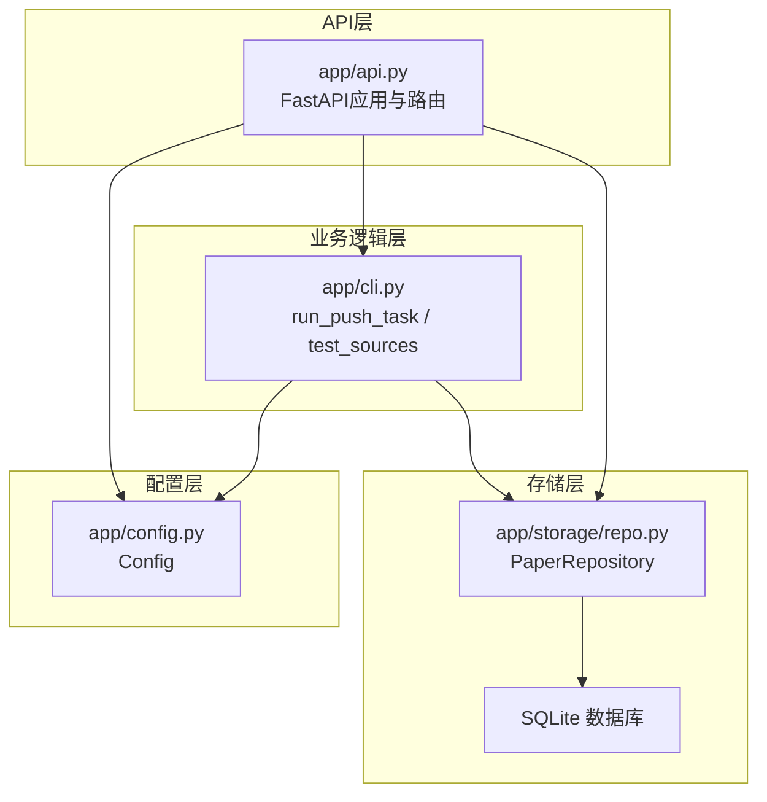
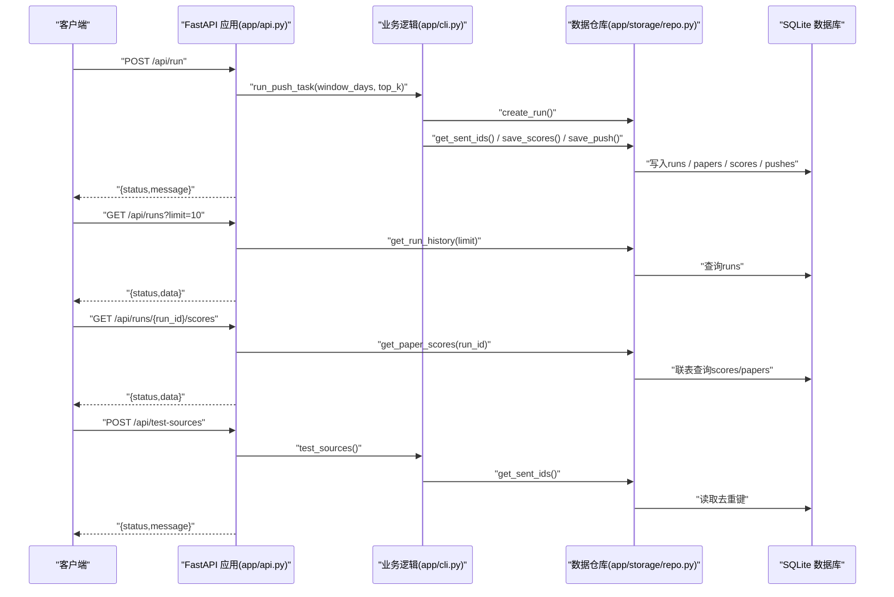
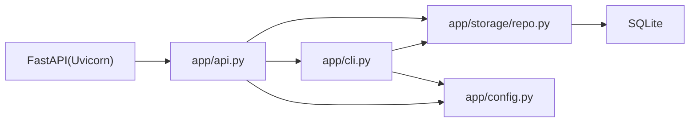

# API参考

<cite>
**本文引用的文件**
- [app/api.py](file://app/api.py)
- [app/cli.py](file://app/cli.py)
- [app/storage/repo.py](file://app/storage/repo.py)
- [app/config.py](file://app/config.py)
- [README.md](file://README.md)
- [requirements.txt](file://requirements.txt)
- [deploy_to_server.md](file://deploy_to_server.md)
- [run_daily.bat](file://run_daily.bat)
</cite>

## 目录
1. [简介](#简介)
2. [项目结构](#项目结构)
3. [核心组件](#核心组件)
4. [架构总览](#架构总览)
5. [详细组件分析](#详细组件分析)
6. [依赖关系分析](#依赖关系分析)
7. [性能考虑](#性能考虑)
8. [故障排查指南](#故障排查指南)
9. [结论](#结论)
10. [附录](#附录)

## 简介
本文件为系统对外暴露的RESTful API提供完整参考，涵盖以下四个公共接口：
- POST /api/run：触发一次推送任务
- GET /api/runs：查询运行历史
- GET /api/runs/{run_id}/scores：查询某次运行的论文评分详情
- POST /api/test-sources：测试所有数据源连通性

文档包含每个端点的HTTP方法、URL路径、请求参数、请求体结构、响应格式（成功与错误）、认证方式（如有）、状态码、典型使用场景、curl示例与Python客户端调用思路，并补充速率限制、错误处理策略与版本控制方案，以及如何将API集成到其他管理系统。

## 项目结构
系统采用模块化设计，API层位于app/api.py，业务逻辑由app/cli.py封装，数据持久化通过app/storage/repo.py访问SQLite数据库，配置来自app/config.py。

图表来源
- [app/api.py](file://app/api.py#L1-L88)
- [app/cli.py](file://app/cli.py#L1-L250)
- [app/storage/repo.py](file://app/storage/repo.py#L1-L258)
- [app/config.py](file://app/config.py#L1-L134)

章节来源
- [app/api.py](file://app/api.py#L1-L88)
- [app/cli.py](file://app/cli.py#L1-L250)
- [app/storage/repo.py](file://app/storage/repo.py#L1-L258)
- [app/config.py](file://app/config.py#L1-L134)
- [README.md](file://README.md#L59-L64)

## 核心组件
- FastAPI应用与路由：定义四个公开API端点，负责请求解析、异常转换与响应包装。
- 业务逻辑：run_push_task负责抓取、评分、生成报告与多渠道推送；test_sources负责逐一测试各数据源。
- 数据仓库：PaperRepository封装runs、scores、pushes、papers、dedup_keys等表的CRUD与聚合查询。
- 配置：Config从环境变量加载API密钥、邮箱、推送通道、抓取窗口、Top K等参数。

章节来源
- [app/api.py](file://app/api.py#L1-L88)
- [app/cli.py](file://app/cli.py#L1-L250)
- [app/storage/repo.py](file://app/storage/repo.py#L1-L258)
- [app/config.py](file://app/config.py#L1-L134)

## 架构总览
下图展示API到业务逻辑再到存储的调用链路与数据流向。

图表来源
- [app/api.py](file://app/api.py#L33-L80)
- [app/cli.py](file://app/cli.py#L23-L149)
- [app/storage/repo.py](file://app/storage/repo.py#L60-L257)

## 详细组件分析

### POST /api/run
- 描述：触发一次推送任务，内部异步执行抓取、评分、生成报告与多渠道推送。
- 方法与路径：POST /api/run
- 请求参数：
  - 查询参数
    - window_days: 整数，抓取窗口天数（默认值来自配置）
    - top_k: 整数，选择Top K篇（默认值来自配置）
- 请求体：无
- 成功响应：
  - 结构：{"status": "success", "message": "任务已启动"}
  - 状态码：200
- 错误响应：
  - 结构：{"detail": "<错误信息字符串>"}
  - 状态码：500
- 认证：无需认证
- 典型使用场景：
  - 通过管理平台手动触发一次推送
  - 与CI/CD流水线集成，按需触发
- curl示例：
  - curl -X POST "http://localhost:8000/api/run?window_days=7&top_k=5"
- Python客户端调用思路：
  - 使用requests库发送POST请求，传入window_days与top_k查询参数
  - 捕获HTTP 200与500分支，解析响应JSON
- 注意事项：
  - 任务在后台线程池中执行，接口立即返回“任务已启动”，实际结果可在历史记录中查看

章节来源
- [app/api.py](file://app/api.py#L33-L44)
- [app/cli.py](file://app/cli.py#L23-L149)
- [app/config.py](file://app/config.py#L110-L117)

### GET /api/runs
- 描述：获取最近N次运行的历史记录
- 方法与路径：GET /api/runs
- 请求参数：
  - 查询参数
    - limit: 整数，返回记录条数上限（默认10）
- 请求体：无
- 成功响应：
  - 结构：{"status": "success", "data": [ {...}, ... ]}
  - data元素字段：run_id, window_days, start_time, end_time, total_papers, unseen_papers, top_k, status, error
  - 状态码：200
- 错误响应：
  - 结构：{"detail": "<错误信息字符串>"}
  - 状态码：500
- 认证：无需认证
- 典型使用场景：
  - 管理界面展示历史运行统计
  - 监控系统集成，周期性拉取运行状态
- curl示例：
  - curl "http://localhost:8000/api/runs?limit=10"
- Python客户端调用思路：
  - 使用requests.get，传入limit参数
  - 解析data数组，遍历每条运行记录

章节来源
- [app/api.py](file://app/api.py#L46-L56)
- [app/storage/repo.py](file://app/storage/repo.py#L206-L233)

### GET /api/runs/{run_id}/scores
- 描述：获取指定run_id的论文评分详情（按分数降序）
- 方法与路径：GET /api/runs/{run_id}/scores
- 路径参数：
  - run_id: 字符串，运行ID
- 请求体：无
- 成功响应：
  - 结构：{"status": "success", "data": [ {...}, ... ]}
  - data元素字段：title, source, date, score, reasons（JSON数组，包含category、points、description）
  - 状态码：200
- 错误响应：
  - 结构：{"detail": "<错误信息字符串>"}
  - 状态码：500
- 认证：无需认证
- 典型使用场景：
  - 展示某次运行的Top论文及其评分构成
  - 导出评分明细供审计或复核
- curl示例：
  - curl "http://localhost:8000/api/runs/<run_id>/scores"
- Python客户端调用思路：
  - 使用requests.get，拼接run_id路径
  - 遍历data数组，读取reasons了解评分维度

章节来源
- [app/api.py](file://app/api.py#L58-L68)
- [app/storage/repo.py](file://app/storage/repo.py#L234-L257)

### POST /api/test-sources
- 描述：测试所有数据源的连通性与可用性
- 方法与路径：POST /api/test-sources
- 请求参数：无
- 请求体：无
- 成功响应：
  - 结构：{"status": "success", "message": "测试完成，请查看日志"}
  - 状态码：200
- 错误响应：
  - 结构：{"detail": "<错误信息字符串>"}
  - 状态码：500
- 认证：无需认证
- 典型使用场景：
  - 部署后快速验证各数据源是否可用
  - 定时巡检，结合日志监控异常
- curl示例：
  - curl -X POST "http://localhost:8000/api/test-sources"
- Python客户端调用思路：
  - 使用requests.post触发测试
  - 通过日志输出判断各数据源状态

章节来源
- [app/api.py](file://app/api.py#L70-L80)
- [app/cli.py](file://app/cli.py#L170-L214)

## 依赖关系分析
- 外部依赖
  - FastAPI与Uvicorn：提供API服务与ASGI运行时
  - requests、feedparser、biopython：数据源抓取所需
  - openai：LLM报告生成（DeepSeek API）
  - python-dotenv：加载.env配置
- 内部依赖
  - app/api.py依赖app/cli.py与app/storage/repo.py
  - app/cli.py依赖app/config.py与app/storage/repo.py
  - app/storage/repo.py依赖app/models.py与app/storage/db.py

图表来源
- [requirements.txt](file://requirements.txt#L1-L21)
- [app/api.py](file://app/api.py#L1-L88)
- [app/cli.py](file://app/cli.py#L1-L250)
- [app/storage/repo.py](file://app/storage/repo.py#L1-L258)
- [app/config.py](file://app/config.py#L1-L134)

章节来源
- [requirements.txt](file://requirements.txt#L1-L21)
- [app/api.py](file://app/api.py#L1-L88)
- [app/cli.py](file://app/cli.py#L1-L250)
- [app/storage/repo.py](file://app/storage/repo.py#L1-L258)
- [app/config.py](file://app/config.py#L1-L134)

## 性能考虑
- 异步与并发
  - /api/run通过线程池并发抓取多个数据源，提升吞吐
  - API层使用事件循环与线程池执行阻塞任务，避免阻塞HTTP请求
- 数据库访问
  - PaperRepository对runs、scores、pushes等表进行批量写入与联表查询，建议在生产环境中启用SQLite WAL模式与索引优化
- I/O与网络
  - 数据源抓取与外部API调用（如DeepSeek）可能成为瓶颈，建议在部署侧做好限流与重试策略
- 资源隔离
  - 建议将API服务与数据源抓取任务分离，避免单实例高负载

[本节为通用性能建议，不直接分析具体文件]

## 故障排查指南
- 常见错误与定位
  - 500错误：API层捕获异常并返回{"detail": "..."}，检查服务日志定位具体异常
  - 配置缺失：DEEPSEEK_API_KEY、PUBMED_EMAIL未设置会导致校验失败
  - 数据源异常：test-sources接口会输出各数据源测试结果，便于快速定位
- 日志与监控
  - 服务启动日志与业务日志可帮助定位问题
  - 建议在生产环境开启日志轮转与集中化收集
- 服务器部署要点
  - 参考部署文档，确保依赖安装、环境变量配置正确
  - 使用tmux或systemd守护进程，避免SSH断开会话导致任务中断

章节来源
- [app/api.py](file://app/api.py#L33-L80)
- [app/cli.py](file://app/cli.py#L228-L234)
- [deploy_to_server.md](file://deploy_to_server.md#L1-L227)

## 结论
本API提供了完整的运行管理能力：触发任务、查询历史、查看评分、测试数据源。接口简单易用，响应结构统一，适合集成到各类管理系统中。建议在生产环境中配合日志监控、配置校验与限流策略，确保稳定性与可观测性。

[本节为总结性内容，不直接分析具体文件]

## 附录

### API端点一览
- POST /api/run
  - 参数：window_days（可选）、top_k（可选）
  - 成功：200，{"status":"success","message":"任务已启动"}
  - 错误：500，{"detail":"<错误信息>"}
- GET /api/runs
  - 参数：limit（可选，默认10）
  - 成功：200，{"status":"success","data":[{...}]}
  - 错误：500，{"detail":"<错误信息>"}
- GET /api/runs/{run_id}/scores
  - 参数：run_id（路径）
  - 成功：200，{"status":"success","data":[{...}]}
  - 错误：500，{"detail":"<错误信息>"}
- POST /api/test-sources
  - 参数：无
  - 成功：200，{"status":"success","message":"测试完成，请查看日志"}
  - 错误：500，{"detail":"<错误信息>"}

章节来源
- [app/api.py](file://app/api.py#L33-L80)
- [app/storage/repo.py](file://app/storage/repo.py#L206-L257)

### curl示例
- 触发任务：curl -X POST "http://localhost:8000/api/run?window_days=7&top_k=5"
- 查询历史：curl "http://localhost:8000/api/runs?limit=10"
- 查看评分：curl "http://localhost:8000/api/runs/<run_id>/scores"
- 测试数据源：curl -X POST "http://localhost:8000/api/test-sources"

章节来源
- [README.md](file://README.md#L59-L64)
- [app/api.py](file://app/api.py#L33-L80)

### Python客户端调用思路
- 使用requests库发送HTTP请求
- 对于POST /api/run与POST /api/test-sources，注意传入查询参数
- 对于GET /api/runs，传入limit参数
- 对于GET /api/runs/{run_id}/scores，拼接run_id路径
- 统一处理200与500响应，解析JSON并按需渲染或入库

[本节为通用调用建议，不直接分析具体文件]

### 速率限制
- 当前实现未内置速率限制
- 建议在网关或反向代理层（如Nginx、Caddy、Cloudflare）配置限速与熔断
- 对于高频调用场景，建议客户端做指数退避与去重

[本节为通用建议，不直接分析具体文件]

### 错误处理策略
- API层统一捕获异常并返回500与{"detail": "..."}
- CLI层在执行失败时更新runs表status为failed并记录error
- 建议在客户端增加重试与告警

章节来源
- [app/api.py](file://app/api.py#L33-L80)
- [app/cli.py](file://app/cli.py#L145-L149)

### 版本控制方案
- API版本：标题与版本信息已在FastAPI应用中声明
- 建议后续通过路径前缀（如/v1）或Accept头进行版本演进
- 保持向后兼容，新增字段以非破坏性方式扩展

章节来源
- [app/api.py](file://app/api.py#L16-L20)

### 集成到其他管理系统
- 方式一：直接HTTP调用上述端点
- 方式二：在目标系统中封装HTTP客户端，统一处理鉴权、重试与日志
- 方式三：将API服务容器化并通过Kubernetes管理，结合Prometheus/Grafana监控

[本节为通用集成建议，不直接分析具体文件]