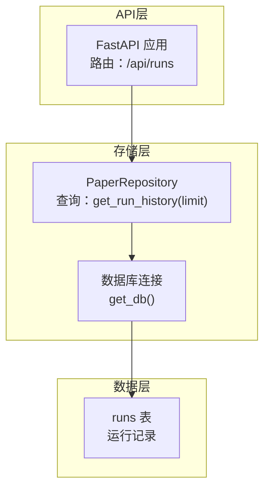
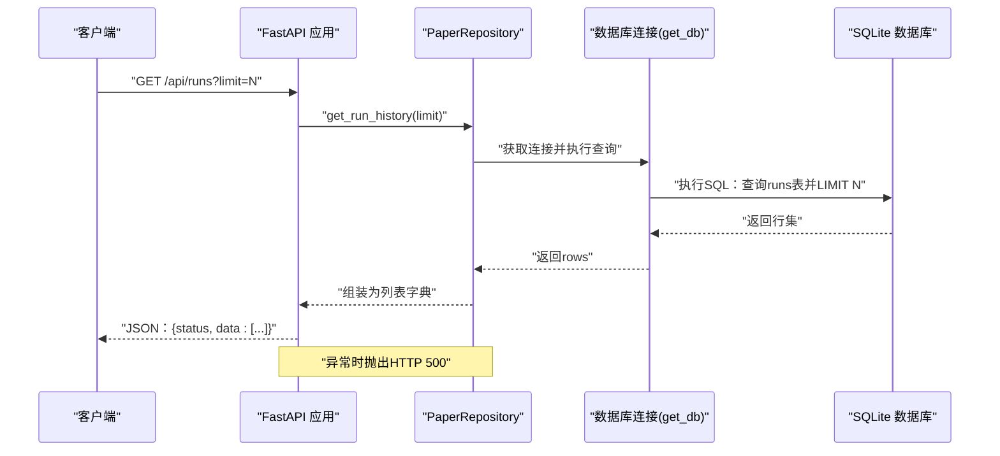
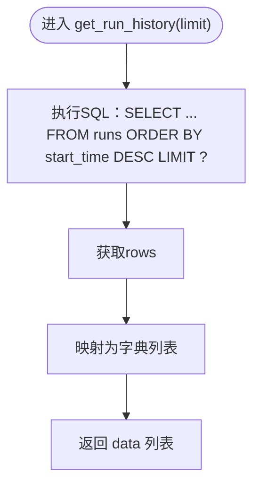

# GET /api/runs - 获取运行历史

<cite>
**本文引用的文件**
- [app/api.py](file://app/api.py)
- [app/storage/repo.py](file://app/storage/repo.py)
- [app/storage/db.py](file://app/storage/db.py)
- [README.md](file://README.md)
</cite>

## 目录
1. [简介](#简介)
2. [项目结构](#项目结构)
3. [核心组件](#核心组件)
4. [架构总览](#架构总览)
5. [详细组件分析](#详细组件分析)
6. [依赖关系分析](#依赖关系分析)
7. [性能考量](#性能考量)
8. [故障排查指南](#故障排查指南)
9. [结论](#结论)
10. [附录](#附录)

## 简介
本文件为 GET /api/runs 端点的完整API文档，面向监控与审计场景，帮助用户查询系统的历史运行记录。该接口返回包含运行标识、抓取窗口、起止时间、状态、处理论文数量、推送结果等信息的列表。响应采用标准结构，包含状态码与数据体；时间字段遵循 ISO 8601 格式；状态枚举值覆盖“进行中”“已完成”“失败”等常见状态。接口通过 FastAPI 提供，底层数据由 SQLite 数据库存储，查询逻辑由 PaperRepository 的查询方法负责。

## 项目结构
- API 层：提供 /api/runs 等REST接口，负责请求解析、异常处理与响应封装。
- 存储层：负责数据库初始化、连接管理与CRUD操作，其中 PaperRepository 提供运行历史查询能力。
- 数据库层：SQLite 表结构包含 runs、papers、scores、pushes、dedup_keys 等，用于记录运行、论文、评分与推送等全生命周期数据。

图表来源
- [app/api.py](file://app/api.py#L46-L56)
- [app/storage/repo.py](file://app/storage/repo.py#L206-L233)
- [app/storage/db.py](file://app/storage/db.py#L23-L38)

章节来源
- [app/api.py](file://app/api.py#L46-L56)
- [app/storage/repo.py](file://app/storage/repo.py#L206-L233)
- [app/storage/db.py](file://app/storage/db.py#L40-L131)
- [README.md](file://README.md#L59-L64)

## 核心组件
- FastAPI 路由：定义 GET /api/runs，接收 limit 参数（默认10），调用 PaperRepository 查询运行历史并返回统一结构。
- PaperRepository：封装数据库访问，提供 get_run_history(limit) 方法，按起始时间倒序返回指定条数的运行记录。
- 数据库：runs 表存储运行元数据，包含运行标识、窗口天数、起止时间、统计指标与状态等字段。

章节来源
- [app/api.py](file://app/api.py#L46-L56)
- [app/storage/repo.py](file://app/storage/repo.py#L206-L233)
- [app/storage/db.py](file://app/storage/db.py#L65-L79)

## 架构总览
下图展示了从客户端到数据库的调用链路，以及各组件之间的依赖关系。

图表来源
- [app/api.py](file://app/api.py#L46-L56)
- [app/storage/repo.py](file://app/storage/repo.py#L206-L233)
- [app/storage/db.py](file://app/storage/db.py#L23-L38)

## 详细组件分析

### 接口定义与行为
- 请求
  - 方法：GET
  - 路径：/api/runs
  - 查询参数：
    - limit：整数，限制返回记录条数，默认10
- 响应
  - 结构：{"status": "success", "data": [...]}
  - data：数组，每项为一次运行的摘要信息
  - 异常：内部错误时返回HTTP 500，错误信息见日志

章节来源
- [app/api.py](file://app/api.py#L46-L56)

### 响应数据结构详解
- 字段说明（来自 runs 表与查询逻辑）
  - run_id：字符串，唯一运行标识
  - window_days：整数，抓取窗口（天）
  - start_time：字符串，ISO 8601 时间戳，表示运行开始时间
  - end_time：字符串，ISO 8601 时间戳，表示运行结束时间（若尚未结束则为空或缺失）
  - total_papers：整数，本次运行抓取到的论文总数
  - unseen_papers：整数，本次运行新增的未见过论文数（相对历史去重集合）
  - top_k：整数，最终选择推送的论文数量
  - status：字符串，运行状态，常见值包括：
    - running：进行中
    - completed：已完成
    - failed：失败
  - error：字符串，失败原因（当状态为 failed 时可能包含）

- 时间格式
  - start_time/end_time 采用 ISO 8601 格式字符串，便于跨语言解析与排序。

- 状态枚举
  - 由 runs.status 字段维护，典型值："running"、"completed"、"failed"。接口在查询时直接返回数据库中的状态值。

章节来源
- [app/storage/repo.py](file://app/storage/repo.py#L60-L112)
- [app/storage/repo.py](file://app/storage/repo.py#L206-L233)
- [app/storage/db.py](file://app/storage/db.py#L65-L79)

### 数据库查询流程
- 查询逻辑
  - PaperRepository.get_run_history(limit) 以 start_time 降序查询 runs 表，限制返回条数为 limit
  - 返回字段与顺序与响应结构一一对应
- 数据来源
  - runs 表由 init_db() 初始化，包含运行标识、窗口天数、起止时间、统计指标与状态等列

图表来源
- [app/storage/repo.py](file://app/storage/repo.py#L206-L233)

章节来源
- [app/storage/repo.py](file://app/storage/repo.py#L206-L233)
- [app/storage/db.py](file://app/storage/db.py#L65-L79)

### curl 示例
- 获取最近10条运行记录
  - curl -X GET "http://localhost:8000/api/runs"
- 指定返回条数（例如20条）
  - curl -X GET "http://localhost:8000/api/runs?limit=20"

章节来源
- [app/api.py](file://app/api.py#L46-L56)
- [README.md](file://README.md#L59-L64)

### 分页建议
- 当前实现
  - 仅支持 limit 参数，不支持 offset 或游标分页
- 未来扩展建议
  - 增加 offset 参数，实现基于偏移的分页
  - 或引入基于时间戳的游标分页（如 last_seen_start_time），避免跳页问题
  - 对 runs 表增加索引以提升大表分页查询性能（例如按 start_time 的复合索引）

章节来源
- [app/api.py](file://app/api.py#L46-L56)
- [app/storage/db.py](file://app/storage/db.py#L122-L129)

### 监控与审计应用场景
- 运行监控
  - 通过 status 快速识别失败运行，结合 error 字段定位问题
  - 通过 total_papers/unseen_papers/top_k 评估抓取与筛选效果
- 审计追踪
  - 通过 start_time/end_time 评估单次运行耗时
  - 通过 window_days 与抓取范围核对配置是否正确
- 报表与告警
  - 可基于返回数据生成运行趋势报表
  - 对连续失败或异常耗时的运行触发告警

章节来源
- [app/storage/repo.py](file://app/storage/repo.py#L60-L112)
- [app/storage/repo.py](file://app/storage/repo.py#L206-L233)

## 依赖关系分析
- 组件耦合
  - API 路由依赖 PaperRepository
  - PaperRepository 依赖数据库连接工厂 get_db()
  - 数据库连接依赖 SQLite 文件路径（来自配置）
- 外部依赖
  - FastAPI（路由与异常处理）
  - SQLite（本地存储）

图表来源
- [app/api.py](file://app/api.py#L46-L56)
- [app/storage/repo.py](file://app/storage/repo.py#L206-L233)
- [app/storage/db.py](file://app/storage/db.py#L23-L38)

章节来源
- [app/api.py](file://app/api.py#L46-L56)
- [app/storage/repo.py](file://app/storage/repo.py#L206-L233)
- [app/storage/db.py](file://app/storage/db.py#L23-L38)

## 性能考量
- 当前实现特点
  - 单表查询，按 start_time 降序，LIMIT 限制返回条数
  - 未实现 offset 或游标分页，适合小到中等规模数据
- 潜在瓶颈
  - runs 表增长后，ORDER BY + LIMIT 的查询成本随数据量线性增长
  - 若 limit 较大，响应延迟可能上升
- 优化方向
  - 建议为 runs 表添加索引（如按 start_time 的索引），以加速排序与分页
  - 未来引入 offset 或游标分页，减少一次性返回大量数据
  - 对高频查询可考虑缓存最近N条运行摘要（需注意一致性）
  - 控制 limit 上限，避免超大规模查询

章节来源
- [app/storage/db.py](file://app/storage/db.py#L122-L129)
- [app/storage/repo.py](file://app/storage/repo.py#L206-L233)

## 故障排查指南
- 常见问题
  - HTTP 500：内部异常，查看服务日志定位具体错误
  - 返回空列表：可能由于 limit 过小或数据库中暂无运行记录
  - 时间字段为空：表示运行尚未结束（状态仍为 running）
- 排查步骤
  - 确认 API 服务已启动且监听端口正常
  - 检查数据库文件是否存在与权限是否正确
  - 查看 runs 表是否初始化成功
  - 关注 status 与 error 字段，定位失败原因

章节来源
- [app/api.py](file://app/api.py#L46-L56)
- [app/storage/db.py](file://app/storage/db.py#L40-L131)

## 结论
GET /api/runs 提供了系统运行历史的统一视图，满足监控与审计需求。当前实现简洁高效，适合中小规模数据；随着数据量增长，建议引入分页与索引优化，以进一步提升查询性能与用户体验。

## 附录

### 字段对照表
- run_id：运行标识
- window_days：抓取窗口（天）
- start_time：开始时间（ISO 8601）
- end_time：结束时间（ISO 8601，可能为空）
- total_papers：抓取论文总数
- unseen_papers：新增未见论文数
- top_k：最终选择推送论文数
- status：运行状态（running/completed/failed）
- error：失败原因（当状态为 failed 时）

章节来源
- [app/storage/repo.py](file://app/storage/repo.py#L206-L233)
- [app/storage/db.py](file://app/storage/db.py#L65-L79)