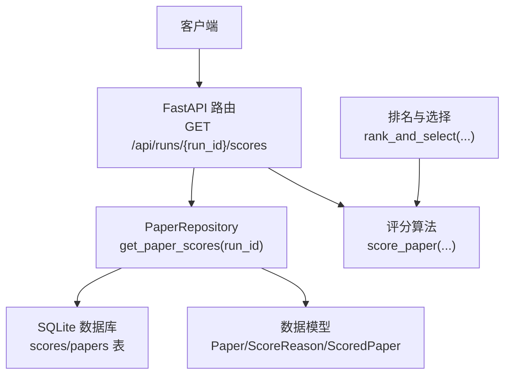
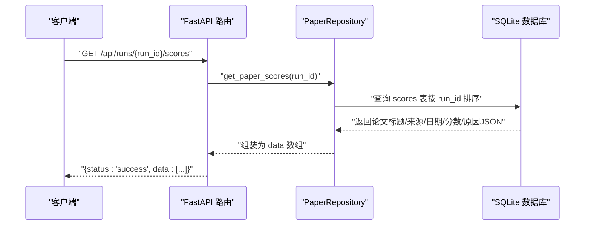
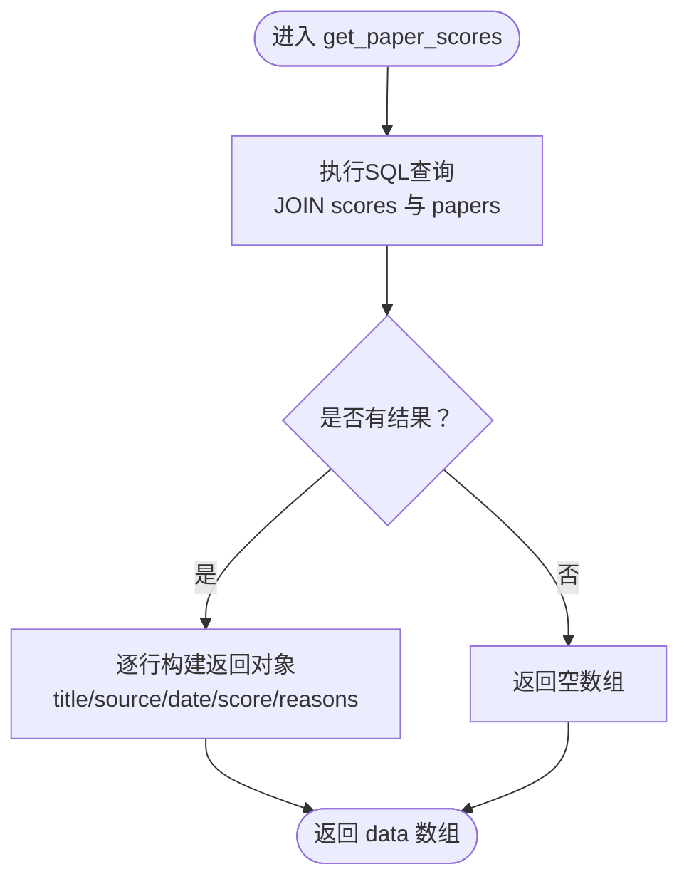
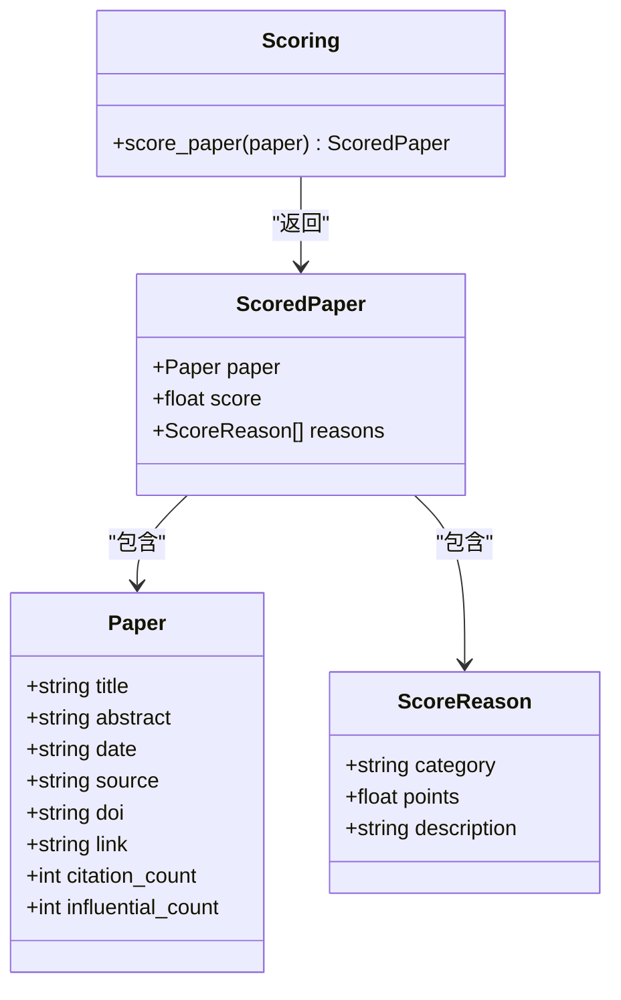
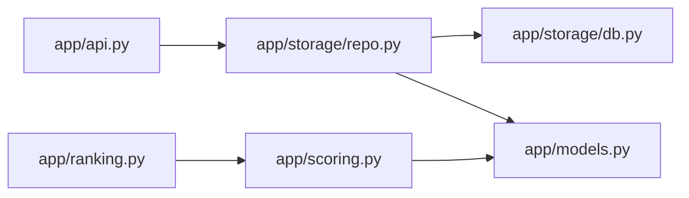

# GET /api/runs/{run_id}/scores - 获取评分详情

<cite>
**本文引用的文件**
- [app/api.py](file://app/api.py)
- [app/storage/repo.py](file://app/storage/repo.py)
- [app/storage/db.py](file://app/storage/db.py)
- [app/scoring.py](file://app/scoring.py)
- [app/ranking.py](file://app/ranking.py)
- [app/models.py](file://app/models.py)
- [README.md](file://README.md)
</cite>

## 目录
1. [简介](#简介)
2. [项目结构](#项目结构)
3. [核心组件](#核心组件)
4. [架构概览](#架构概览)
5. [详细组件分析](#详细组件分析)
6. [依赖关系分析](#依赖关系分析)
7. [性能考量](#性能考量)
8. [故障排查指南](#故障排查指南)
9. [结论](#结论)
10. [附录](#附录)

## 简介
本接口用于获取指定运行批次（run_id）中所有论文的详细评分信息，包括每篇论文的总分以及各维度评分原因（如关键词匹配、顶刊加分、引用数、新鲜度等）。接口返回的数据结构与评分算法完全对应，便于开发者调试评分逻辑、验证配置有效性，并理解系统的可解释性优势。

- 接口路径：GET /api/runs/{run_id}/scores
- 请求参数：
  - 路径参数：run_id（字符串，必填）
- 响应结构：
  - status：字符串，成功时为 "success"
  - data：数组，每个元素代表一篇论文及其评分详情
    - title：论文标题
    - source：来源（如期刊或数据源名称）
    - date：发表日期（YYYY-MM-DD）
    - score：总分（浮点数）
    - reasons：评分原因数组，每个元素为 ScoreReason 对象
      - category：原因类别（字符串）
      - points：该原因带来的分数（浮点数）
      - description：人类可读的原因描述（字符串）

curl 示例（请将 {run_id} 替换为实际运行ID）：
- curl -X GET "http://localhost:8000/api/runs/{run_id}/scores"

## 项目结构
围绕该接口的相关文件组织如下：
- API 层：app/api.py 提供路由与异常处理
- 存储层：app/storage/repo.py 实现数据访问；app/storage/db.py 定义数据库表结构
- 评分与模型：app/scoring.py 定义评分算法；app/models.py 定义数据模型（Paper、ScoreReason、ScoredPaper）
- 排名流程：app/ranking.py 展示评分与TopK选择的整体流程，便于理解评分数据如何产生

图表来源
- [app/api.py](file://app/api.py#L58-L67)
- [app/storage/repo.py](file://app/storage/repo.py#L250-L272)
- [app/storage/db.py](file://app/storage/db.py#L40-L131)
- [app/models.py](file://app/models.py#L9-L77)
- [app/scoring.py](file://app/scoring.py#L10-L92)
- [app/ranking.py](file://app/ranking.py#L46-L109)

章节来源
- [README.md](file://README.md#L59-L64)
- [app/api.py](file://app/api.py#L58-L67)
- [app/storage/repo.py](file://app/storage/repo.py#L250-L272)
- [app/storage/db.py](file://app/storage/db.py#L40-L131)
- [app/models.py](file://app/models.py#L9-L77)
- [app/scoring.py](file://app/scoring.py#L10-L92)
- [app/ranking.py](file://app/ranking.py#L46-L109)

## 核心组件
- API 路由：负责接收请求、调用存储层、返回标准化响应
- PaperRepository：封装数据库访问，提供按 run_id 查询评分详情的方法
- SQLite 数据库：持久化论文、运行、评分、推送等数据
- 评分算法：基于关键词、顶刊、引用数、新鲜度等维度计算分数，并记录可解释的原因
- 数据模型：定义 Paper、ScoreReason、ScoredPaper 等核心数据结构

章节来源
- [app/api.py](file://app/api.py#L58-L67)
- [app/storage/repo.py](file://app/storage/repo.py#L250-L272)
- [app/storage/db.py](file://app/storage/db.py#L40-L131)
- [app/scoring.py](file://app/scoring.py#L10-L92)
- [app/models.py](file://app/models.py#L9-L77)

## 架构概览
该接口遵循“API -> 存储 -> 数据库”的清晰分层，评分数据在运行流程中由评分算法生成并持久化到 scores 表，随后通过存储层查询返回给客户端。

图表来源
- [app/api.py](file://app/api.py#L58-L67)
- [app/storage/repo.py](file://app/storage/repo.py#L250-L272)
- [app/storage/db.py](file://app/storage/db.py#L40-L131)

## 详细组件分析

### API 路由：GET /api/runs/{run_id}/scores
- 职责：接收 run_id 参数，调用存储层获取评分详情，返回统一格式的响应
- 错误处理：捕获异常并返回 500 及错误详情
- 关键实现位置：
  - 路由定义与实现：[app/api.py](file://app/api.py#L58-L67)

章节来源
- [app/api.py](file://app/api.py#L58-L67)

### 存储层：PaperRepository.get_paper_scores(run_id)
- 功能：根据 run_id 查询该次运行的所有论文评分详情
- 查询逻辑：联接 scores 与 papers 表，按分数降序返回
- 输出结构：包含论文标题、来源、日期、总分及原因数组（从 reasons_json 反序列化而来）
- 关键实现位置：
  - 方法定义与SQL：[app/storage/repo.py](file://app/storage/repo.py#L250-L272)
  - 数据库表结构（scores/papers）：[app/storage/db.py](file://app/storage/db.py#L40-L131)

图表来源
- [app/storage/repo.py](file://app/storage/repo.py#L250-L272)
- [app/storage/db.py](file://app/storage/db.py#L40-L131)

章节来源
- [app/storage/repo.py](file://app/storage/repo.py#L250-L272)
- [app/storage/db.py](file://app/storage/db.py#L40-L131)

### 评分算法：score_paper(paper) 与 ScoreReason
- 算法维度：
  - 关键词匹配：命中核心关键词（如结构、固氮、信号相关）给予基础加分
  - 顶刊加分：命中顶级期刊名称给予固定加分
  - 引用数加权：按引用数量线性加分
  - 新鲜度补偿：根据发表日期距今天数进行线性加分（窗口内）
- 结果结构：返回 ScoredPaper，其中包含 paper、score、reasons（ScoreReason 列表）
- 关键实现位置：
  - 评分函数与原因记录：[app/scoring.py](file://app/scoring.py#L10-L92)
  - 数据模型定义：[app/models.py](file://app/models.py#L49-L77)

图表来源
- [app/models.py](file://app/models.py#L9-L77)
- [app/scoring.py](file://app/scoring.py#L10-L92)

章节来源
- [app/scoring.py](file://app/scoring.py#L10-L92)
- [app/models.py](file://app/models.py#L49-L77)

### 评分数据如何产生与持久化
- 评分产生：在运行流程中，先去重、再对每篇论文调用评分算法得到 ScoredPaper
- 持久化：将评分结果写入 scores 表，同时将原因以 JSON 形式存储在 reasons_json 字段
- 查询：接口直接从 scores 表读取，避免重新计算，保证高效与一致性
- 关键实现位置：
  - 评分与持久化流程参考：[app/ranking.py](file://app/ranking.py#L46-L109)
  - 评分持久化写入：[app/storage/repo.py](file://app/storage/repo.py#L113-L179)
  - 数据库表定义：[app/storage/db.py](file://app/storage/db.py#L40-L131)

章节来源
- [app/ranking.py](file://app/ranking.py#L46-L109)
- [app/storage/repo.py](file://app/storage/repo.py#L113-L179)
- [app/storage/db.py](file://app/storage/db.py#L40-L131)

### 响应结构详解（ScoreReason 组成）
- category：原因类别，常见值包括 "keyword_match"、"top_journal"、"citation"、"freshness"
- points：该原因带来的分数增量
- description：人类可读的描述，例如列出命中关键词或说明顶刊名称、引用数、新鲜度天数等

章节来源
- [app/models.py](file://app/models.py#L49-L77)
- [app/scoring.py](file://app/scoring.py#L10-L92)

### 典型响应示例（结构说明）
- status：字符串，成功时为 "success"
- data：数组，元素结构：
  - title：字符串
  - source：字符串
  - date：字符串（YYYY-MM-DD）
  - score：数值
  - reasons：数组，元素为对象，包含 category、points、description

说明：本节为结构说明，不包含具体代码片段或真实数据示例。

## 依赖关系分析
- API 层依赖存储层；存储层依赖数据库；评分层与模型层相互独立但被存储层引用
- 评分算法与排名流程共同决定 scores 表的内容，接口直接消费该内容

图表来源
- [app/api.py](file://app/api.py#L58-L67)
- [app/storage/repo.py](file://app/storage/repo.py#L250-L272)
- [app/storage/db.py](file://app/storage/db.py#L40-L131)
- [app/models.py](file://app/models.py#L9-L77)
- [app/scoring.py](file://app/scoring.py#L10-L92)
- [app/ranking.py](file://app/ranking.py#L46-L109)

章节来源
- [app/api.py](file://app/api.py#L58-L67)
- [app/storage/repo.py](file://app/storage/repo.py#L250-L272)
- [app/storage/db.py](file://app/storage/db.py#L40-L131)
- [app/models.py](file://app/models.py#L9-L77)
- [app/scoring.py](file://app/scoring.py#L10-L92)
- [app/ranking.py](file://app/ranking.py#L46-L109)

## 性能考量
- 查询优化：scores 表按 run_id 建有索引，接口按分数降序返回，有利于前端展示 TopK
- 读写分离：评分计算发生在运行流程中，接口只做读取，避免重复计算
- 数据规模：SQLite 适合中小规模数据；若数据量增长，建议评估分表或迁移至更合适的数据库

章节来源
- [app/storage/db.py](file://app/storage/db.py#L122-L129)
- [app/storage/repo.py](file://app/storage/repo.py#L250-L272)

## 故障排查指南
- 404/无数据：确认 run_id 是否正确且对应已有运行记录
- 500 错误：查看服务日志，定位数据库连接或查询异常
- 评分为空：检查运行流程是否成功执行评分与持久化步骤
- 配置问题：核对环境变量与配置文件，确保数据库路径、API密钥等有效

章节来源
- [app/api.py](file://app/api.py#L58-L67)
- [app/storage/db.py](file://app/storage/db.py#L40-L131)
- [README.md](file://README.md#L86-L94)

## 结论
GET /api/runs/{run_id}/scores 接口提供了完整的评分可解释性输出，结合评分算法与存储层设计，既满足调试与验证需求，又保持良好的性能与可维护性。通过该接口，开发者可以直观地理解每篇论文的得分构成，辅助优化关键词、阈值与权重等配置。

## 附录
- 快速开始（API服务）：参考 README 中的启动说明
- curl 示例：替换 {run_id} 为实际运行ID后执行

章节来源
- [README.md](file://README.md#L47-L64)