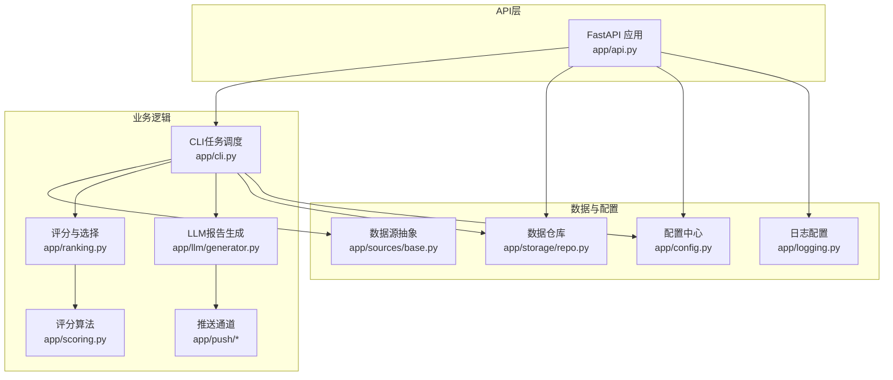
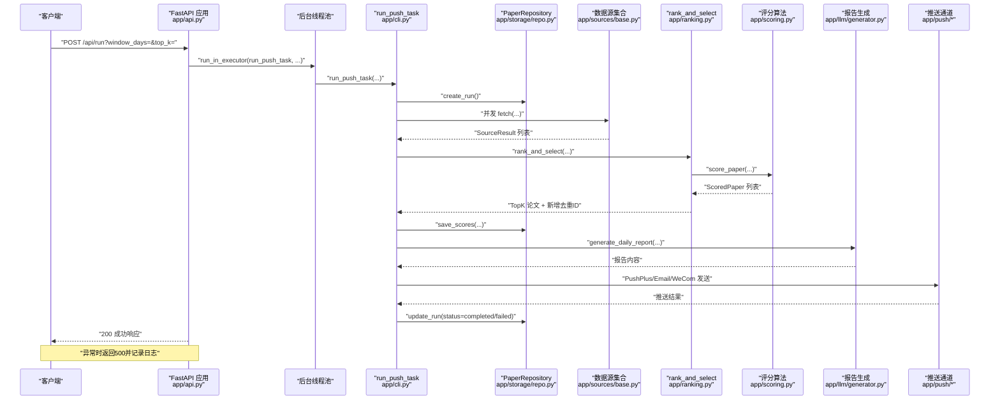
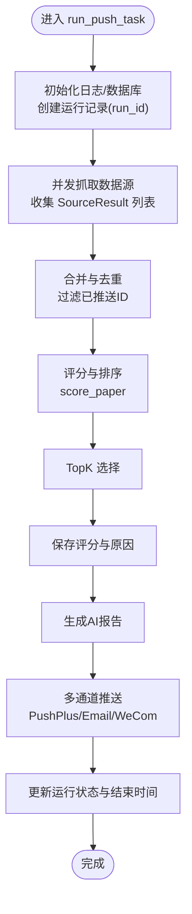
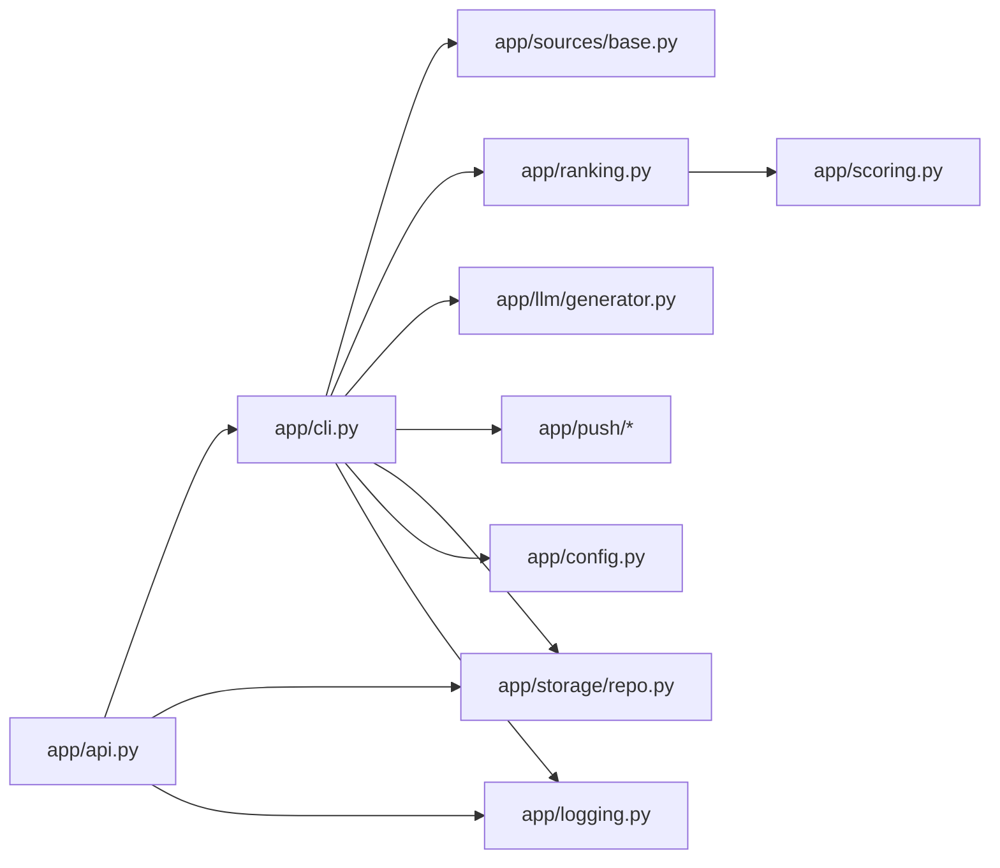

# POST /api/run - 触发推送任务

<cite>
**本文引用的文件**
- [app/api.py](file://app/api.py)
- [app/cli.py](file://app/cli.py)
- [app/ranking.py](file://app/ranking.py)
- [app/scoring.py](file://app/scoring.py)
- [app/llm/generator.py](file://app/llm/generator.py)
- [app/push/pushplus.py](file://app/push/pushplus.py)
- [app/push/email.py](file://app/push/email.py)
- [app/push/wecom.py](file://app/push/wecom.py)
- [app/storage/repo.py](file://app/storage/repo.py)
- [app/sources/base.py](file://app/sources/base.py)
- [app/config.py](file://app/config.py)
- [app/logging.py](file://app/logging.py)
- [README.md](file://README.md)
</cite>

## 目录
1. [简介](#简介)
2. [项目结构](#项目结构)
3. [核心组件](#核心组件)
4. [架构总览](#架构总览)
5. [详细组件分析](#详细组件分析)
6. [依赖关系分析](#依赖关系分析)
7. [性能考量](#性能考量)
8. [故障排查指南](#故障排查指南)
9. [结论](#结论)
10. [附录](#附录)

## 简介
本文件面向外部系统集成，提供 POST /api/run 端点的完整API文档。该接口用于手动触发“每日科研简报”的生成与推送流程，等价于命令行入口 python -m app.cli run 的执行路径。接口支持可选查询参数以覆盖默认抓取窗口与TopK选择策略，并返回任务启动状态。成功时返回200状态码，若内部执行失败则返回500状态码并附带错误详情。

## 项目结构
该系统采用模块化设计，围绕“数据采集—评分—报告生成—推送”四阶段流水线组织代码：
- API层：提供REST接口与异步执行
- CLI层：提供命令行入口与定时任务
- 数据采集：多数据源适配器（抽象基类 + 具体实现）
- 评分与选择：统一去重、评分、排序与TopK选择
- 报告生成：基于LLM的结构化报告生成
- 推送：PushPlus、邮件、企业微信三通道
- 存储：SQLite持久化与运行历史、评分、推送记录
- 配置与日志：集中式配置与结构化日志

图表来源
- [app/api.py](file://app/api.py#L1-L88)
- [app/cli.py](file://app/cli.py#L1-L250)
- [app/ranking.py](file://app/ranking.py#L1-L109)
- [app/scoring.py](file://app/scoring.py#L1-L95)
- [app/llm/generator.py](file://app/llm/generator.py#L1-L151)
- [app/push/pushplus.py](file://app/push/pushplus.py#L1-L54)
- [app/storage/repo.py](file://app/storage/repo.py#L1-L258)
- [app/sources/base.py](file://app/sources/base.py#L1-L53)
- [app/config.py](file://app/config.py#L1-L134)
- [app/logging.py](file://app/logging.py#L1-L41)

章节来源
- [README.md](file://README.md#L59-L63)

## 核心组件
- 接口定义与路由：位于 FastAPI 应用中，提供 POST /api/run，接收可选参数 window_days、top_k，并通过线程池在后台执行任务
- 任务执行器：run_push_task 实现完整的流水线，包括初始化数据库、创建运行记录、并发抓取、合并去重、评分、TopK选择、保存评分、生成报告、多通道推送、更新运行状态
- 数据源抽象：BaseSource 定义统一抓取契约，具体实现负责各自数据源的API调用与结果封装
- 评分与选择：rank_and_select 负责合并、去重、评分、排序与TopK选择
- 报告生成：generate_daily_report 基于DeepSeek API生成结构化报告
- 推送通道：PushPlusSender、EmailSender、WeComSender 分别对接不同推送渠道
- 存储：PaperRepository 提供运行记录、评分、推送记录的CRUD与查询能力
- 配置与日志：Config 统一读取环境变量，setup_logging 提供结构化日志输出

章节来源
- [app/api.py](file://app/api.py#L33-L44)
- [app/cli.py](file://app/cli.py#L23-L149)
- [app/ranking.py](file://app/ranking.py#L46-L109)
- [app/scoring.py](file://app/scoring.py#L10-L95)
- [app/llm/generator.py](file://app/llm/generator.py#L14-L151)
- [app/push/pushplus.py](file://app/push/pushplus.py#L12-L54)
- [app/storage/repo.py](file://app/storage/repo.py#L60-L112)
- [app/config.py](file://app/config.py#L1-L134)
- [app/logging.py](file://app/logging.py#L9-L34)

## 架构总览
POST /api/run 的调用链如下：
- 客户端发起请求
- API 层接收请求并校验异常
- API 层在后台线程池中调用 run_push_task
- run_push_task 完整执行流水线：抓取→去重→评分→TopK→保存评分→生成报告→多通道推送→更新运行状态
- API 层返回任务启动响应或异常

图表来源
- [app/api.py](file://app/api.py#L33-L44)
- [app/cli.py](file://app/cli.py#L23-L149)
- [app/storage/repo.py](file://app/storage/repo.py#L60-L112)
- [app/sources/base.py](file://app/sources/base.py#L9-L30)
- [app/ranking.py](file://app/ranking.py#L46-L109)
- [app/scoring.py](file://app/scoring.py#L10-L95)
- [app/llm/generator.py](file://app/llm/generator.py#L14-L151)
- [app/push/pushplus.py](file://app/push/pushplus.py#L12-L54)

## 详细组件分析

### 接口定义与行为
- HTTP 方法与路径：POST /api/run
- 请求头要求：无需特殊头，但建议 Content-Type: application/json（即使无请求体）
- 可选查询参数：
  - window_days：抓取窗口天数（覆盖默认值）
  - top_k：TopK选择数量（覆盖默认值）
- 请求体：无
- 成功响应：
  - 状态码：200
  - 响应体：包含 status 字段（字符串）与 message 字段（字符串），表示任务已启动
- 错误响应：
  - 状态码：500
  - 响应体：包含 detail 字段（字符串），为异常信息

章节来源
- [app/api.py](file://app/api.py#L33-L44)

### 等效性说明：CLI 与 API
- CLI 入口：python -m app.cli run
- API 等效：POST /api/run
- 参数映射：
  - CLI 的 --window-days 对应 API 的 window_days
  - CLI 的 --top-k 对应 API 的 top_k
- 执行模式：两者均调用 run_push_task，走相同的流水线

章节来源
- [README.md](file://README.md#L30-L46)
- [app/api.py](file://app/api.py#L33-L44)
- [app/cli.py](file://app/cli.py#L215-L245)

### 内部调用链详解
- 初始化与运行记录
  - 初始化日志与数据库
  - 创建运行记录，返回 run_id
- 数据采集
  - 定义数据源集合（含不同抓取窗口）
  - 并发抓取，收集 SourceResult 列表
  - 对失败的数据源记录错误并继续
- 合并与选择
  - 合并所有论文
  - 基于去重ID集合过滤已推送论文
  - 评分：score_paper
  - 排序并选择TopK
- 评分持久化
  - 保存评分与原因
- 报告生成
  - generate_daily_report 基于LLM生成报告
- 推送
  - PushPlusSender、EmailSender、WeComSender 依次尝试
  - 记录每次推送结果
- 状态更新
  - 根据是否至少一次成功，将运行状态标记为 completed 或 failed
  - 记录结束时间

图表来源
- [app/cli.py](file://app/cli.py#L23-L149)
- [app/ranking.py](file://app/ranking.py#L46-L109)
- [app/scoring.py](file://app/scoring.py#L10-L95)
- [app/llm/generator.py](file://app/llm/generator.py#L14-L151)
- [app/push/pushplus.py](file://app/push/pushplus.py#L12-L54)
- [app/storage/repo.py](file://app/storage/repo.py#L60-L112)

章节来源
- [app/cli.py](file://app/cli.py#L23-L149)
- [app/ranking.py](file://app/ranking.py#L46-L109)
- [app/scoring.py](file://app/scoring.py#L10-L95)
- [app/llm/generator.py](file://app/llm/generator.py#L14-L151)
- [app/push/pushplus.py](file://app/push/pushplus.py#L12-L54)
- [app/storage/repo.py](file://app/storage/repo.py#L60-L112)

### 错误处理与日志
- API 层：
  - 在后台线程池中执行任务，异常捕获并记录日志，向上抛出HTTP 500
- CLI 层：
  - 任务执行期间的异常被捕获，记录错误并更新运行状态为 failed
  - 数据源抓取失败时记录警告并继续处理其他数据源
- 日志：
  - 结构化日志输出到控制台与文件，级别由配置决定
  - 关键节点均有日志记录，便于故障定位

章节来源
- [app/api.py](file://app/api.py#L33-L44)
- [app/cli.py](file://app/cli.py#L145-L149)
- [app/ranking.py](file://app/ranking.py#L70-L85)
- [app/logging.py](file://app/logging.py#L9-L34)

### 响应格式与字段说明
- 成功响应（200）：
  - status：字符串，固定为 "success"
  - message：字符串，固定为 "任务已启动"
- 失败响应（500）：
  - detail：字符串，异常信息

注意：当前实现返回的是任务启动状态，而非运行ID、状态、时间戳等字段。若需扩展，可在 API 层返回 run_id，并在后续接口中提供运行历史与评分详情查询。

章节来源
- [app/api.py](file://app/api.py#L33-L44)

### 集成示例（curl 与 Python requests）
- curl 示例（无参数）：
  - curl -X POST "http://localhost:8000/api/run" -H "Content-Type: application/json"
- curl 示例（自定义参数）：
  - curl -X POST "http://localhost:8000/api/run?window_days=14&top_k=10" -H "Content-Type: application/json"
- Python requests 示例（无参数）：
  - requests.post("http://localhost:8000/api/run", headers={"Content-Type": "application/json"})
- Python requests 示例（自定义参数）：
  - requests.post("http://localhost:8000/api/run", params={"window_days": 14, "top_k": 10}, headers={"Content-Type": "application/json"})

章节来源
- [app/api.py](file://app/api.py#L33-L44)
- [README.md](file://README.md#L47-L63)

## 依赖关系分析
- API 层依赖 CLI 任务执行器与存储模块
- CLI 任务依赖数据源抽象、评分与选择、LLM生成、推送通道、存储与配置
- 存储模块依赖配置与模型定义
- 日志模块被多处使用，贯穿全链路

图表来源
- [app/api.py](file://app/api.py#L1-L88)
- [app/cli.py](file://app/cli.py#L1-L250)
- [app/sources/base.py](file://app/sources/base.py#L1-L53)
- [app/ranking.py](file://app/ranking.py#L1-L109)
- [app/scoring.py](file://app/scoring.py#L1-L95)
- [app/llm/generator.py](file://app/llm/generator.py#L1-L151)
- [app/push/pushplus.py](file://app/push/pushplus.py#L1-L54)
- [app/storage/repo.py](file://app/storage/repo.py#L1-L258)
- [app/config.py](file://app/config.py#L1-L134)
- [app/logging.py](file://app/logging.py#L1-L41)

## 性能考量
- 并发抓取：使用线程池并发访问各数据源，缩短整体等待时间
- 去重与评分：在内存中完成，避免多次I/O；TopK选择按分数排序后截断
- LLM调用：内置重试与等待机制，降低瞬时失败概率
- 存储：批量写入，减少事务开销；运行记录包含开始/结束时间，便于性能分析

[本节为通用性能讨论，不直接分析具体文件]

## 故障排查指南
- 常见问题与定位要点：
  - 配置缺失：DEEPSEEK_API_KEY、PUBMED_EMAIL 未设置会导致任务失败
  - 数据源异常：单个数据源失败不会阻断整体流程，但会在日志中记录警告
  - LLM调用失败：重试机制会自动重试，最终失败会记录错误
  - 推送失败：多通道依次尝试，任一成功即视为成功；全部失败会记录错误
- 定位步骤：
  - 查看日志文件（由配置决定路径与级别）
  - 使用 GET /api/runs 查询最近运行历史
  - 使用 GET /api/runs/{run_id}/scores 获取某次运行的评分详情
- 建议：
  - 在生产环境启用更细粒度的日志级别
  - 对关键环节增加监控与告警

章节来源
- [app/config.py](file://app/config.py#L122-L131)
- [app/ranking.py](file://app/ranking.py#L70-L85)
- [app/llm/generator.py](file://app/llm/generator.py#L118-L149)
- [app/push/pushplus.py](file://app/push/pushplus.py#L20-L50)
- [app/storage/repo.py](file://app/storage/repo.py#L206-L258)
- [app/logging.py](file://app/logging.py#L9-L34)

## 结论
POST /api/run 提供了与 CLI 等效的手动触发能力，适合外部系统集成与临时执行场景。其内部调用链清晰、模块职责明确，具备良好的可维护性与可观测性。建议在生产环境中结合运行历史与评分详情接口进行持续监控与优化。

[本节为总结性内容，不直接分析具体文件]

## 附录

### API 定义一览
- POST /api/run
  - 请求头：Content-Type: application/json（建议）
  - 查询参数：
    - window_days：整数，可选
    - top_k：整数，可选
  - 请求体：无
  - 成功响应（200）：{"status": "success", "message": "任务已启动"}
  - 失败响应（500）：{"detail": "<异常信息>"}

章节来源
- [app/api.py](file://app/api.py#L33-L44)
- [README.md](file://README.md#L59-L63)

### 运行历史与评分详情接口（辅助定位）
- GET /api/runs
  - 查询参数：limit（默认10）
  - 成功响应（200）：{"status": "success", "data": [...]}
- GET /api/runs/{run_id}/scores
  - 成功响应（200）：{"status": "success", "data": [...]}
  
章节来源
- [app/api.py](file://app/api.py#L46-L68)
- [app/storage/repo.py](file://app/storage/repo.py#L206-L258)