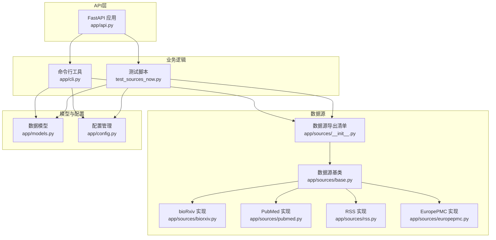
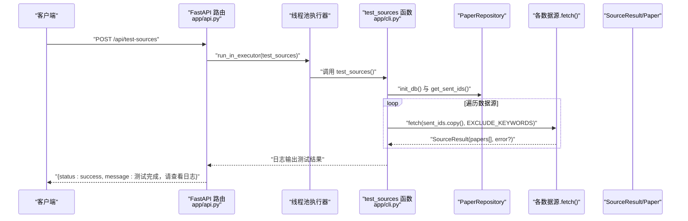
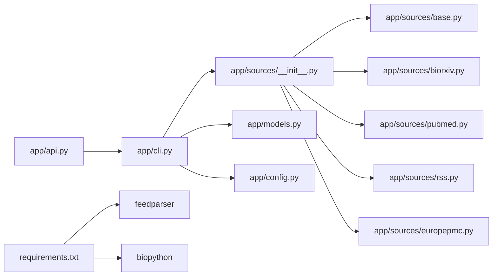

# POST /api/test-sources - 测试数据源连通性

<cite>
**本文引用的文件**
- [app/api.py](file://app/api.py)
- [app/cli.py](file://app/cli.py)
- [test_sources_now.py](file://test_sources_now.py)
- [app/sources/__init__.py](file://app/sources/__init__.py)
- [app/sources/base.py](file://app/sources/base.py)
- [app/sources/biorxiv.py](file://app/sources/biorxiv.py)
- [app/sources/pubmed.py](file://app/sources/pubmed.py)
- [app/sources/rss.py](file://app/sources/rss.py)
- [app/sources/europepmc.py](file://app/sources/europepmc.py)
- [app/models.py](file://app/models.py)
- [app/config.py](file://app/config.py)
- [README.md](file://README.md)
- [requirements.txt](file://requirements.txt)
</cite>

## 目录
1. [简介](#简介)
2. [项目结构](#项目结构)
3. [核心组件](#核心组件)
4. [架构总览](#架构总览)
5. [详细组件分析](#详细组件分析)
6. [依赖关系分析](#依赖关系分析)
7. [性能考量](#性能考量)
8. [故障排查指南](#故障排查指南)
9. [结论](#结论)
10. [附录](#附录)

## 简介
本文档面向POST /api/test-sources端点，详细说明其用途、行为、请求与响应格式、与命令行脚本的关系，以及在部署后验证与日常维护中的价值。该接口用于测试所有配置的数据源（如bioRxiv、PubMed、RSS、Europe PMC、ScienceNews、GitHub、SemanticScholar）的实时连通性与响应情况，返回各数据源的测试结果（成功/失败）、抓取到的论文数量等信息。接口本身不接收请求体参数，但其行为与命令行脚本“test-sources”完全一致，便于在生产环境中通过HTTP接口进行连通性验证与故障排查。

## 项目结构
该API服务采用FastAPI框架，核心入口位于app/api.py；数据源实现位于app/sources目录；测试逻辑同时存在于命令行脚本test_sources_now.py与app/cli.py中；数据模型与配置分别位于app/models.py与app/config.py。

图表来源
- [app/api.py](file://app/api.py#L70-L80)
- [app/cli.py](file://app/cli.py#L170-L214)
- [test_sources_now.py](file://test_sources_now.py#L18-L43)
- [app/sources/__init__.py](file://app/sources/__init__.py#L1-L23)
- [app/sources/base.py](file://app/sources/base.py#L1-L53)
- [app/sources/biorxiv.py](file://app/sources/biorxiv.py#L1-L96)
- [app/sources/pubmed.py](file://app/sources/pubmed.py#L1-L139)
- [app/sources/rss.py](file://app/sources/rss.py#L1-L85)
- [app/sources/europepmc.py](file://app/sources/europepmc.py#L1-L72)
- [app/models.py](file://app/models.py#L65-L77)
- [app/config.py](file://app/config.py#L1-L134)

章节来源
- [app/api.py](file://app/api.py#L1-L88)
- [README.md](file://README.md#L59-L63)

## 核心组件
- API端点：POST /api/test-sources，负责触发数据源测试流程，返回通用成功/失败提示。
- 测试执行器：app/cli.py中的test_sources函数，负责遍历所有数据源并调用其fetch方法，收集结果。
- 数据源基类与实现：BaseSource定义统一接口；具体实现包括BioRxivSource、PubMedSource、RSSSource、EuropePMCSource等。
- 数据模型：SourceResult封装单个数据源的抓取结果，包含source_name、papers、error字段；Paper定义论文对象。
- 配置：Config集中管理关键词、窗口天数、API密钥等，影响测试行为。

章节来源
- [app/api.py](file://app/api.py#L70-L80)
- [app/cli.py](file://app/cli.py#L170-L214)
- [app/sources/base.py](file://app/sources/base.py#L1-L53)
- [app/models.py](file://app/models.py#L65-L77)
- [app/config.py](file://app/config.py#L1-L134)

## 架构总览
POST /api/test-sources的工作流如下：
- 客户端向 /api/test-sources 发起POST请求。
- FastAPI路由触发异步执行，通过线程池调用app/cli.py中的test_sources函数。
- test_sources函数初始化数据库与仓库，加载历史已推送ID，遍历所有数据源实例，逐一调用其fetch方法。
- 每个数据源的fetch返回SourceResult，其中success()用于判断是否成功，papers长度表示抓取到的论文数量。
- 测试完成后，API返回通用的成功提示，实际结果与错误信息通过日志输出。

图表来源
- [app/api.py](file://app/api.py#L70-L80)
- [app/cli.py](file://app/cli.py#L170-L214)
- [app/models.py](file://app/models.py#L65-L77)

## 详细组件分析

### API端点：POST /api/test-sources
- 请求方法与路径：POST /api/test-sources
- 请求体：无（无请求体参数）
- 响应体：
  - status: 字符串，固定为 "success"
  - message: 字符串，提示测试已完成，请查看日志
- 异常：若执行过程中发生异常，将抛出HTTP 500并返回错误详情
- 行为说明：该端点通过线程池调用app/cli.py中的test_sources函数，实现与命令行脚本一致的测试流程。

章节来源
- [app/api.py](file://app/api.py#L70-L80)

### 测试执行器：test_sources（app/cli.py）
- 初始化：初始化数据库、创建PaperRepository、加载历史已推送ID集合
- 遍历数据源：按顺序实例化各数据源并调用fetch，收集SourceResult
- 结果聚合：根据SourceResult.success()判断成功/失败，统计papers数量
- 输出：通过日志打印每个数据源的状态与数量，最终汇总

章节来源
- [app/cli.py](file://app/cli.py#L170-L214)

### 数据源基类与实现
- 基类：BaseSource定义抽象fetch接口与通用的去重ID生成逻辑
- 具体实现：
  - BioRxivSource：按日期窗口分页抓取，放宽关键词与分类匹配条件
  - PubMedSource：依赖Biopython，按主题组合查询，提取日期与DOI
  - RSSSource：依赖feedparser，抓取多家顶级期刊RSS，放宽匹配条件
  - EuropePMCSource：基于EBI接口查询，按日期窗口与关键词匹配

章节来源
- [app/sources/base.py](file://app/sources/base.py#L1-L53)
- [app/sources/biorxiv.py](file://app/sources/biorxiv.py#L1-L96)
- [app/sources/pubmed.py](file://app/sources/pubmed.py#L1-L139)
- [app/sources/rss.py](file://app/sources/rss.py#L1-L85)
- [app/sources/europepmc.py](file://app/sources/europepmc.py#L1-L72)

### 数据模型与配置
- SourceResult：包含source_name、papers、error；提供success()辅助判断
- Paper：包含title、abstract、date、source、doi、link等字段
- Config：集中管理关键词、窗口天数、API密钥、邮箱等配置项

章节来源
- [app/models.py](file://app/models.py#L65-L77)
- [app/config.py](file://app/config.py#L1-L134)

### 与命令行脚本的关系
- 命令行脚本test_sources_now.py与app/cli.py中的test_sources函数均实现了相同的数据源遍历与测试逻辑
- API端点通过线程池调用app/cli.py中的test_sources，确保API与CLI行为一致
- README中提供了命令行方式的测试命令，API方式与之等价

章节来源
- [test_sources_now.py](file://test_sources_now.py#L18-L43)
- [app/cli.py](file://app/cli.py#L170-L214)
- [README.md](file://README.md#L37-L41)

## 依赖关系分析
- API依赖：app/api.py依赖app/cli.py中的test_sources函数
- CLI依赖：app/cli.py依赖app/sources导出的所有数据源类
- 数据源依赖：各数据源实现依赖app/models.py中的Paper与SourceResult，app/config.py中的配置
- 可选依赖：feedparser（RSS）、biopython（PubMed）在requirements.txt中标注

图表来源
- [app/api.py](file://app/api.py#L70-L80)
- [app/cli.py](file://app/cli.py#L1-L169)
- [app/sources/__init__.py](file://app/sources/__init__.py#L1-L23)
- [app/sources/base.py](file://app/sources/base.py#L1-L53)
- [app/sources/biorxiv.py](file://app/sources/biorxiv.py#L1-L96)
- [app/sources/pubmed.py](file://app/sources/pubmed.py#L1-L139)
- [app/sources/rss.py](file://app/sources/rss.py#L1-L85)
- [app/sources/europepmc.py](file://app/sources/europepmc.py#L1-L72)
- [app/models.py](file://app/models.py#L65-L77)
- [app/config.py](file://app/config.py#L1-L134)
- [requirements.txt](file://requirements.txt#L1-L21)

章节来源
- [requirements.txt](file://requirements.txt#L1-L21)
- [app/api.py](file://app/api.py#L70-L80)
- [app/cli.py](file://app/cli.py#L1-L169)

## 性能考量
- 并发与阻塞：API端点通过线程池执行测试，避免阻塞事件循环；但测试涉及网络请求与外部API调用，整体耗时取决于各数据源的可用性与响应速度
- 窗口天数：不同数据源可能有不同的窗口天数配置，影响抓取范围与耗时
- 可选依赖缺失：若缺少feedparser或biopython，对应数据源将直接返回错误，不会进行网络请求，从而减少等待时间
- 日志级别：建议在生产环境中将日志级别设为INFO或更高，以便快速定位问题

[本节为通用性能讨论，无需列出章节来源]

## 故障排查指南
- 快速定位数据源问题
  - 查看API返回：若返回status为success，说明API层未抛错；具体错误与结果通过日志输出
  - 检查各数据源依赖：若RSS或PubMed无法使用，确认requirements.txt中相应依赖已安装
- 常见错误类型
  - 网络超时或连接失败：检查代理设置、防火墙与目标站点可达性
  - 缺少可选依赖：feedparser或biopython未安装会导致对应数据源测试失败
  - 配置缺失：DEEPSEEK_API_KEY、PUBMED_EMAIL等关键配置未设置可能导致上游功能异常
- 建议排查步骤
  - 使用API端点触发测试，观察日志输出，逐项核对各数据源状态
  - 对于失败的数据源，单独检查其fetch实现与外部API限制
  - 若仅个别数据源失败，优先检查该数据源的网络与依赖；若全部失败，检查系统网络与代理配置

章节来源
- [app/cli.py](file://app/cli.py#L170-L214)
- [app/config.py](file://app/config.py#L122-L131)
- [requirements.txt](file://requirements.txt#L1-L21)

## 结论
POST /api/test-sources端点为部署后的系统健康检查提供了便捷入口。它与命令行脚本test-sources保持一致的行为，能够快速验证所有数据源的连通性与可用性。通过日志输出的详细结果，运维人员可以迅速定位是特定数据源中断还是系统内部问题，从而提升故障排查效率与系统的可维护性。

[本节为总结性内容，无需列出章节来源]

## 附录

### curl示例
以下curl命令用于触发测试：
- 基本用法
  - curl -X POST http://localhost:8000/api/test-sources
- 指定主机与端口
  - curl -X POST http://127.0.0.1:8000/api/test-sources
- 指定域名
  - curl -X POST https://your-domain.com/api/test-sources

章节来源
- [README.md](file://README.md#L59-L63)

### 响应格式说明
- 返回体字段
  - status: 字符串，固定为 "success"
  - message: 字符串，提示测试已完成，请查看日志
- 日志输出
  - API层：记录测试开始与结束、异常信息
  - CLI层：逐个数据源输出测试结果（成功/失败、抓取数量）

章节来源
- [app/api.py](file://app/api.py#L70-L80)
- [app/cli.py](file://app/cli.py#L170-L214)

### 请求体说明
- 该端点不接收请求体参数，无需传入任何JSON或表单数据

章节来源
- [app/api.py](file://app/api.py#L70-L80)

### 与test_sources_now.py的关系
- 两者均实现相同的数据源遍历与测试逻辑，API端点通过线程池调用app/cli.py中的test_sources函数，保证行为一致性

章节来源
- [test_sources_now.py](file://test_sources_now.py#L18-L43)
- [app/cli.py](file://app/cli.py#L170-L214)