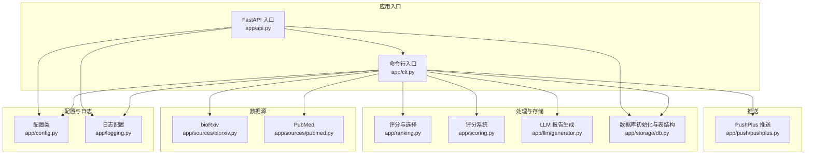
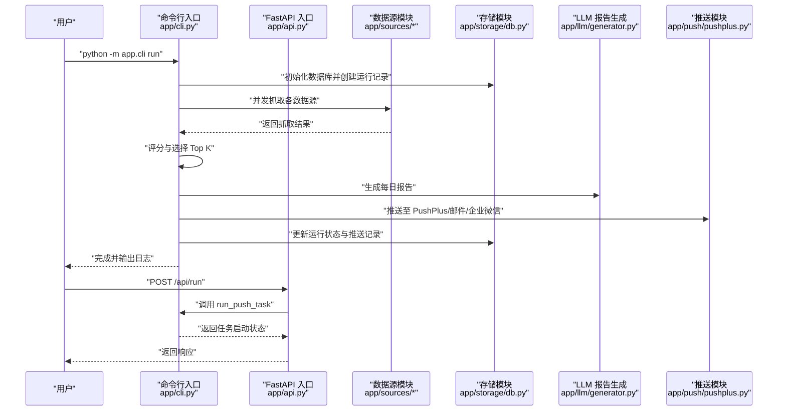
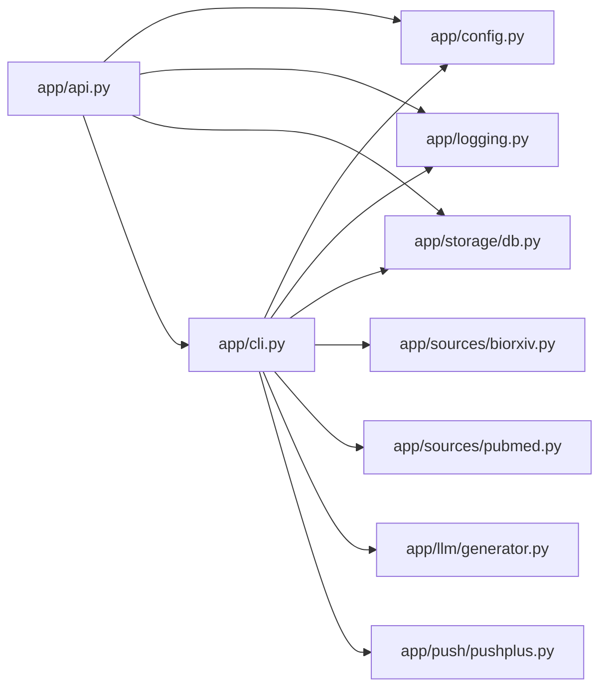

# 快速开始

<cite>
**本文引用的文件**
- [README.md](file://README.md)
- [requirements.txt](file://requirements.txt)
- [app/config.py](file://app/config.py)
- [app/cli.py](file://app/cli.py)
- [app/api.py](file://app/api.py)
- [app/logging.py](file://app/logging.py)
- [app/storage/db.py](file://app/storage/db.py)
- [app/sources/pubmed.py](file://app/sources/pubmed.py)
- [app/sources/biorxiv.py](file://app/sources/biorxiv.py)
- [app/push/pushplus.py](file://app/push/pushplus.py)
</cite>

## 目录
1. [简介](#简介)
2. [项目结构](#项目结构)
3. [核心组件](#核心组件)
4. [架构总览](#架构总览)
5. [详细组件分析](#详细组件分析)
6. [依赖关系分析](#依赖关系分析)
7. [性能考虑](#性能考虑)
8. [故障排查指南](#故障排查指南)
9. [结论](#结论)
10. [附录](#附录)

## 简介
本指南面向首次接触本项目的用户，帮助你在本地环境完成克隆、依赖安装、环境变量配置，并通过 CLI 或 API 方式完成首次运行。你将学会：
- 如何克隆仓库并安装依赖
- 如何创建并填写 .env 环境变量文件
- 如何使用 CLI 命令执行推送任务
- 如何启动 API 服务并通过浏览器访问接口
- 常见问题的排查思路与建议

## 项目结构
项目采用“模块化 + 多入口”的设计：既有命令行入口用于定时任务，也有 FastAPI 入口用于提供管理接口。核心模块包括：
- 配置管理：集中读取环境变量与默认值
- 数据源：从多个来源抓取论文
- 评分与排序：对抓取结果进行评分与选择
- AI 报告生成：基于 LLM 生成每日报告
- 推送：支持 PushPlus、邮件、企业微信
- 存储：SQLite 数据库存储运行记录、评分与推送状态

图表来源
- [app/cli.py](file://app/cli.py#L1-L250)
- [app/api.py](file://app/api.py#L1-L88)
- [app/config.py](file://app/config.py#L1-L134)
- [app/logging.py](file://app/logging.py#L1-L41)
- [app/storage/db.py](file://app/storage/db.py#L1-L134)
- [app/sources/biorxiv.py](file://app/sources/biorxiv.py#L1-L96)
- [app/sources/pubmed.py](file://app/sources/pubmed.py#L1-L139)
- [app/push/pushplus.py](file://app/push/pushplus.py#L1-L54)

章节来源
- [README.md](file://README.md#L1-L134)

## 核心组件
- 配置管理：从环境变量加载关键参数，如 API 密钥、邮箱、推送 token、抓取窗口、Top K 等；并提供校验函数
- CLI 入口：支持 run 与 test-sources 两个子命令，负责并发抓取、评分选择、生成报告、推送与持久化
- API 入口：提供触发任务、查询运行历史、查看评分详情、测试数据源等接口
- 数据源：实现 bioRxiv、PubMed 等数据源的抓取逻辑
- 存储：初始化 SQLite 表结构，记录论文、运行、评分与推送状态
- 推送：封装 PushPlus 推送能力

章节来源
- [app/config.py](file://app/config.py#L1-L134)
- [app/cli.py](file://app/cli.py#L1-L250)
- [app/api.py](file://app/api.py#L1-L88)
- [app/storage/db.py](file://app/storage/db.py#L1-L134)

## 架构总览
下面以“首次运行”为例，展示从 CLI 或 API 触发到最终推送完成的端到端流程。

图表来源
- [app/cli.py](file://app/cli.py#L1-L250)
- [app/api.py](file://app/api.py#L1-L88)
- [app/storage/db.py](file://app/storage/db.py#L1-L134)
- [app/sources/biorxiv.py](file://app/sources/biorxiv.py#L1-L96)
- [app/sources/pubmed.py](file://app/sources/pubmed.py#L1-L139)
- [app/push/pushplus.py](file://app/push/pushplus.py#L1-L54)

## 详细组件分析

### 安装与环境准备
- 克隆仓库后，进入项目根目录
- 安装依赖：使用 pip 安装 requirements.txt 中声明的依赖
- 准备 .env 文件：复制示例文件并填写关键环境变量

章节来源
- [README.md](file://README.md#L14-L26)
- [requirements.txt](file://requirements.txt#L1-L21)

### 配置与环境变量
你需要在 .env 文件中设置以下关键变量（参考 README 的配置说明）：
- DEEPSEEK_API_KEY：用于 LLM 报告生成
- PUBMED_EMAIL：PubMed 查询所需的邮箱
- PUSHPLUS_TOKENS：PushPlus 的 token，多个可用逗号分隔
- 其他可选：DEFAULT_WINDOW_DAYS、EUROPEPMC_WINDOW_DAYS、TOP_K 等

配置类会从环境变量加载这些值，并提供默认值与校验函数。若缺失必填项，CLI 会在启动前报错。

章节来源
- [README.md](file://README.md#L84-L94)
- [app/config.py](file://app/config.py#L1-L134)
- [app/cli.py](file://app/cli.py#L215-L246)

### 首次运行（CLI）
- 执行推送任务：python -m app.cli run
- 测试数据源：python -m app.cli test-sources
- 自定义参数：通过 --window-days 与 --top-k 调整抓取窗口与选择数量

CLI 内部会：
- 初始化数据库并创建运行记录
- 并发抓取多个数据源
- 合并与评分，选择 Top K
- 生成报告并推送
- 更新运行状态与推送记录

章节来源
- [README.md](file://README.md#L28-L46)
- [app/cli.py](file://app/cli.py#L1-L250)

### 首次运行（API）
- 启动服务：python -m app.api 或 uvicorn app.api:app --host 0.0.0.0 --port 8000
- 触发任务：POST /api/run
- 查看历史：GET /api/runs
- 查看评分：GET /api/runs/{run_id}/scores
- 测试数据源：POST /api/test-sources

章节来源
- [README.md](file://README.md#L47-L64)
- [app/api.py](file://app/api.py#L1-L88)

### 数据源与存储
- 数据源：当前实现包含 bioRxiv 与 PubMed 等，均支持按时间窗口与关键词过滤
- 存储：SQLite 初始化包含 papers、runs、scores、pushes、dedup_keys 等表，并建立必要索引

章节来源
- [app/sources/biorxiv.py](file://app/sources/biorxiv.py#L1-L96)
- [app/sources/pubmed.py](file://app/sources/pubmed.py#L1-L139)
- [app/storage/db.py](file://app/storage/db.py#L1-L134)

### 推送与日志
- 推送：PushPlus 支持多 token 群发，失败会记录日志
- 日志：控制台与文件同时输出，级别与文件名来自配置

章节来源
- [app/push/pushplus.py](file://app/push/pushplus.py#L1-L54)
- [app/logging.py](file://app/logging.py#L1-L41)

## 依赖关系分析
- CLI 与 API 共用配置、存储、数据源与推送模块
- API 通过异步线程池调用 CLI 的任务函数，避免阻塞
- 数据源依赖外部库（如 biopython），若未安装则相关功能不可用

图表来源
- [app/cli.py](file://app/cli.py#L1-L250)
- [app/api.py](file://app/api.py#L1-L88)
- [app/config.py](file://app/config.py#L1-L134)
- [app/logging.py](file://app/logging.py#L1-L41)
- [app/storage/db.py](file://app/storage/db.py#L1-L134)
- [app/sources/biorxiv.py](file://app/sources/biorxiv.py#L1-L96)
- [app/sources/pubmed.py](file://app/sources/pubmed.py#L1-L139)
- [app/push/pushplus.py](file://app/push/pushplus.py#L1-L54)

## 性能考虑
- 并发抓取：CLI 使用线程池并发访问多个数据源，提升整体吞吐
- 数据库索引：初始化时创建常用索引，有助于查询与去重
- 日志级别：生产环境建议提高日志级别以减少 IO 开销
- 代理禁用：CLI 启动时会清理代理环境变量，避免网络异常导致超时

章节来源
- [app/cli.py](file://app/cli.py#L57-L78)
- [app/storage/db.py](file://app/storage/db.py#L112-L130)
- [app/logging.py](file://app/logging.py#L1-L41)
- [app/cli.py](file://app/cli.py#L235-L240)

## 故障排查指南
- 依赖安装失败
  - 确认 Python 版本与 pip 正常
  - 若安装 biopython 失败，可先跳过该可选依赖，或单独安装后再重试
  - 参考 requirements.txt 中的依赖声明
- API 密钥无效
  - 检查 DEEPSEEK_API_KEY 是否正确填写
  - 若为空，配置类会提供默认值，但实际调用可能失败
- PubMed 查询失败
  - 确认已安装 biopython，且 PUBMED_EMAIL 已正确设置
  - 若未安装 biopython，PubMed 数据源将不可用
- 端口占用或无法访问
  - 使用 uvicorn 启动时指定不同端口
  - 确保防火墙放行对应端口
- 数据库初始化失败
  - 检查 DB_PATH 权限与磁盘空间
  - 确认 SQLite 可用
- 日志定位问题
  - 查看日志文件与控制台输出，级别由 LOG_LEVEL 控制

章节来源
- [requirements.txt](file://requirements.txt#L1-L21)
- [app/config.py](file://app/config.py#L1-L134)
- [app/sources/pubmed.py](file://app/sources/pubmed.py#L1-L21)
- [app/api.py](file://app/api.py#L82-L88)
- [app/storage/db.py](file://app/storage/db.py#L1-L134)
- [app/logging.py](file://app/logging.py#L1-L41)

## 结论
通过本指南，你可以在本地完成项目的克隆、依赖安装与环境变量配置，并使用 CLI 或 API 完成首次运行。建议先用 CLI 验证数据源与推送链路，再切换到 API 以便集成到更复杂的运维体系中。遇到问题时，优先检查依赖安装、API 密钥与网络连通性，并结合日志定位。

## 附录
- 示例命令与接口请参考 README 的使用方法章节
- 配置项与默认值请参考配置类与 README 的配置说明

章节来源
- [README.md](file://README.md#L28-L94)
- [app/config.py](file://app/config.py#L1-L134)