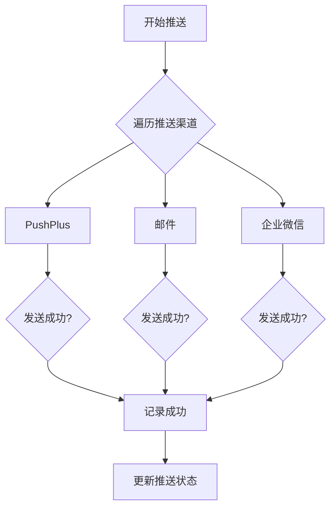
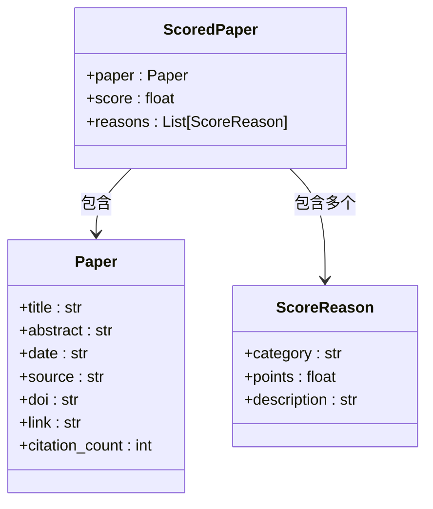

# 扩展开发

<cite>
**本文档引用的文件**  
- [base.py](file://app/sources/base.py)
- [scoring.py](file://app/scoring.py)
- [pushplus.py](file://app/push/pushplus.py)
- [email.py](file://app/push/email.py)
- [wecom.py](file://app/push/wecom.py)
- [config.py](file://app/config.py)
- [models.py](file://app/models.py)
</cite>

## 目录
1. [简介](#简介)
2. [扩展数据源](#扩展数据源)
3. [扩展推送渠道](#扩展推送渠道)
4. [自定义评分规则](#自定义评分规则)
5. [配置与启用](#配置与启用)
6. [最佳实践](#最佳实践)

## 简介
本指南为开发者提供系统扩展开发的详细说明，涵盖如何添加新的学术数据源、集成新的推送渠道以及自定义评分规则。系统采用模块化设计，支持通过继承和配置实现功能扩展，同时确保核心逻辑的稳定性。

## 扩展数据源

系统通过继承 `app/sources/base.py` 中的 `BaseSource` 类来支持新增数据源。开发者可基于此基类实现对 ArXiv 或 IEEE Xplore 等平台的数据抓取。

`BaseSource` 类定义了抽象方法 `fetch`，所有子类必须实现该方法以完成数据获取逻辑。`fetch` 方法接收两个参数：`sent_ids`（已推送论文 ID 集合）用于去重，`exclude_keywords`（排除关键词列表）用于过滤不相关内容。

新数据源需返回 `SourceResult` 对象，包含抓取结果列表和可能的错误信息。系统通过 `get_item_id` 方法生成论文唯一标识，优先级为 DOI > 链接 > 标题+来源。

**Section sources**
- [base.py](file://app/sources/base.py#L1-L53)
- [models.py](file://app/models.py#L66-L77)

## 扩展推送渠道

可通过创建新的推送类来扩展系统支持的推送方式，如钉钉或飞书机器人。推送类需遵循统一接口规范，位于 `app/push/` 目录下，并在 `__init__.py` 中导出。

现有推送实现包括：
- `PushPlusSender`：支持微信 PushPlus 推送
- `EmailSender`：基于 SMTP 的邮件推送
- `WeComSender`：企业微信机器人推送

新推送类应实现 `send(title: str, content: str) -> bool` 方法，返回是否发送成功。建议在初始化时读取配置项，并在发送失败时记录日志以便排查问题。

推送调度器在 `app/cli.py` 中通过并发调用各推送实例完成多渠道分发，任一渠道成功即视为整体推送成功。



**Diagram sources**
- [pushplus.py](file://app/push/pushplus.py#L12-L54)
- [email.py](file://app/push/email.py#L13-L51)
- [wecom.py](file://app/push/wecom.py#L12-L55)
- [cli.py](file://app/cli.py#L114-L137)

**Section sources**
- [pushplus.py](file://app/push/pushplus.py#L1-L54)
- [email.py](file://app/push/email.py#L1-L51)
- [wecom.py](file://app/push/wecom.py#L1-L55)

## 自定义评分规则

评分逻辑位于 `app/scoring.py` 文件中，由 `score_paper` 函数实现。该函数返回 `ScoredPaper` 对象，包含原始论文、总分及评分原因列表，支持可解释性分析。

当前评分维度包括：
- **关键词匹配**：命中核心关键词（如 cryo-em、nitrogen fixation）加分
- **顶刊加分**：发表于 Nature、Science 等顶级期刊额外加分
- **引用数加权**：按引用次数线性加分
- **新鲜度补偿**：近30天内发布的论文按天数递减加分

开发者可通过修改 `scoring.py` 中的关键词列表或新增评分维度来自定义评分策略。例如增加“影响因子加权”或“作者机构权重”等高级规则。



**Diagram sources**
- [scoring.py](file://app/scoring.py#L10-L95)
- [models.py](file://app/models.py#L49-L62)

**Section sources**
- [scoring.py](file://app/scoring.py#L1-L95)
- [models.py](file://app/models.py#L49-L62)

## 配置与启用

所有扩展功能应通过配置文件 `.env` 进行启用和参数设置。新增数据源或推送渠道应在 `config.py` 中添加对应配置项，并提供默认值。

例如，若新增钉钉推送，可在 `config.py` 中添加：
```python
DINGTALK_WEBHOOK_URL = os.getenv("DINGTALK_WEBHOOK_URL", "")
```

配置项应在 `Config` 类中定义，并通过 `os.getenv` 读取环境变量。敏感信息如 API 密钥、Token 应避免硬编码。

系统启动时会自动验证必要配置项（如 `DEEPSEEK_API_KEY`、`PUBMED_EMAIL`），缺失时将报错并终止执行。

**Section sources**
- [config.py](file://app/config.py#L16-L134)

## 最佳实践

1. **继承而非修改**：新增功能优先通过继承实现，避免修改核心文件，降低维护成本。
2. **异常处理**：数据抓取和网络请求必须包含完整异常捕获，防止单点故障导致整个流程中断。
3. **日志记录**：使用 `logging.getLogger(__name__)` 获取模块日志器，关键操作需记录 INFO 级别日志。
4. **去重机制**：利用 `get_item_id` 方法生成唯一标识，确保跨数据源去重准确。
5. **配置驱动**：所有可变参数（如窗口天数、Top-K 数量）应从配置读取，支持灵活调整。
6. **测试验证**：新增数据源后应运行 `python -m app.cli test-sources` 验证其可用性。

遵循以上规范可确保扩展功能与系统良好集成，同时保持代码的可维护性和稳定性。