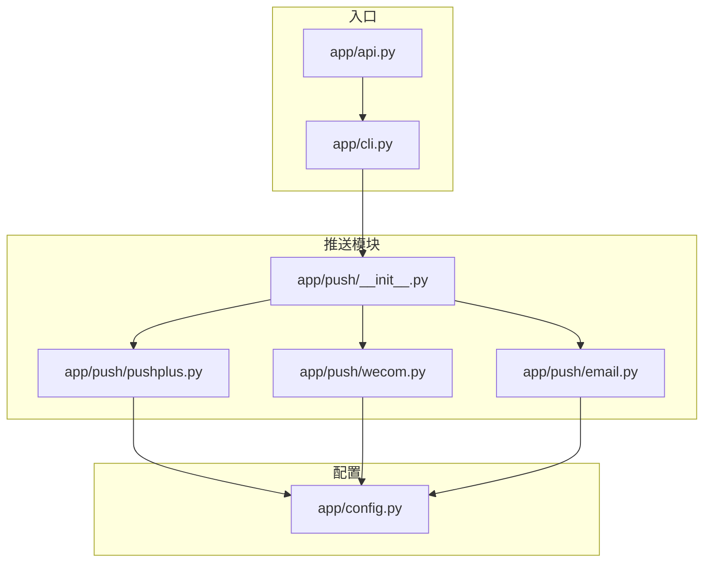
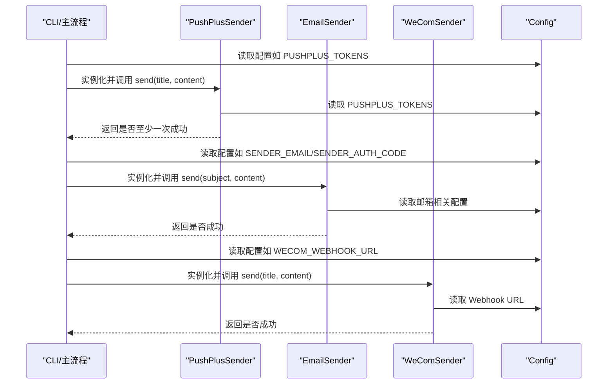
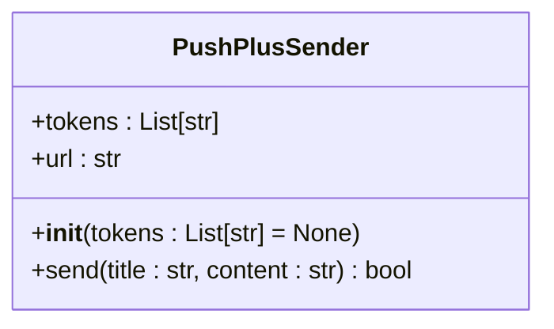
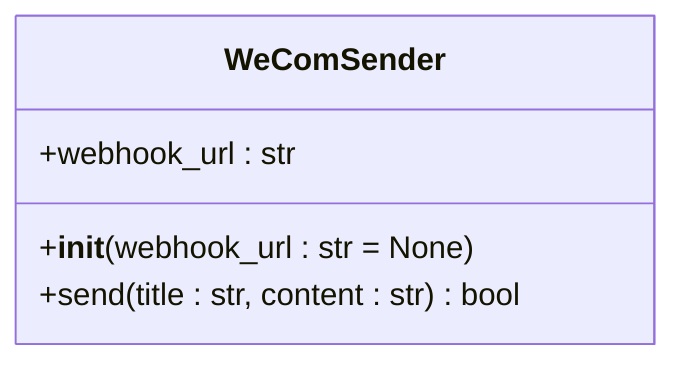
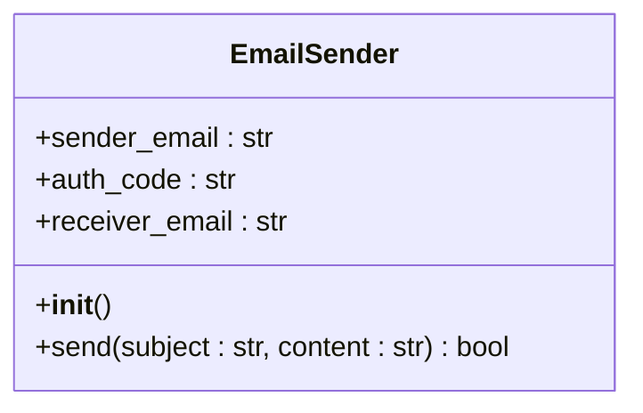
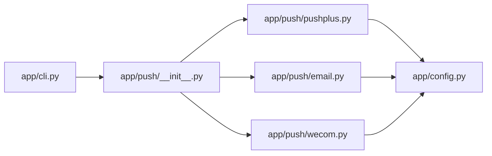

# 扩展推送渠道

<cite>
**本文引用的文件**
- [app/push/__init__.py](file://app/push/__init__.py)
- [app/push/pushplus.py](file://app/push/pushplus.py)
- [app/push/wecom.py](file://app/push/wecom.py)
- [app/push/email.py](file://app/push/email.py)
- [app/config.py](file://app/config.py)
- [app/cli.py](file://app/cli.py)
- [app/api.py](file://app/api.py)
- [README.md](file://README.md)
</cite>

## 目录
1. [简介](#简介)
2. [项目结构](#项目结构)
3. [核心组件](#核心组件)
4. [架构总览](#架构总览)
5. [详细组件分析](#详细组件分析)
6. [依赖关系分析](#依赖关系分析)
7. [性能考量](#性能考量)
8. [故障排查指南](#故障排查指南)
9. [结论](#结论)
10. [附录](#附录)

## 简介
本文件面向希望为系统新增消息推送渠道（如钉钉、飞书、Telegram、Slack 等）的开发者，基于现有推送模块的设计模式，提供从接口约定、配置扩展、主流程集成到最佳实践的完整指南。现有推送模块采用统一接口抽象，通过配置文件动态加载，所有推送类均实现相同的 send 方法签名，便于在主流程中以一致的方式调用。

## 项目结构
推送模块位于 app/push 目录，包含三个现有实现：
- PushPlusSender：基于 PushPlus 的微信推送
- EmailSender：基于 SMTP 的邮件推送
- WeComSender：基于企业微信 Webhook 的机器人推送

推送模块通过 app/push/__init__.py 对外暴露统一的类名，供 CLI/主流程导入使用；配置集中于 app/config.py，通过环境变量或 .env 文件读取。

图表来源
- [app/push/__init__.py](file://app/push/__init__.py#L1-L12)
- [app/push/pushplus.py](file://app/push/pushplus.py#L1-L54)
- [app/push/wecom.py](file://app/push/wecom.py#L1-L55)
- [app/push/email.py](file://app/push/email.py#L1-L51)
- [app/config.py](file://app/config.py#L1-L134)
- [app/cli.py](file://app/cli.py#L1-L250)
- [app/api.py](file://app/api.py#L1-L88)

章节来源
- [app/push/__init__.py](file://app/push/__init__.py#L1-L12)
- [app/push/pushplus.py](file://app/push/pushplus.py#L1-L54)
- [app/push/wecom.py](file://app/push/wecom.py#L1-L55)
- [app/push/email.py](file://app/push/email.py#L1-L51)
- [app/config.py](file://app/config.py#L1-L134)
- [app/cli.py](file://app/cli.py#L1-L250)
- [app/api.py](file://app/api.py#L1-L88)

## 核心组件
- 统一接口抽象：所有推送类均实现 send(self, title: str, content: str) -> bool，返回是否至少一次成功。
- 配置驱动：推送所需的凭据（如 token、webhook、邮箱账号等）从 Config 类读取，支持多值（如 PushPlus 支持多个 token）。
- 异常处理：每个 send 方法内部捕获异常并记录日志，避免单个渠道失败影响整体流程。
- 主流程集成：CLI 中按顺序尝试 PushPlus、Email、WeCom，只要任一成功即标记推送成功，并记录每篇论文的推送状态。

章节来源
- [app/push/pushplus.py](file://app/push/pushplus.py#L1-L54)
- [app/push/wecom.py](file://app/push/wecom.py#L1-L55)
- [app/push/email.py](file://app/push/email.py#L1-L51)
- [app/cli.py](file://app/cli.py#L113-L139)
- [app/config.py](file://app/config.py#L92-L105)

## 架构总览
下图展示了主流程如何调用不同推送器，以及它们如何从配置读取凭据。

图表来源
- [app/cli.py](file://app/cli.py#L113-L139)
- [app/push/pushplus.py](file://app/push/pushplus.py#L12-L54)
- [app/push/email.py](file://app/push/email.py#L13-L51)
- [app/push/wecom.py](file://app/push/wecom.py#L12-L55)
- [app/config.py](file://app/config.py#L92-L105)

## 详细组件分析

### PushPlusSender 分析
- 构造函数初始化：接收 tokens 列表，若未传入则从 Config.PUSHPLUS_TOKENS 读取；设置目标 URL。
- 消息格式封装：将标题、内容、模板类型封装为 JSON。
- HTTP 请求发送：使用 requests.post，设置超时与禁用代理；对响应进行状态检查。
- 错误处理机制：捕获异常并记录日志；统计成功次数，只要至少一次成功即返回 True。

图表来源
- [app/push/pushplus.py](file://app/push/pushplus.py#L12-L54)

章节来源
- [app/push/pushplus.py](file://app/push/pushplus.py#L12-L54)
- [app/config.py](file://app/config.py#L96-L101)

### WeComSender 分析
- 构造函数初始化：接收 webhook_url，若未传入则从 Config.WECOM_WEBHOOK_URL 读取。
- 消息格式封装：使用企业微信 Markdown 格式，将标题与内容拼接为 markdown 内容。
- HTTP 请求发送：使用 requests.post，设置超时；解析 JSON 并检查 errcode。
- 错误处理机制：捕获异常并记录日志；当 errcode 不为 0 或异常时返回 False。

图表来源
- [app/push/wecom.py](file://app/push/wecom.py#L12-L55)

章节来源
- [app/push/wecom.py](file://app/push/wecom.py#L12-L55)
- [app/config.py](file://app/config.py#L103-L104)

### EmailSender 分析
- 构造函数初始化：从 Config 读取发件人邮箱、授权码、收件人邮箱。
- 消息格式封装：使用 MIMEMultipart/MIMEText 组装邮件正文。
- HTTP 请求发送：通过 SMTP 服务器发送邮件（注意：此处为 SMTP 协议，非 HTTP）。
- 错误处理机制：捕获异常并记录日志；当缺少必要配置时直接返回 False。

图表来源
- [app/push/email.py](file://app/push/email.py#L13-L51)

章节来源
- [app/push/email.py](file://app/push/email.py#L13-L51)
- [app/config.py](file://app/config.py#L92-L95)

### 新增推送器实现指南（以钉钉/飞书/Telegram/Slack 为例）

- 设计模式与接口约定
  - 新类命名规范：例如 DingTalkSender、FeishuSender、TelegramSender、SlackSender。
  - 必须实现统一接口：send(self, title: str, content: str) -> bool。
  - 构造函数参数：优先从 Config 读取配置；若外部传入则覆盖默认值。
  - 消息格式：根据目标平台要求封装消息体（如 Markdown、富文本、块级组件等）。
  - HTTP 请求：使用 requests.post，设置合理超时；对响应状态码与业务字段进行校验。
  - 错误处理：捕获异常并记录日志；返回布尔值表示“是否至少一次成功”。

- 配置扩展步骤
  - 在 app/config.py 中添加新的配置项：
    - 如需多值（如多个机器人 token），使用逗号分隔字符串并拆分为列表。
    - 如需单值（如 webhook URL 或 API Key），使用字符串或空字符串占位。
  - 在 README.md 的配置说明部分补充新增配置项的说明与示例。

- 主流程安全注册步骤
  - 在 app/push/__init__.py 中导出新类，并加入 __all__ 列表。
  - 在 app/cli.py 中导入新类并在 run_push_task 中按顺序调用 send，确保即使某个渠道失败也不会阻断其他渠道。
  - 若通过 API 调用，可在 app/api.py 的触发任务接口中同样调用新推送器。

- 最佳实践清单
  - 异常重试：对网络波动导致的瞬时失败，可在 send 内部增加有限次重试（指数退避更佳），但需避免无限重试导致阻塞。
  - 消息长度截断：在发送前计算字符长度，超过平台限制时截断或摘要化，保证消息可送达。
  - 敏感信息脱敏：日志中避免打印 token/webhook/API Key 等敏感信息，仅打印必要的摘要或提示。
  - 凭证加密存储：建议将敏感配置存放在受控的密钥管理服务或加密的 .env 文件中，避免明文泄露。
  - 速率限制应对：遵守各平台的速率限制，必要时增加延迟或队列控制；对批量发送场景考虑分批与去重。
  - 平台差异处理：不同平台的消息模板、字段名称、错误码不同，需分别处理；对返回的业务字段进行严格校验。

- API/CLI 启用与验证
  - CLI 启用：新增推送器后，在 app/cli.py 中按现有模式注册调用，运行 python -m app.cli run 验证。
  - API 启用：在 app/api.py 的触发任务接口中同样调用新推送器，访问 POST /api/run 验证。
  - 成功率验证：观察日志输出与数据库中的推送记录，确认每条论文的推送状态更新。

章节来源
- [app/push/__init__.py](file://app/push/__init__.py#L1-L12)
- [app/cli.py](file://app/cli.py#L113-L139)
- [app/api.py](file://app/api.py#L33-L44)
- [app/config.py](file://app/config.py#L92-L105)
- [README.md](file://README.md#L84-L101)

## 依赖关系分析
- 模块耦合
  - 推送器与配置模块耦合：通过 Config 读取凭据，降低硬编码风险。
  - 主流程与推送器耦合：通过统一接口调用，便于扩展与替换。
- 可能的循环依赖
  - 当前结构清晰，无明显循环依赖迹象。
- 外部依赖
  - requests 用于 HTTP 请求；logging 用于日志记录；smtplib 用于邮件发送。

图表来源
- [app/cli.py](file://app/cli.py#L1-L250)
- [app/push/__init__.py](file://app/push/__init__.py#L1-L12)
- [app/push/pushplus.py](file://app/push/pushplus.py#L1-L54)
- [app/push/email.py](file://app/push/email.py#L1-L51)
- [app/push/wecom.py](file://app/push/wecom.py#L1-L55)
- [app/config.py](file://app/config.py#L1-L134)

章节来源
- [app/cli.py](file://app/cli.py#L1-L250)
- [app/push/__init__.py](file://app/push/__init__.py#L1-L12)
- [app/push/pushplus.py](file://app/push/pushplus.py#L1-L54)
- [app/push/email.py](file://app/push/email.py#L1-L51)
- [app/push/wecom.py](file://app/push/wecom.py#L1-L55)
- [app/config.py](file://app/config.py#L1-L134)

## 性能考量
- 并发与超时：现有主流程对数据源抓取使用线程池并发，推送阶段按顺序执行。若新增高延迟渠道，建议在主流程中引入并发或异步队列，同时设置合理的超时与重试。
- 批量发送：对支持批量的平台（如企业微信群机器人），尽量合并消息减少请求次数。
- 日志开销：避免在高频路径中输出大量日志，必要时调整日志级别。

## 故障排查指南
- 配置问题
  - 确认 .env 中新增配置项已正确填写；在 CLI 启动时会调用 Config.validate 进行基础校验。
- 网络与代理
  - 现有代码在 PushPlusSender 中显式禁用代理，若遇到网络问题，检查代理环境变量与防火墙设置。
- 平台返回码
  - WeComSender 对 errcode 进行校验，若返回非 0，需根据平台文档定位原因（如权限、URL 无效、消息格式不正确）。
- 日志定位
  - 查看 INFO/ERROR 级别日志，关注“发送失败”、“未配置”等关键字，结合具体渠道的日志上下文定位问题。

章节来源
- [app/config.py](file://app/config.py#L122-L131)
- [app/push/pushplus.py](file://app/push/pushplus.py#L32-L41)
- [app/push/wecom.py](file://app/push/wecom.py#L42-L51)
- [app/cli.py](file://app/cli.py#L228-L233)

## 结论
通过统一接口与配置驱动的设计，系统能够以最小改动安全地集成新的推送渠道。建议在新增渠道时严格遵循接口约定、完善配置项、在主流程中稳妥注册，并落实异常重试、消息截断、敏感信息脱敏与速率限制等最佳实践，确保推送链路的稳定性与安全性。

## 附录

### 新增推送器的步骤清单
- 在 app/push 下新增文件并实现类：
  - 类名：XXXSender
  - 构造函数：从 Config 读取配置，支持外部传参覆盖
  - send：封装消息、发送请求、校验返回、记录日志、返回布尔值
- 在 app/push/__init__.py 导出类并加入 __all__
- 在 app/config.py 添加配置项（多值或单值）
- 在 README.md 补充配置说明
- 在 app/cli.py 中导入并注册调用
- 在 app/api.py 中按需在触发任务接口中调用
- 运行 CLI 或 API 验证推送成功与日志输出

章节来源
- [app/push/__init__.py](file://app/push/__init__.py#L1-L12)
- [app/push/pushplus.py](file://app/push/pushplus.py#L12-L54)
- [app/push/wecom.py](file://app/push/wecom.py#L12-L55)
- [app/push/email.py](file://app/push/email.py#L13-L51)
- [app/config.py](file://app/config.py#L92-L105)
- [app/cli.py](file://app/cli.py#L113-L139)
- [app/api.py](file://app/api.py#L33-L44)
- [README.md](file://README.md#L84-L101)