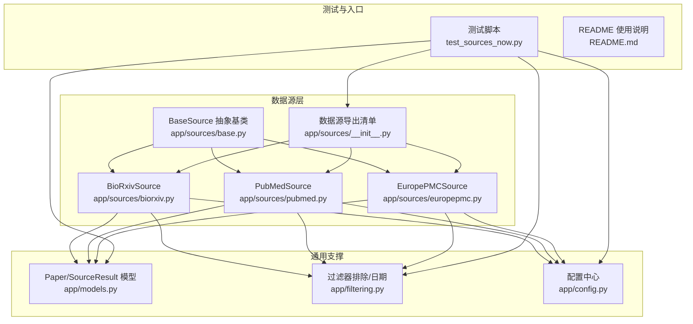
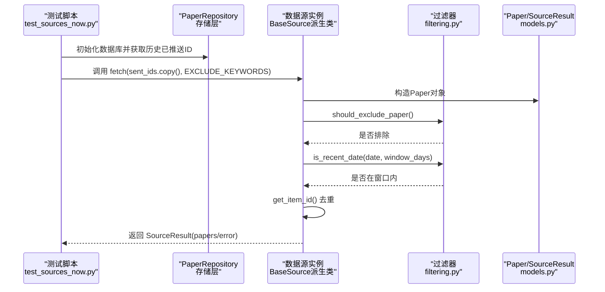
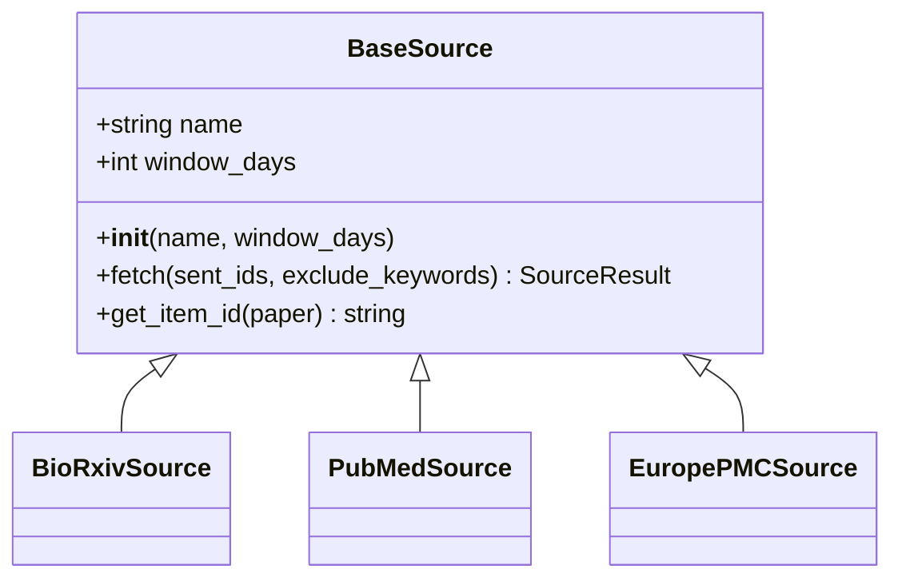
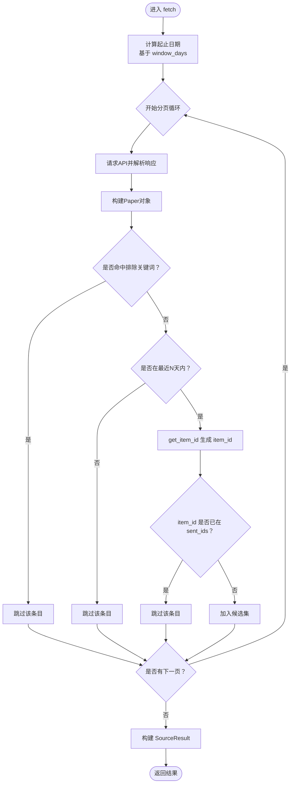
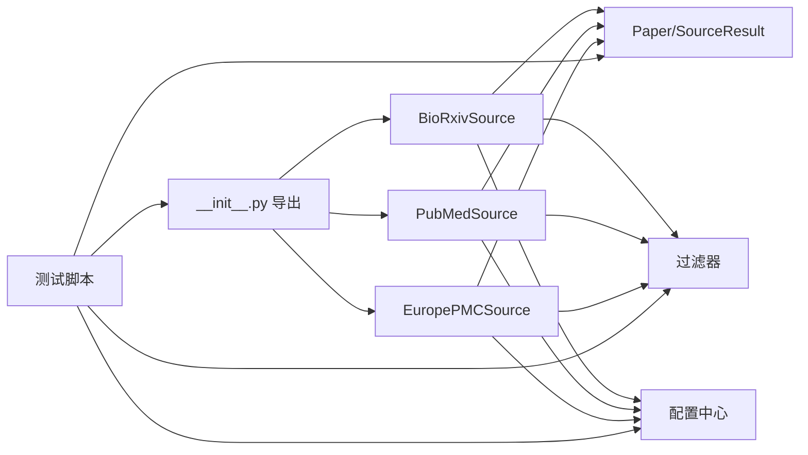

# 添加新的数据源

<cite>
**本文引用的文件**
- [app/sources/base.py](file://app/sources/base.py)
- [app/sources/biorxiv.py](file://app/sources/biorxiv.py)
- [app/sources/pubmed.py](file://app/sources/pubmed.py)
- [app/sources/europepmc.py](file://app/sources/europepmc.py)
- [app/sources/__init__.py](file://app/sources/__init__.py)
- [app/models.py](file://app/models.py)
- [app/filtering.py](file://app/filtering.py)
- [app/config.py](file://app/config.py)
- [test_sources_now.py](file://test_sources_now.py)
- [README.md](file://README.md)
</cite>

## 目录
1. [简介](#简介)
2. [项目结构](#项目结构)
3. [核心组件](#核心组件)
4. [架构总览](#架构总览)
5. [详细组件分析](#详细组件分析)
6. [依赖关系分析](#依赖关系分析)
7. [性能考量](#性能考量)
8. [故障排查指南](#故障排查指南)
9. [结论](#结论)
10. [附录](#附录)

## 简介
本指南面向希望扩展“智能论文推送系统”的开发者，目标是帮助你在不破坏既有架构的前提下，通过继承 app/sources/base.py 中的 BaseSource 抽象基类，快速添加新的学术数据源（如 ArXiv、IEEE Xplore 或 SpringerLink）。文档将重点说明：
- fetch 方法的实现要求：API 分页、异常重试、时间窗口过滤（window_days）、关键词排除、已推送 ID 去重
- 如何解析特定 API 响应结构并转换为统一的 Paper 对象
- get_item_id 方法在去重中的关键作用
- 如何通过 app/sources/__init__.py 注册新数据源
- 结合现有 biorxiv.py 与 pubmed.py 实例，对比不同数据源的实现差异，指导处理无 DOI、无摘要、非标准日期格式等边界情况
- 调试建议：使用 test_sources_now.py 验证新数据源稳定性

## 项目结构
该项目采用按功能域划分的模块化组织方式，数据源相关代码集中在 app/sources 下，核心数据模型与过滤逻辑分别位于 app/models.py 与 app/filtering.py，配置集中于 app/config.py，测试与调试入口位于 test_sources_now.py。

图表来源
- [app/sources/base.py](file://app/sources/base.py#L1-L53)
- [app/sources/biorxiv.py](file://app/sources/biorxiv.py#L1-L96)
- [app/sources/pubmed.py](file://app/sources/pubmed.py#L1-L139)
- [app/sources/europepmc.py](file://app/sources/europepmc.py#L1-L72)
- [app/sources/__init__.py](file://app/sources/__init__.py#L1-L23)
- [app/models.py](file://app/models.py#L1-L77)
- [app/filtering.py](file://app/filtering.py#L1-L68)
- [app/config.py](file://app/config.py#L1-L134)
- [test_sources_now.py](file://test_sources_now.py#L1-L75)
- [README.md](file://README.md#L1-L134)

章节来源
- [README.md](file://README.md#L1-L134)
- [app/sources/__init__.py](file://app/sources/__init__.py#L1-L23)

## 核心组件
- BaseSource 抽象基类：定义统一的数据源接口，包括构造函数（含窗口天数）、fetch 抽象方法以及 get_item_id 去重方法。
- Paper/SourceResult 数据模型：统一论文字段与抓取结果容器，便于跨数据源一致性处理。
- 过滤器：提供关键词排除与日期窗口过滤能力，确保只保留符合研究方向且近期的论文。
- 配置中心：集中管理关键词、排除词、窗口天数、API 密钥等全局配置。

章节来源
- [app/sources/base.py](file://app/sources/base.py#L1-L53)
- [app/models.py](file://app/models.py#L1-L77)
- [app/filtering.py](file://app/filtering.py#L1-L68)
- [app/config.py](file://app/config.py#L1-L134)

## 架构总览
下图展示了数据源扩展的整体流程：测试脚本初始化数据库并读取历史已推送 ID，随后逐一调用各数据源的 fetch 方法，基于过滤器与去重策略产出最终候选集。

图表来源
- [test_sources_now.py](file://test_sources_now.py#L1-L75)
- [app/filtering.py](file://app/filtering.py#L1-L68)
- [app/models.py](file://app/models.py#L1-L77)
- [app/sources/base.py](file://app/sources/base.py#L1-L53)

## 详细组件分析

### BaseSource 抽象基类与去重策略
- 构造函数：接收 name 与 window_days，后者决定时间窗口。
- fetch 抽象方法：必须接收 sent_ids（已推送 ID 集合）与 exclude_keywords（排除关键词列表），返回 SourceResult。
- get_item_id：优先级策略用于生成稳定唯一的 item_id，顺序为 DOI、链接、标题+来源、标题，若无法生成则返回 None。此方法是去重的关键。

图表来源
- [app/sources/base.py](file://app/sources/base.py#L1-L53)
- [app/sources/biorxiv.py](file://app/sources/biorxiv.py#L1-L96)
- [app/sources/pubmed.py](file://app/sources/pubmed.py#L1-L139)
- [app/sources/europepmc.py](file://app/sources/europepmc.py#L1-L72)

章节来源
- [app/sources/base.py](file://app/sources/base.py#L1-L53)

### fetch 方法实现要求与最佳实践
- 输入参数
  - sent_ids: 已推送 ID 集合（set），用于去重
  - exclude_keywords: 排除关键词列表（Config.EXCLUDE_KEYWORDS）
- 时间窗口过滤
  - 使用 window_days 计算起止日期，仅保留“最近 N 天”内的论文
  - 可参考现有实现中的日期解析与过滤逻辑
- 关键词排除
  - 将标题与摘要拼接后统一小写，再进行包含判断
- API 分页
  - 通过游标/页码/批次大小控制循环抓取，直到无新增或达到最大页数
- 异常处理
  - 捕获异常并返回 SourceResult(error)，避免中断整体流程
- 去重
  - 使用 get_item_id 生成 item_id，若不在 sent_ids 中则加入候选集

章节来源
- [app/sources/biorxiv.py](file://app/sources/biorxiv.py#L1-L96)
- [app/sources/pubmed.py](file://app/sources/pubmed.py#L1-L139)
- [app/sources/europepmc.py](file://app/sources/europepmc.py#L1-L72)
- [app/filtering.py](file://app/filtering.py#L1-L68)
- [app/sources/base.py](file://app/sources/base.py#L1-L53)

### 解析 API 响应并转换为 Paper 对象
- 统一字段：title、abstract、date、source、doi、link
- 字段映射示例（来自现有实现）
  - BioRxiv：从响应 collection 中提取 title、abstract、date、doi；部分字段可能为空，需提供默认值
  - EuropePMC：从 resultList.result 中提取 title、abstractText、firstPublicationDate 或 pubYear；同样需要默认日期
  - PubMed：使用 Biopython 解析 XML，提取标题、日期（优先 DateCompleted/ArticleDate，回退到默认日期）、DOI
- 边界情况处理
  - 无摘要：使用空字符串或默认提示
  - 无 DOI：保持空字符串，get_item_id 仍可通过链接或标题生成 item_id
  - 非标准日期格式：参考 is_recent_date 的解析策略，优先 RSS 格式，其次标准 YYYY-MM-DD 或 YYYY/MM/DD，最后回退到默认日期

章节来源
- [app/sources/biorxiv.py](file://app/sources/biorxiv.py#L1-L96)
- [app/sources/europepmc.py](file://app/sources/europepmc.py#L1-L72)
- [app/sources/pubmed.py](file://app/sources/pubmed.py#L1-L139)
- [app/filtering.py](file://app/filtering.py#L1-L68)

### get_item_id 在去重中的关键作用
- 优先级策略确保 item_id 的稳定性与唯一性，从而避免重复推送
- 若无法生成有效 item_id（例如缺少 DOI、链接、标题），应返回 None 并跳过该条目，以免影响去重集合

章节来源
- [app/sources/base.py](file://app/sources/base.py#L1-L53)

### 不同数据源实现差异对比（biorxiv vs pubmed）
- 分页与请求方式
  - BioRxiv：固定页大小与最大页数，使用简单游标参数
  - PubMed：使用 Biopython 的 Entrez 接口，先 esearch 再 efetch，分两步获取 ID 列表与摘要
- 日期与摘要
  - BioRxiv：直接提供日期与摘要字段
  - PubMed：日期与摘要需要从 XML 中提取，存在多种日期来源（DateCompleted、ArticleDate），摘要可能为空
- 关键词匹配
  - BioRxiv：标题+摘要统一小写后匹配目标分类或关键词
  - PubMed：先做关键词匹配，再做日期过滤与去重
- 可选依赖
  - PubMed 需要安装 biopython，否则直接返回错误

章节来源
- [app/sources/biorxiv.py](file://app/sources/biorxiv.py#L1-L96)
- [app/sources/pubmed.py](file://app/sources/pubmed.py#L1-L139)

### 新增数据源的完整步骤与模板指引
- 步骤
  1) 在 app/sources 下新建 my_source.py，定义 MySource(BaseSource) 类
  2) 实现 __init__ 与 fetch 方法，遵循上述实现要求
  3) 在 app/sources/__init__.py 中导出并加入 __all__
  4) 在 test_sources_now.py 中添加测试入口，验证稳定性
  5) 在 README.md 的使用说明中补充新数据源的使用方式
- 模板要点（以路径代替代码）
  - 构造函数：调用 super().__init__(name, window_days)
  - fetch：
    - 计算起止日期
    - 循环分页抓取
    - 解析响应为 Paper 列表
    - 应用关键词排除与日期过滤
    - 使用 get_item_id 去重
    - 捕获异常并返回 SourceResult(error)
  - 导出：在 app/sources/__init__.py 中导出类并在 __all__ 中声明
  - 测试：在 test_sources_now.py 中添加 (name, MySource()) 列表项并运行测试

章节来源
- [app/sources/__init__.py](file://app/sources/__init__.py#L1-L23)
- [test_sources_now.py](file://test_sources_now.py#L1-L75)
- [README.md](file://README.md#L1-L134)

### 代码级流程图：fetch 的典型实现

图表来源
- [app/sources/biorxiv.py](file://app/sources/biorxiv.py#L1-L96)
- [app/sources/europepmc.py](file://app/sources/europepmc.py#L1-L72)
- [app/filtering.py](file://app/filtering.py#L1-L68)
- [app/sources/base.py](file://app/sources/base.py#L1-L53)

## 依赖关系分析
- 数据源与模型/过滤/配置的耦合
  - 所有数据源均依赖 Paper/SourceResult 模型、过滤器与配置中心
  - 去重依赖 get_item_id 的稳定策略
- 导出清单与测试入口
  - app/sources/__init__.py 统一导出各数据源，便于测试脚本批量调用
  - test_sources_now.py 通过统一入口初始化数据库并读取 sent_ids，然后逐一测试

图表来源
- [app/sources/__init__.py](file://app/sources/__init__.py#L1-L23)
- [app/sources/biorxiv.py](file://app/sources/biorxiv.py#L1-L96)
- [app/sources/pubmed.py](file://app/sources/pubmed.py#L1-L139)
- [app/sources/europepmc.py](file://app/sources/europepmc.py#L1-L72)
- [app/models.py](file://app/models.py#L1-L77)
- [app/filtering.py](file://app/filtering.py#L1-L68)
- [app/config.py](file://app/config.py#L1-L134)
- [test_sources_now.py](file://test_sources_now.py#L1-L75)

章节来源
- [app/sources/__init__.py](file://app/sources/__init__.py#L1-L23)
- [test_sources_now.py](file://test_sources_now.py#L1-L75)

## 性能考量
- 分页与超时
  - 合理设置 pageSize 与最大页数，避免过度请求
  - 为网络请求设置合理超时，防止阻塞
- 过滤前置
  - 在构建 Paper 之前尽早进行关键词排除与日期过滤，减少后续处理成本
- 去重优化
  - 使用 set 作为 sent_ids，确保 O(1) 查找
- 依赖安装
  - 对可选依赖（如 biopython）进行条件导入与降级处理，保证基础功能可用

[本节为通用建议，无需具体文件引用]

## 故障排查指南
- 常见问题
  - API 请求失败：检查网络代理、超时设置与返回码
  - 日期解析失败：确认日期格式，必要时回退到默认日期
  - 无摘要或无 DOI：不影响去重，但会影响下游评分与推送
  - 无 biopython：PubMed 将直接返回错误，需安装依赖
- 调试方法
  - 使用 test_sources_now.py 运行单个数据源，观察返回数量与错误信息
  - 在本地禁用代理并调整日志级别，定位异常
  - 对比不同数据源的实现差异，复用其健壮的日期解析与过滤策略

章节来源
- [test_sources_now.py](file://test_sources_now.py#L1-L75)
- [app/sources/pubmed.py](file://app/sources/pubmed.py#L1-L139)
- [app/filtering.py](file://app/filtering.py#L1-L68)

## 结论
通过继承 BaseSource 并遵循统一的 fetch 实现规范，你可以快速、安全地扩展新的学术数据源。关键在于：
- 明确分页与异常处理策略
- 严格的时间窗口与关键词过滤
- 借助 get_item_id 的稳定去重机制
- 在导出清单与测试脚本中正确注册与验证

[本节为总结，无需具体文件引用]

## 附录

### 快速对照表：实现 fetch 的关键点
- 输入输出：fetch(sent_ids, exclude_keywords) -> SourceResult
- 分页：游标/页码/批次大小，直至无新增或达上限
- 过滤：关键词排除 + 日期窗口过滤
- 去重：get_item_id(item_id) 与 sent_ids
- 错误：捕获异常并返回 SourceResult(error)

章节来源
- [app/sources/base.py](file://app/sources/base.py#L1-L53)
- [app/filtering.py](file://app/filtering.py#L1-L68)
- [app/sources/biorxiv.py](file://app/sources/biorxiv.py#L1-L96)
- [app/sources/europepmc.py](file://app/sources/europepmc.py#L1-L72)
- [app/sources/pubmed.py](file://app/sources/pubmed.py#L1-L139)

### 注册新数据源的最小步骤
- 在 app/sources/my_source.py 中实现 MySource(BaseSource)
- 在 app/sources/__init__.py 中导出并加入 __all__
- 在 test_sources_now.py 中添加 (name, MySource()) 测试项
- 在 README.md 中补充使用说明

章节来源
- [app/sources/__init__.py](file://app/sources/__init__.py#L1-L23)
- [test_sources_now.py](file://test_sources_now.py#L1-L75)
- [README.md](file://README.md#L1-L134)