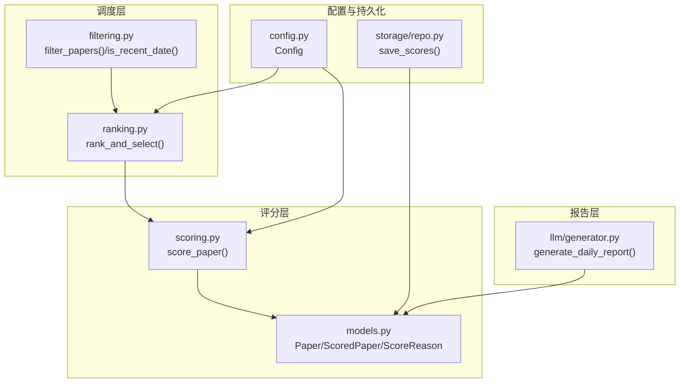
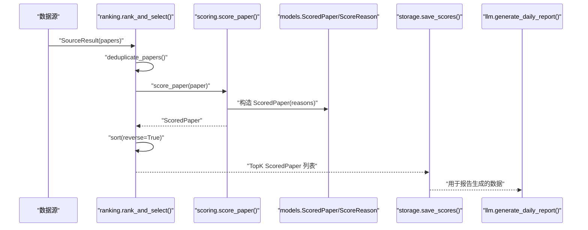
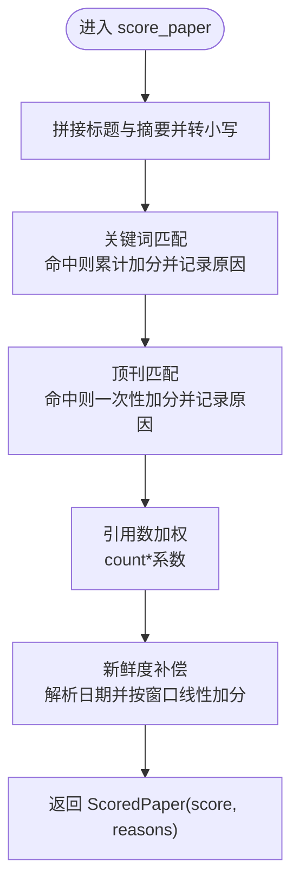
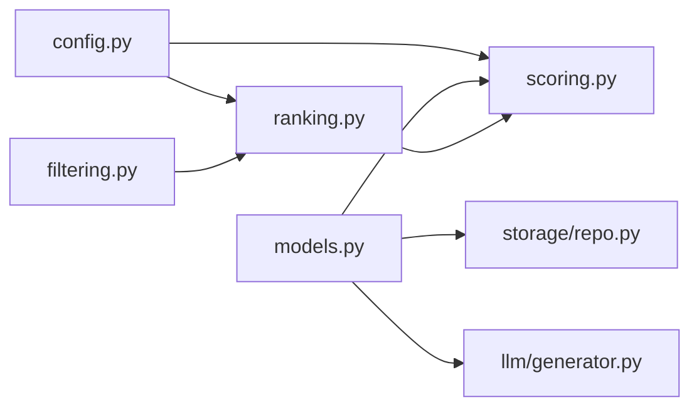

# 自定义评分规则

<cite>
**本文引用的文件**
- [app/scoring.py](file://app/scoring.py)
- [app/ranking.py](file://app/ranking.py)
- [app/models.py](file://app/models.py)
- [app/config.py](file://app/config.py)
- [app/filtering.py](file://app/filtering.py)
- [app/storage/repo.py](file://app/storage/repo.py)
- [app/llm/generator.py](file://app/llm/generator.py)
</cite>

## 目录
1. [简介](#简介)
2. [项目结构](#项目结构)
3. [核心组件](#核心组件)
4. [架构总览](#架构总览)
5. [详细组件分析](#详细组件分析)
6. [依赖关系分析](#依赖关系分析)
7. [性能考虑](#性能考虑)
8. [故障排查指南](#故障排查指南)
9. [结论](#结论)
10. [附录](#附录)

## 简介
本文件面向高级用户，提供对评分系统“智能权重算法”的深度定制指导。围绕评分函数 score_paper 的四大核心维度：
- 关键词匹配
- 顶刊加分
- 引用数加权
- 新鲜度补偿

我们将说明如何安全地扩展研究方向关键词（例如新增“CRISPR”“代谢工程”等）、调整各维度权重系数、引入新的评分因子（如作者H指数、机构排名、开放获取状态），并解释 ScoreReason 在评分可解释性中的作用与如何生成更细粒度的评分理由。同时给出通过环境变量或配置文件热更新评分规则的实践建议，并提供性能优化策略（如关键词 Trie 树优化、日期解析缓存）以支撑大规模数据处理。

## 项目结构
评分系统位于 app/scoring.py，评分结果由 ScoredPaper 和 ScoreReason 两个模型承载；ranking.py 负责合并、去重、评分与 TopK 选择；config.py 提供统一配置（含研究方向关键词、排除词、窗口期等）；filtering.py 提供过滤逻辑；storage/repo.py 负责评分结果持久化；llm/generator.py 使用评分结果生成每日报告。

图表来源
- [app/scoring.py](file://app/scoring.py#L1-L95)
- [app/ranking.py](file://app/ranking.py#L1-L109)
- [app/models.py](file://app/models.py#L1-L77)
- [app/config.py](file://app/config.py#L1-L134)
- [app/filtering.py](file://app/filtering.py#L1-L68)
- [app/storage/repo.py](file://app/storage/repo.py#L100-L180)
- [app/llm/generator.py](file://app/llm/generator.py#L1-L151)

章节来源
- [app/scoring.py](file://app/scoring.py#L1-L95)
- [app/ranking.py](file://app/ranking.py#L1-L109)
- [app/models.py](file://app/models.py#L1-L77)
- [app/config.py](file://app/config.py#L1-L134)
- [app/filtering.py](file://app/filtering.py#L1-L68)
- [app/storage/repo.py](file://app/storage/repo.py#L100-L180)
- [app/llm/generator.py](file://app/llm/generator.py#L1-L151)

## 核心组件
- 评分函数：score_paper(paper: Paper) -> ScoredPaper
- 可解释评分模型：ScoreReason（类别、分数、描述）；ScoredPaper（Paper、score、reasons）
- 排序与选择：rank_and_select() 调用 score_paper 并按 score 降序取 TopK
- 配置中心：Config（研究方向关键词、排除词、窗口期、回退策略等）
- 过滤器：filter_papers() 与 is_recent_date() 用于预过滤
- 存储：save_scores() 将评分与理由持久化为 JSON
- 报告：generate_daily_report() 使用评分结果生成 AI 报告

章节来源
- [app/scoring.py](file://app/scoring.py#L1-L95)
- [app/models.py](file://app/models.py#L1-L77)
- [app/ranking.py](file://app/ranking.py#L1-L109)
- [app/config.py](file://app/config.py#L1-L134)
- [app/filtering.py](file://app/filtering.py#L1-L68)
- [app/storage/repo.py](file://app/storage/repo.py#L100-L180)
- [app/llm/generator.py](file://app/llm/generator.py#L1-L151)

## 架构总览
评分流程从数据源抓取 Paper 列表，先经过滤器预处理，再进入评分阶段，最后排序并选择 TopK。评分结果通过存储模块持久化，供后续报告生成使用。

图表来源
- [app/ranking.py](file://app/ranking.py#L46-L109)
- [app/scoring.py](file://app/scoring.py#L10-L91)
- [app/models.py](file://app/models.py#L49-L77)
- [app/storage/repo.py](file://app/storage/repo.py#L113-L180)
- [app/llm/generator.py](file://app/llm/generator.py#L14-L46)

## 详细组件分析

### 评分函数 score_paper 的四维解析
- 关键词匹配
  - 当前实现：在标题与摘要的小写文本中逐个匹配关键词集合，命中即加分并记录原因。
  - 可扩展点：将关键词集合改为从 Config.RESEARCH_TOPICS 动态聚合；支持多主题权重差异化；支持短语匹配与同义词扩展。
- 顶刊加分
  - 当前实现：对特定期刊名进行子串匹配，命中即一次性加分并记录原因。
  - 可扩展点：维护期刊等级映射表；支持模糊匹配与正则增强；区分不同等级的顶刊给予不同加分。
- 引用数加权
  - 当前实现：引用计数乘以固定系数累加到总分。
  - 可扩展点：采用对数尺度或分段加权；结合高影响力引用（influential_count）进行二次加权。
- 新鲜度补偿
  - 当前实现：解析日期字符串（支持多种格式），计算距今天数并在限定窗口内按线性补偿加分。
  - 可扩展点：引入指数衰减；根据来源可信度调整新鲜度权重；支持节假日/工作日差异。

图表来源
- [app/scoring.py](file://app/scoring.py#L10-L91)

章节来源
- [app/scoring.py](file://app/scoring.py#L10-L91)

### ScoreReason 在评分可解释性中的作用
- ScoreReason 提供评分的“类别-分数-描述”三元组，便于：
  - 定位加分来源（关键词命中、顶刊、引用、新鲜度）
  - 生成可读性强的理由文本
  - 为后续可视化与审计提供依据
- 建议生成更细粒度的理由：
  - 将“命中核心关键词”拆分为“命中主题关键词”“命中机制关键词”“命中技术关键词”等子类别
  - 为“顶刊加分”增加来源期刊等级与权重说明
  - 为“引用数加权”补充“高影响力引用”额外加分项
  - 为“新鲜度补偿”细化“发布日期解析方式”“窗口边界”等说明

章节来源
- [app/models.py](file://app/models.py#L49-L77)
- [app/scoring.py](file://app/scoring.py#L30-L35)
- [app/scoring.py](file://app/scoring.py#L43-L49)
- [app/scoring.py](file://app/scoring.py#L55-L60)
- [app/scoring.py](file://app/scoring.py#L82-L87)

### 如何安全添加新的研究方向关键词
- 方案一：在配置中扩展主题关键词
  - 在 Config.RESEARCH_TOPICS 中新增主题键值对，例如新增“CRISPR”“代谢工程”等条目，随后在评分函数中读取聚合。
  - 优点：集中管理、易于热更新；缺点：需同步修改评分逻辑以使用聚合后的关键词集合。
- 方案二：在评分函数中直接维护关键词集合
  - 保持现有实现不变，直接在 score_paper 内部维护关键词列表。
  - 优点：改动最小；缺点：不利于集中管理与热更新。
- 方案三：引入 Trie 树优化关键词匹配
  - 将关键词集合构建为 Trie，提升长文本下的匹配效率；适合大规模关键词集合与高频评分场景。

章节来源
- [app/config.py](file://app/config.py#L26-L64)
- [app/scoring.py](file://app/scoring.py#L19-L36)

### 如何调整各维度权重系数
- 关键词匹配权重：当前为固定加分，可改为按命中数量乘以可配置系数。
- 顶刊加分：当前为固定加分，可改为按期刊等级映射不同加分。
- 引用数加权：当前为线性加权，可改为对数尺度或分段加权。
- 新鲜度补偿：当前为线性补偿，可改为指数衰减或分段窗口。

章节来源
- [app/scoring.py](file://app/scoring.py#L24-L36)
- [app/scoring.py](file://app/scoring.py#L41-L49)
- [app/scoring.py](file://app/scoring.py#L52-L60)
- [app/scoring.py](file://app/scoring.py#L77-L87)

### 如何引入新的评分因子
- 作者H指数：若数据源提供作者信息，可在评分中引入作者影响力加权。
- 机构排名：若数据源提供作者所属机构，可引入机构等级映射加权。
- 开放获取状态：若数据源提供 OA 信息，可对 OA 文章给予额外加分。
- 实施建议：
  - 在 Paper 模型中新增字段（如 author_h_index、institution_rank、is_oa）
  - 在评分函数中读取并加权
  - 在 ScoreReason 中记录新增加分来源与数值

章节来源
- [app/models.py](file://app/models.py#L9-L20)
- [app/scoring.py](file://app/scoring.py#L10-L91)

### 通过环境变量或配置文件热更新评分规则
- 环境变量驱动
  - 在 Config 中新增评分相关参数（如关键词权重、顶刊加分、引用系数、新鲜度窗口等），通过 os.getenv 读取。
  - 在评分函数中读取 Config 参数，避免硬编码。
- 配置文件热更新
  - 由于 Python 进程启动后导入的模块常量不会自动刷新，建议：
    - 在评分函数入口处显式读取最新 Config 值（如每次评分前重新读取）
    - 或在进程内提供一个“刷新配置”的接口，在不重启服务的前提下重新加载评分规则
  - 注意：热更新需保证线程安全与一致性，避免并发修改导致的竞态。

章节来源
- [app/config.py](file://app/config.py#L1-L134)
- [app/scoring.py](file://app/scoring.py#L10-L91)

### 评分结果持久化与报告生成
- 评分结果持久化
  - save_scores() 将评分与理由序列化为 JSON 存入数据库，便于后续查询与审计。
- 报告生成
  - generate_daily_report() 使用评分结果生成 AI 报告，包含论文清单、来源分布、热点统计等。

章节来源
- [app/storage/repo.py](file://app/storage/repo.py#L113-L180)
- [app/llm/generator.py](file://app/llm/generator.py#L14-L46)

## 依赖关系分析
- ranking 依赖 scoring 产出 ScoredPaper
- scoring 依赖 models 的数据结构
- config 为 ranking 与 scoring 提供配置
- filtering 作为前置过滤器影响评分输入规模
- storage/repo 依赖 models 的数据结构进行持久化
- llm/generator 依赖 models 的数据结构进行报告生成

图表来源
- [app/config.py](file://app/config.py#L1-L134)
- [app/ranking.py](file://app/ranking.py#L1-L109)
- [app/scoring.py](file://app/scoring.py#L1-L95)
- [app/models.py](file://app/models.py#L1-L77)
- [app/filtering.py](file://app/filtering.py#L1-L68)
- [app/storage/repo.py](file://app/storage/repo.py#L100-L180)
- [app/llm/generator.py](file://app/llm/generator.py#L1-L151)

## 性能考虑
- 关键词匹配优化
  - 使用 Trie 树：将关键词集合构建为 Trie，减少长文本扫描次数，提升大规模关键词集合的匹配效率。
  - 分主题分集：按研究方向拆分关键词集合，先做粗筛再做细筛，降低无效匹配成本。
- 日期解析缓存
  - 缓存常见日期格式解析结果，避免重复解析相同字符串；对异常格式进行快速失败与降级。
- 引用数与新鲜度计算
  - 引用数加权采用对数或分段函数，避免极端值拉高整体评分；新鲜度补偿采用指数衰减，提升近期文章的相对权重。
- 并发与批处理
  - 评分阶段采用批处理与并发（注意线程安全与共享资源访问控制）；TopK 选择可采用堆或分块归并策略，降低排序开销。
- I/O 与持久化
  - 评分结果批量写入数据库，减少事务次数；理由 JSON 序列化采用流式写法，降低内存占用。

[本节为通用性能建议，不直接分析具体文件，故无章节来源]

## 故障排查指南
- 日期解析失败
  - 现象：新鲜度补偿未加分或报错。
  - 排查：确认 paper.date 格式是否符合预期；检查解析分支（“-”“/”及 RSS 格式）是否覆盖完整。
- 顶刊匹配不到
  - 现象：未命中顶刊加分。
  - 排查：核对期刊名是否包含在预设集合中；考虑引入模糊匹配或正则增强。
- 引用数异常
  - 现象：引用数加权异常。
  - 排查：确认 citation_count 是否为整数；检查空值与零值处理。
- 评分结果缺失
  - 现象：数据库中缺少评分记录。
  - 排查：确认 save_scores() 是否被调用；检查 run_id 与 paper_id 关联是否正确；确认 reasons_json 是否序列化成功。

章节来源
- [app/scoring.py](file://app/scoring.py#L62-L90)
- [app/storage/repo.py](file://app/storage/repo.py#L113-L180)

## 结论
通过对 score_paper 的四维评分进行模块化改造，结合配置中心与可解释评分模型，可以在不重启服务的前提下灵活调整权重与规则，并通过 Trie 树与日期解析缓存等手段显著提升性能。建议优先从配置中心集中管理关键词与权重，逐步引入更精细的评分因子与热更新机制，以满足复杂业务场景下的持续演进需求。

[本节为总结性内容，不直接分析具体文件，故无章节来源]

## 附录
- 快速定位评分实现位置
  - 评分函数：[app/scoring.py](file://app/scoring.py#L10-L91)
  - 可解释评分模型：[app/models.py](file://app/models.py#L49-L77)
  - 排序与选择：[app/ranking.py](file://app/ranking.py#L46-L109)
  - 配置中心：[app/config.py](file://app/config.py#L1-L134)
  - 过滤器：[app/filtering.py](file://app/filtering.py#L1-L68)
  - 持久化：[app/storage/repo.py](file://app/storage/repo.py#L113-L180)
  - 报告生成：[app/llm/generator.py](file://app/llm/generator.py#L14-L46)