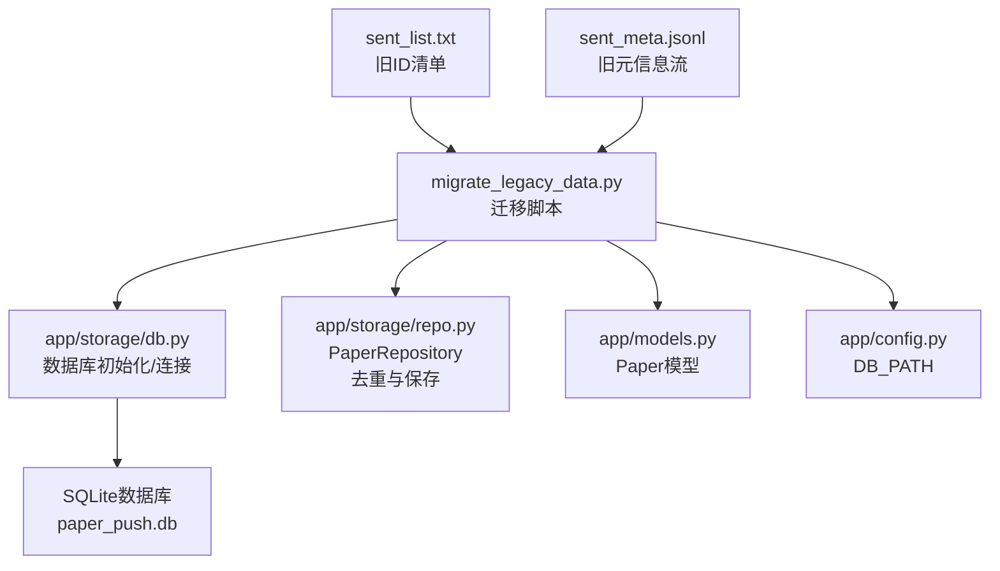
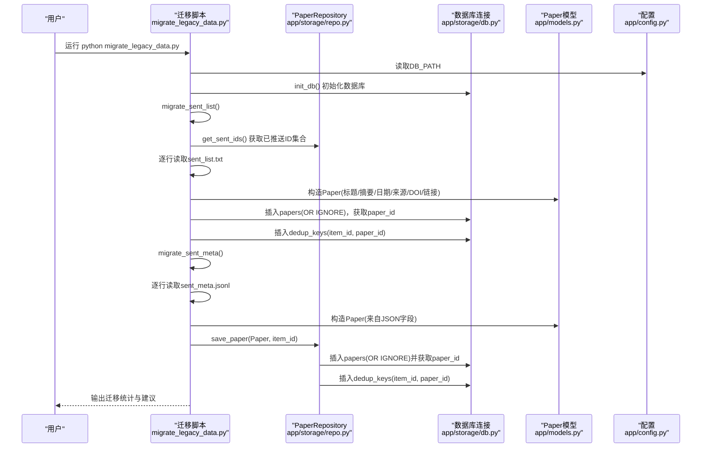
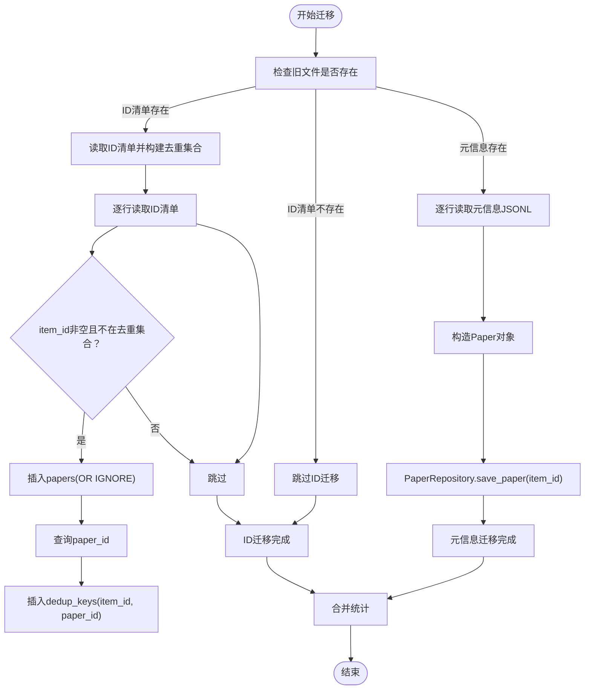
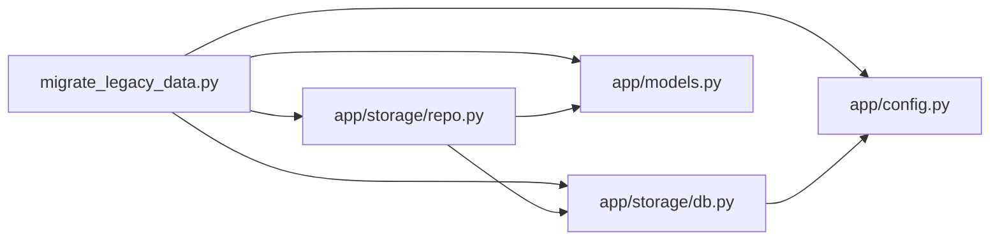

# 数据迁移

<cite>
**本文引用的文件**
- [migrate_legacy_data.py](file://migrate_legacy_data.py)
- [sent_list.txt](file://sent_list.txt)
- [sent_meta.jsonl](file://sent_meta.jsonl)
- [app/storage/db.py](file://app/storage/db.py)
- [app/storage/repo.py](file://app/storage/repo.py)
- [app/models.py](file://app/models.py)
- [app/config.py](file://app/config.py)
- [README.md](file://README.md)
</cite>

## 目录
1. [简介](#简介)
2. [项目结构](#项目结构)
3. [核心组件](#核心组件)
4. [架构总览](#架构总览)
5. [详细组件分析](#详细组件分析)
6. [依赖关系分析](#依赖关系分析)
7. [性能考虑](#性能考虑)
8. [故障排查指南](#故障排查指南)
9. [结论](#结论)
10. [附录](#附录)

## 简介
本文件面向需要从旧版系统迁移到当前版本的用户，提供完整、可操作的数据迁移指南。旧版系统使用文本文件形式的“已推送ID清单”和“论文元信息流式JSON”作为持久化载体；当前版本采用SQLite数据库进行统一存储。本文将：
- 对比旧数据格式与新数据库结构的差异；
- 详解迁移脚本的使用方法、执行流程与数据转换逻辑；
- 强调迁移前的备份建议与迁移后的验证步骤；
- 给出旧文件的处理建议（归档或删除）；
- 提供常见问题排查思路，确保用户顺利完成迁移，避免重复推送或数据丢失。

## 项目结构
本次迁移涉及的关键文件与模块如下：
- 迁移脚本：migrate_legacy_data.py
- 旧数据文件：sent_list.txt、sent_meta.jsonl
- 新数据库初始化与连接：app/storage/db.py
- 数据仓库与去重键：app/storage/repo.py
- 数据模型：app/models.py
- 配置：app/config.py
- 项目说明与迁移指引：README.md

图表来源
- [migrate_legacy_data.py](file://migrate_legacy_data.py#L1-L124)
- [app/storage/db.py](file://app/storage/db.py#L1-L134)
- [app/storage/repo.py](file://app/storage/repo.py#L1-L258)
- [app/models.py](file://app/models.py#L1-L77)
- [app/config.py](file://app/config.py#L1-L134)
- [sent_list.txt](file://sent_list.txt#L1-L43)
- [sent_meta.jsonl](file://sent_meta.jsonl#L1-L11)

章节来源
- [README.md](file://README.md#L76-L83)

## 核心组件
- 迁移脚本：负责读取旧数据文件，初始化数据库，执行两条迁移路径：ID去重键迁移与元信息迁移。
- PaperRepository：封装论文保存、去重键维护、运行记录与评分/推送记录的CRUD操作。
- SQLite数据库：包含papers、runs、scores、pushes、dedup_keys等表，以及若干索引。
- Paper模型：定义论文字段及序列化/反序列化方法。
- 配置：DB_PATH决定数据库文件位置。

章节来源
- [migrate_legacy_data.py](file://migrate_legacy_data.py#L1-L124)
- [app/storage/repo.py](file://app/storage/repo.py#L1-L258)
- [app/storage/db.py](file://app/storage/db.py#L1-L134)
- [app/models.py](file://app/models.py#L1-L77)
- [app/config.py](file://app/config.py#L106-L108)

## 架构总览
下图展示了迁移流程与各模块之间的交互关系。

图表来源
- [migrate_legacy_data.py](file://migrate_legacy_data.py#L1-L124)
- [app/storage/repo.py](file://app/storage/repo.py#L1-L258)
- [app/storage/db.py](file://app/storage/db.py#L1-L134)
- [app/models.py](file://app/models.py#L1-L77)
- [app/config.py](file://app/config.py#L106-L108)

## 详细组件分析

### 旧数据格式对比与差异
- 旧ID清单（sent_list.txt）：每行一个item_id字符串，用于去重与历史推送记录的快速判定。
- 旧元信息（sent_meta.jsonl）：每行一条JSON记录，包含item_id、title、source、date、doi、link等字段，用于恢复论文元信息。

新数据库结构（SQLite）：
- papers：存储论文元信息，包含唯一item_id、标题、摘要、日期、来源、DOI、链接、引用计数、影响力计数等。
- dedup_keys：以item_id为主键，指向papers.id，用于快速去重与查询。
- runs、scores、pushes：用于运行记录、评分与推送记录的审计与回溯（迁移阶段不直接写入这些表，但初始化时会创建）。

差异要点：
- 旧格式为平面文本/JSONL，无主键约束与索引，查询效率低。
- 新格式为关系型数据库，具备唯一约束、外键与索引，支持高效去重与关联查询。
- 迁移脚本通过PaperRepository与数据库交互，自动维护dedup_keys，避免重复推送。

章节来源
- [sent_list.txt](file://sent_list.txt#L1-L43)
- [sent_meta.jsonl](file://sent_meta.jsonl#L1-L11)
- [app/storage/db.py](file://app/storage/db.py#L40-L131)
- [app/storage/repo.py](file://app/storage/repo.py#L15-L59)

### 迁移脚本使用方法
- 执行命令
  - 在项目根目录执行：python migrate_legacy_data.py
  - 脚本会自动初始化数据库并按顺序执行两条迁移路径。
- 预期输出
  - 控制台日志显示：开始迁移、从旧文件迁移的条目数量、完成统计、迁移建议（备份并删除旧文件）。
- 迁移过程中的数据转换逻辑
  - ID去重键迁移（sent_list.txt）：读取每行item_id，若不在去重集合中，则插入papers（使用OR IGNORE保证幂等），再向dedup_keys写入(item_id, paper_id)。
  - 元信息迁移（sent_meta.jsonl）：逐行解析JSON，构造Paper对象，调用PaperRepository.save_paper，内部同样使用OR IGNORE插入papers并维护dedup_keys。
  - 数据库初始化：在执行迁移前调用init_db，确保papers、runs、scores、pushes、dedup_keys表存在并建立必要索引。

章节来源
- [migrate_legacy_data.py](file://migrate_legacy_data.py#L1-L124)
- [README.md](file://README.md#L76-L83)

### 数据转换与去重逻辑
- 去重键生成规则（由PaperRepository维护）：
  - 若Paper有非空DOI，标准化后作为item_id（例如以“DOI:”前缀）。
  - 否则若Paper有非空link，以“LINK:”前缀作为item_id。
  - 否则以“TITLE:”前缀加来源与标题片段作为item_id。
  - 若三项均不可得，则无法生成item_id。
- 写入策略：
  - 插入papers时使用OR IGNORE，避免重复。
  - dedup_keys使用OR IGNORE，确保item_id唯一且指向正确paper_id。
- 读取策略：
  - get_sent_ids()从dedup_keys读取所有item_id，作为后续迁移的去重基线。

图表来源
- [migrate_legacy_data.py](file://migrate_legacy_data.py#L14-L119)
- [app/storage/repo.py](file://app/storage/repo.py#L15-L59)

章节来源
- [migrate_legacy_data.py](file://migrate_legacy_data.py#L14-L119)
- [app/storage/repo.py](file://app/storage/repo.py#L15-L59)

### 数据模型与数据库表结构
- Paper模型字段：title、abstract、date、source、doi、link、citation_count、influential_count。
- 数据库表：
  - papers：item_id唯一，包含上述Paper字段。
  - dedup_keys：item_id主键，paper_id外键。
  - runs、scores、pushes：用于运行、评分与推送记录（迁移阶段不直接写入）。
- 索引：对papers.item_id、papers.date、scores.run_id、pushes.run_id、pushes.status建立索引，提升查询性能。

章节来源
- [app/models.py](file://app/models.py#L9-L47)
- [app/storage/db.py](file://app/storage/db.py#L40-L131)

### 迁移前备份与迁移后验证
- 迁移前备份建议
  - 备份旧文件：sent_list.txt、sent_meta.jsonl。
  - 备份数据库：复制SQLite数据库文件（默认路径由DB_PATH配置决定）。
- 迁移后验证步骤
  - 校验去重键：确认dedup_keys中item_id数量与预期一致。
  - 校验论文元信息：随机抽查papers表中的title、source、date、doi、link字段是否正确。
  - 校验运行状态：确认runs表中存在至少一条运行记录（由后续任务写入）。
  - 校验推送记录：确认pushes表中存在推送记录（由后续任务写入）。
- 旧文件处理方式
  - 建议：迁移完成后进行归档（保留历史证据），或删除以节省空间。删除前请再次确认数据库备份有效。

章节来源
- [app/config.py](file://app/config.py#L106-L108)
- [migrate_legacy_data.py](file://migrate_legacy_data.py#L113-L119)

## 依赖关系分析
- 迁移脚本依赖PaperRepository进行论文保存与去重键维护，依赖数据库连接模块进行初始化与事务控制。
- PaperRepository依赖数据库连接模块与Paper模型。
- 数据库连接模块依赖配置模块以确定数据库文件路径。

图表来源
- [migrate_legacy_data.py](file://migrate_legacy_data.py#L1-L124)
- [app/storage/repo.py](file://app/storage/repo.py#L1-L258)
- [app/storage/db.py](file://app/storage/db.py#L1-L134)
- [app/models.py](file://app/models.py#L1-L77)
- [app/config.py](file://app/config.py#L106-L108)

## 性能考虑
- 使用OR IGNORE插入papers与dedup_keys，避免重复写入带来的性能损耗。
- 通过索引加速查询（如papers.item_id、dedup_keys.item_id）。
- 逐行读取旧文件，内存占用低，适合大规模历史数据迁移。
- 建议在迁移前确保磁盘空间充足，避免因IO瓶颈导致迁移中断。

## 故障排查指南
- 无法找到旧文件
  - 现象：日志提示旧文件不存在并跳过。
  - 处理：确认文件位于项目根目录，名称与内容格式正确。
- 数据库初始化失败
  - 现象：日志出现数据库操作失败或权限错误。
  - 处理：检查DB_PATH配置、目标路径权限、磁盘空间。
- 重复推送或数据缺失
  - 现象：迁移后发现重复记录或遗漏记录。
  - 处理：核对dedup_keys与papers一致性；确认PaperRepository的item_id生成规则是否符合预期。
- JSONL解析异常
  - 现象：日志提示某行解析失败。
  - 处理：检查对应行的JSON格式，确保包含item_id与必要字段。

章节来源
- [migrate_legacy_data.py](file://migrate_legacy_data.py#L14-L119)
- [app/storage/db.py](file://app/storage/db.py#L23-L38)
- [app/storage/repo.py](file://app/storage/repo.py#L15-L59)

## 结论
通过本迁移文档，用户可以安全、可控地将旧版系统的“ID清单+元信息流”迁移到当前版本的SQLite数据库中。迁移脚本提供了幂等的写入策略与完善的日志输出，配合去重键与索引设计，能够有效避免重复推送与数据丢失。建议在迁移前后做好备份与验证，确保业务连续性。

## 附录
- 迁移命令示例
  - 在项目根目录执行：python migrate_legacy_data.py
- 旧数据文件说明
  - sent_list.txt：每行一个item_id，用于去重与历史推送记录。
  - sent_meta.jsonl：每行一条JSON记录，包含item_id与论文元信息。
- 数据库文件位置
  - 默认由DB_PATH配置决定，通常为项目根目录下的paper_push.db。

章节来源
- [README.md](file://README.md#L76-L83)
- [app/config.py](file://app/config.py#L106-L108)