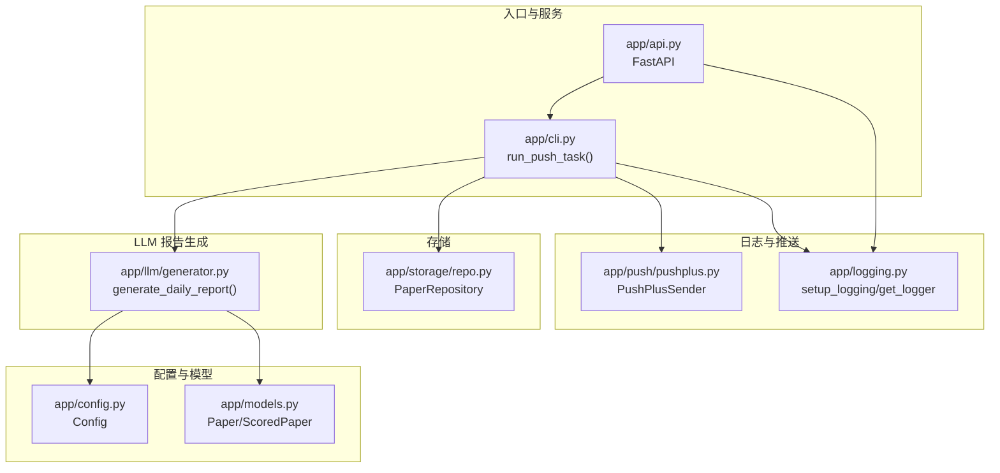
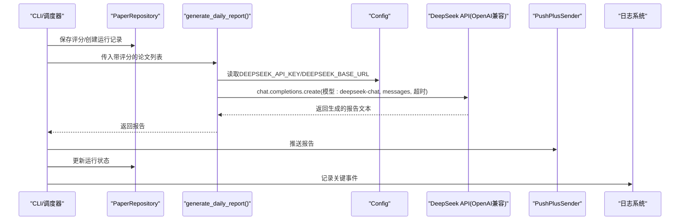
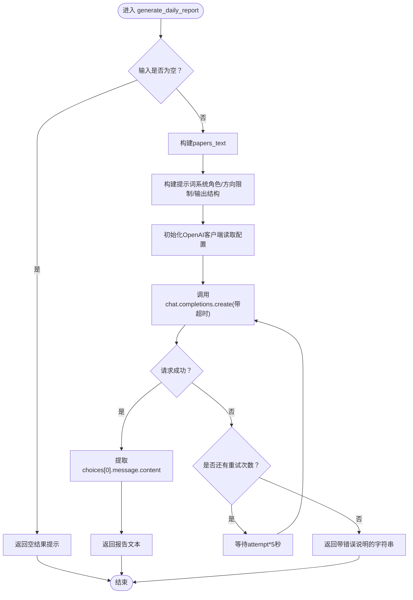
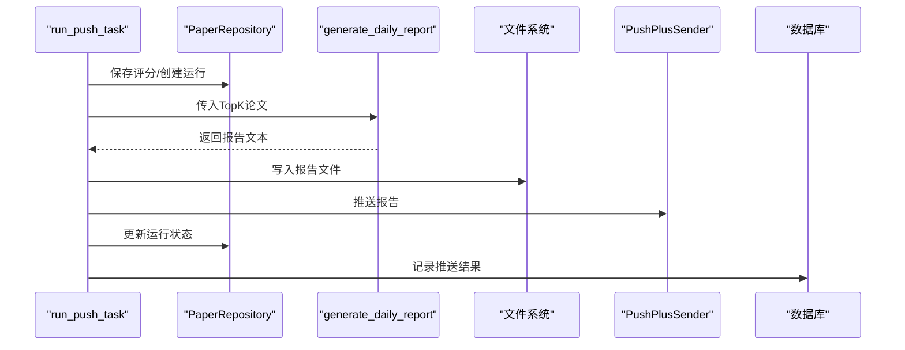
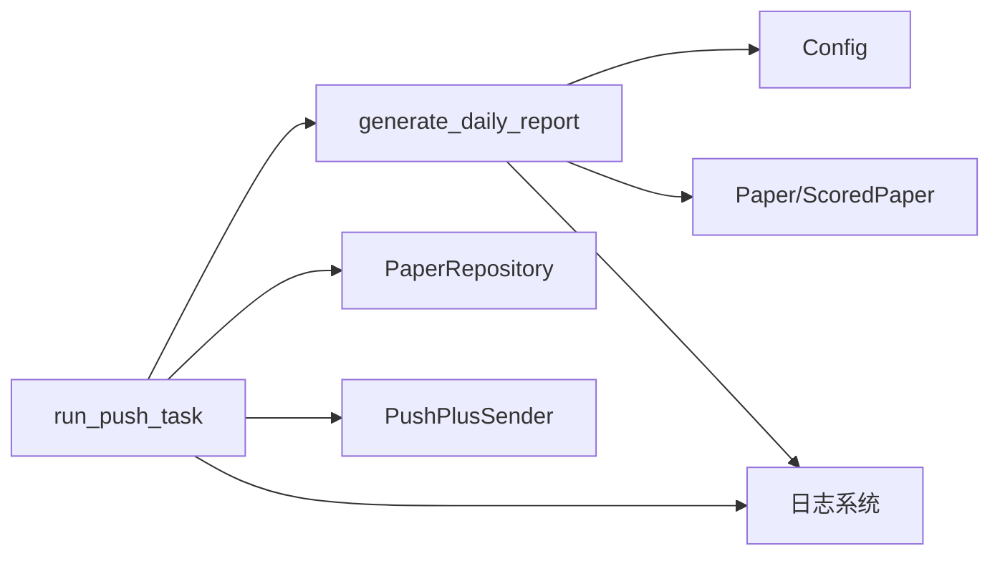

# AI报告生成

<cite>
**本文引用的文件**
- [app/llm/generator.py](file://app/llm/generator.py)
- [app/config.py](file://app/config.py)
- [app/models.py](file://app/models.py)
- [app/cli.py](file://app/cli.py)
- [app/api.py](file://app/api.py)
- [app/logging.py](file://app/logging.py)
- [app/push/pushplus.py](file://app/push/pushplus.py)
- [app/storage/repo.py](file://app/storage/repo.py)
- [README.md](file://README.md)
</cite>

## 目录
1. [简介](#简介)
2. [项目结构](#项目结构)
3. [核心组件](#核心组件)
4. [架构总览](#架构总览)
5. [详细组件分析](#详细组件分析)
6. [依赖关系分析](#依赖关系分析)
7. [性能考量](#性能考量)
8. [故障排查指南](#故障排查指南)
9. [结论](#结论)
10. [附录](#附录)

## 简介
本文件聚焦“AI报告生成”模块，围绕 generate_daily_report 函数如何利用 DeepSeek 大语言模型将结构化的论文数据转化为自然语言情报内参展开。文档解析提示词工程设计：通过系统角色设定（生物化学专家）、明确研究方向限制（三大核心领域）、定义输出结构（P0-P3优先级层级）来引导模型生成高质量内容；说明输入数据的组织方式（papers_text 格式）与 API 调用流程（OpenAI 兼容接口），并强调重试机制与超时控制在保障服务稳定性方面的作用；结合配置项 DEEPSEEK_API_KEY 与 DEEPSEEK_BASE_URL 解释外部依赖管理；最后分析生成失败的可能原因（网络问题、API 配额、模型响应异常）及日志追踪方法，确保可维护性。

## 项目结构
本项目采用按功能域划分的模块化组织方式，AI 报告生成位于 app/llm/generator.py，配合配置、模型、CLI、API、日志、推送与存储模块协同工作。

图表来源
- [app/llm/generator.py](file://app/llm/generator.py#L1-L151)
- [app/config.py](file://app/config.py#L1-L134)
- [app/models.py](file://app/models.py#L1-L77)
- [app/cli.py](file://app/cli.py#L1-L250)
- [app/api.py](file://app/api.py#L1-L88)
- [app/logging.py](file://app/logging.py#L1-L41)
- [app/push/pushplus.py](file://app/push/pushplus.py#L1-L54)
- [app/storage/repo.py](file://app/storage/repo.py#L1-L274)

章节来源
- [README.md](file://README.md#L1-L134)

## 核心组件
- generate_daily_report：将带评分的论文列表转换为结构化提示词，调用 DeepSeek API 生成每日情报内参，包含重试与超时控制。
- Config：集中管理 DEEPSEEK_API_KEY、DEEPSEEK_BASE_URL、研究方向关键词与窗口期等配置。
- Paper/ScoredPaper：论文与评分数据模型，支撑 generate_daily_report 的输入组织。
- run_push_task：端到端流程编排，负责抓取、评分、生成报告、保存与推送。
- 日志与推送：统一日志配置与 PushPlus 推送实现，便于可观测性与运维。

章节来源
- [app/llm/generator.py](file://app/llm/generator.py#L1-L151)
- [app/config.py](file://app/config.py#L1-L134)
- [app/models.py](file://app/models.py#L1-L77)
- [app/cli.py](file://app/cli.py#L1-L250)
- [app/logging.py](file://app/logging.py#L1-L41)
- [app/push/pushplus.py](file://app/push/pushplus.py#L1-L54)

## 架构总览
下图展示 generate_daily_report 在整体流程中的位置与交互关系。

图表来源
- [app/cli.py](file://app/cli.py#L1-L250)
- [app/llm/generator.py](file://app/llm/generator.py#L1-L151)
- [app/config.py](file://app/config.py#L1-L134)
- [app/push/pushplus.py](file://app/push/pushplus.py#L1-L54)
- [app/storage/repo.py](file://app/storage/repo.py#L1-L274)
- [app/logging.py](file://app/logging.py#L1-L41)

## 详细组件分析

### generate_daily_report 组件分析
- 输入组织（papers_text）：函数接收带评分的论文列表，逐条拼接标题、来源、日期、摘要、DOI/链接、引用计数等字段，形成结构化文本块，便于模型理解与抽取。
- 提示词工程：
  - 系统角色：以“生物化学与分子生物学专家”的身份引导模型输出专业且通俗的语言风格。
  - 研究方向限制：明确限定三大核心领域（生物固氮、胞外信号感知与传递、酶的结构与作用机制），并强调“仅限以上三个研究方向”，避免无关内容干扰。
  - 输出结构：定义 P0-P3 四级优先级（顶级论文、新工具、关联性挖掘、数据统计），并给出每部分的具体要点与格式要求，提升生成内容的结构性与可读性。
- API 调用（OpenAI 兼容接口）：
  - 客户端初始化：基于 Config.DEEPSEEK_API_KEY 与 DEEPSEEK_BASE_URL 创建 OpenAI 客户端。
  - 请求参数：指定模型 deepseek-chat，messages 包含系统消息与用户提示词，设置温度与最大 token 数。
  - 超时控制：客户端层设置超时阈值，避免长时间阻塞。
- 重试机制与错误处理：
  - 最多重试次数固定，每次指数级等待（attempt×5秒），并在日志中记录错误与等待信息。
  - 用户中断（KeyboardInterrupt）会被直接抛出，保证可中断性。
  - 若达到最大重试仍失败，返回包含错误信息的字符串，便于上层处理。
- 返回值：成功时返回生成的报告文本，失败时返回带错误说明的字符串。

图表来源
- [app/llm/generator.py](file://app/llm/generator.py#L1-L151)
- [app/config.py](file://app/config.py#L1-L134)

章节来源
- [app/llm/generator.py](file://app/llm/generator.py#L1-L151)

### 提示词工程设计详解
- 系统角色设定：通过系统消息将模型定位为“生物化学与分子生物学专家”，确保输出语言风格与专业度符合预期。
- 研究方向限制：明确列出三大核心领域，并反复强调“仅限以上三个研究方向”，降低无关内容污染。
- 输出结构定义：P0-P3 四级优先级与具体要点（如来源标注、DOI/链接、统计信息等）帮助模型聚焦关键要素，提升可读性与实用性。
- 输入数据格式：papers_text 采用“论文编号+字段键值对+分隔线”的结构，便于模型解析与抽取。

章节来源
- [app/llm/generator.py](file://app/llm/generator.py#L1-L151)

### 输入数据组织（papers_text）
- 字段覆盖：标题、来源、日期、摘要、DOI、链接、引用计数、高影响力引用等。
- 分隔与可读性：使用分隔线与换行增强可读性，便于模型快速定位各论文信息。
- 可扩展性：若后续增加字段，可在构建阶段追加，保持与提示词结构的一致性。

章节来源
- [app/llm/generator.py](file://app/llm/generator.py#L1-L151)
- [app/models.py](file://app/models.py#L1-L77)

### API 调用流程（OpenAI 兼容接口）
- 客户端初始化：从配置读取 DEEPSEEK_API_KEY 与 DEEPSEEK_BASE_URL，构造 OpenAI 客户端。
- 请求参数：messages 包含系统消息与用户提示词；temperature 与 max_tokens 控制生成风格与长度。
- 超时控制：客户端层设置超时阈值，避免长时间阻塞。
- 错误处理：捕获异常并记录日志，配合重试机制提升稳定性。

章节来源
- [app/llm/generator.py](file://app/llm/generator.py#L1-L151)
- [app/config.py](file://app/config.py#L1-L134)

### 重试机制与超时控制
- 重试策略：固定最大重试次数，每次等待时间随尝试次数递增，降低瞬时压力。
- 超时控制：客户端层设置超时，避免长时间挂起。
- 中断处理：允许用户中断，及时退出并抛出异常，便于调试与停止。

章节来源
- [app/llm/generator.py](file://app/llm/generator.py#L1-L151)

### 外部依赖管理（DEEPSEEK_API_KEY 与 DEEPSEEK_BASE_URL）
- 配置来源：从环境变量读取，若未设置则使用默认值，便于本地开发与部署。
- 依赖类型：OpenAI 兼容接口，模型名称为 deepseek-chat。
- 管理建议：在生产环境中务必设置安全的 API 密钥与稳定的基地址，避免泄露与不可用风险。

章节来源
- [app/config.py](file://app/config.py#L1-L134)
- [app/llm/generator.py](file://app/llm/generator.py#L1-L151)

### 与端到端流程的衔接（run_push_task）
- 评分与保存：在生成报告前，已通过评分与保存流程将 Top K 篇论文持久化至数据库。
- 报告生成：调用 generate_daily_report，得到报告文本。
- 文件落盘：将报告写入本地文件，便于归档与人工审阅。
- 推送：依次尝试 PushPlus、邮件、企业微信等方式推送。
- 状态更新：根据推送结果更新运行记录状态。

图表来源
- [app/cli.py](file://app/cli.py#L1-L250)
- [app/llm/generator.py](file://app/llm/generator.py#L1-L151)
- [app/push/pushplus.py](file://app/push/pushplus.py#L1-L54)
- [app/storage/repo.py](file://app/storage/repo.py#L1-L274)

章节来源
- [app/cli.py](file://app/cli.py#L1-L250)
- [app/storage/repo.py](file://app/storage/repo.py#L1-L274)

## 依赖关系分析
- generate_daily_report 依赖：
  - 配置：DEEPSEEK_API_KEY、DEEPSEEK_BASE_URL、RESEARCH_INTEREST。
  - 模型：Paper/ScoredPaper 数据结构。
  - 日志：统一日志记录。
- 端到端流程依赖：
  - CLI/调度器：run_push_task 协调抓取、评分、生成、保存与推送。
  - 存储：PaperRepository 提供评分与运行记录的持久化能力。
  - 推送：PushPlusSender 实现多 token 的群发与失败回退。
  - 日志：setup_logging/get_logger 提供结构化日志输出。

图表来源
- [app/llm/generator.py](file://app/llm/generator.py#L1-L151)
- [app/config.py](file://app/config.py#L1-L134)
- [app/models.py](file://app/models.py#L1-L77)
- [app/cli.py](file://app/cli.py#L1-L250)
- [app/storage/repo.py](file://app/storage/repo.py#L1-L274)
- [app/push/pushplus.py](file://app/push/pushplus.py#L1-L54)
- [app/logging.py](file://app/logging.py#L1-L41)

章节来源
- [app/llm/generator.py](file://app/llm/generator.py#L1-L151)
- [app/cli.py](file://app/cli.py#L1-L250)
- [app/storage/repo.py](file://app/storage/repo.py#L1-L274)
- [app/push/pushplus.py](file://app/push/pushplus.py#L1-L54)
- [app/logging.py](file://app/logging.py#L1-L41)

## 性能考量
- 生成耗时：受模型响应时间、网络延迟与提示词长度影响。可通过缩短提示词、减少 Top K、优化字段选择降低生成成本。
- 重试策略：适度的重试与等待间隔可缓解瞬时波动，但应避免过度重试导致资源占用。
- 超时控制：客户端层设置超时，避免长时间阻塞，提升整体吞吐。
- 日志开销：结构化日志便于定位问题，但需注意日志级别与文件大小，避免成为性能瓶颈。

## 故障排查指南
- 常见失败原因
  - 网络问题：DNS 解析失败、代理阻断、防火墙拦截。
  - API 配额：超出配额或速率限制。
  - 模型响应异常：模型内部错误、返回格式异常。
  - 配置缺失：DEEPSEEK_API_KEY 未设置或错误。
- 日志追踪
  - 查看统一日志：由 setup_logging 统一配置，包含时间戳、模块名、级别与消息。
  - 关键日志点：生成开始、生成成功、生成失败、重试等待、推送结果。
- 快速定位步骤
  - 确认配置项 DEEPSEEK_API_KEY 与 DEEPSEEK_BASE_URL 是否正确。
  - 检查网络连通性与代理设置（CLI 中显式移除了代理环境变量）。
  - 查看日志文件与控制台输出，定位错误发生阶段。
  - 适当降低 Top K 或缩短提示词，验证是否为资源限制导致的失败。

章节来源
- [app/llm/generator.py](file://app/llm/generator.py#L1-L151)
- [app/config.py](file://app/config.py#L1-L134)
- [app/logging.py](file://app/logging.py#L1-L41)
- [app/cli.py](file://app/cli.py#L1-L250)

## 结论
generate_daily_report 通过精心设计的提示词工程与严格的输入组织，将结构化论文数据转化为高质量、高结构性的自然语言情报内参。借助 OpenAI 兼容接口与 DeepSeek 模型，结合重试机制与超时控制，显著提升了服务稳定性。配合统一的日志与推送模块，实现了从抓取、评分、生成到推送的完整闭环。建议在生产环境中强化配置校验与监控告警，持续优化提示词与字段选择，以获得更稳定、更高效的生成效果。

## 附录
- 配置项说明（节选）
  - DEEPSEEK_API_KEY：DeepSeek API 密钥（必需）
  - DEEPSEEK_BASE_URL：DeepSeek API 基础 URL（默认值）
  - RESEARCH_INTEREST：研究方向描述（用于提示词）
- 使用建议
  - 在 .env 中设置 DEEPSEEK_API_KEY 与 DEEPSEEK_BASE_URL。
  - 通过 CLI 或 API 方式触发任务，观察日志与报告文件。
  - 如需调整生成风格，可微调 temperature 与 max_tokens 参数（当前固定值）。

章节来源
- [README.md](file://README.md#L1-L134)
- [app/config.py](file://app/config.py#L1-L134)
- [app/llm/generator.py](file://app/llm/generator.py#L1-L151)