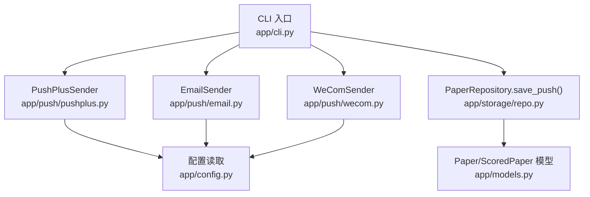
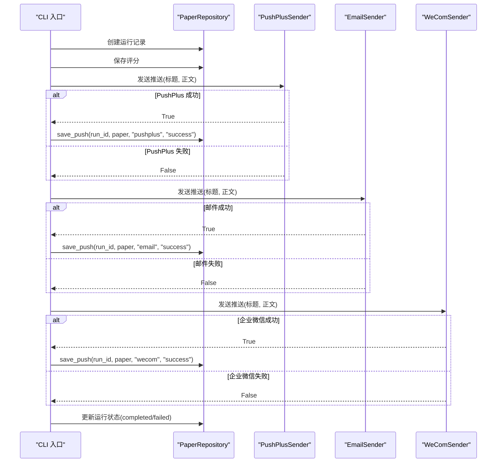
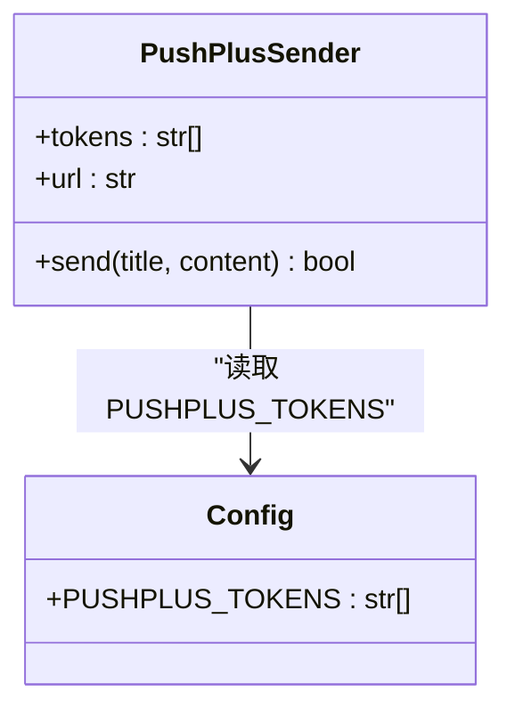
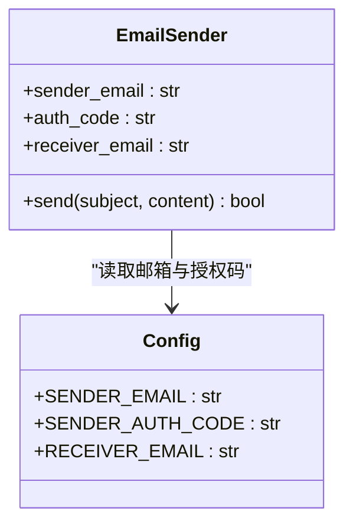
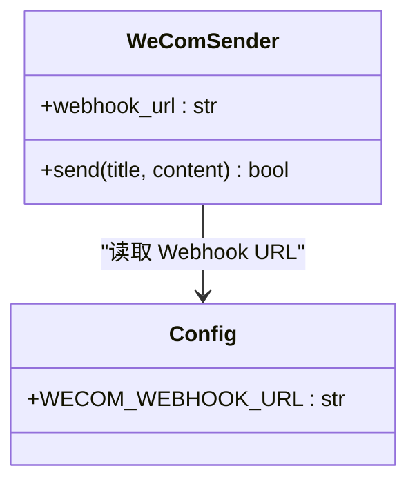
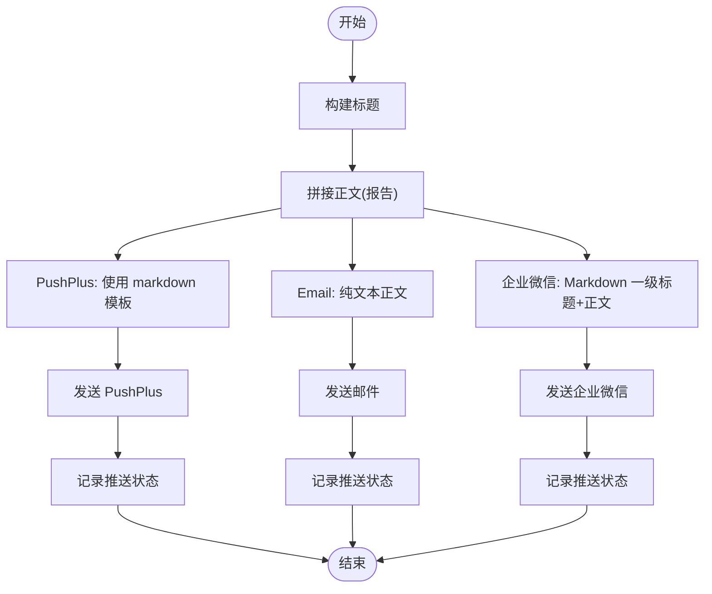
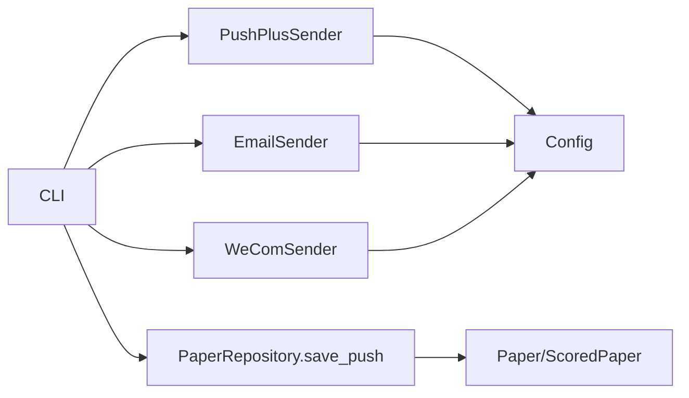

# 多渠道推送

<cite>
**本文引用的文件**
- [app/push/__init__.py](file://app/push/__init__.py)
- [app/push/pushplus.py](file://app/push/pushplus.py)
- [app/push/email.py](file://app/push/email.py)
- [app/push/wecom.py](file://app/push/wecom.py)
- [app/config.py](file://app/config.py)
- [app/storage/repo.py](file://app/storage/repo.py)
- [app/cli.py](file://app/cli.py)
- [app/models.py](file://app/models.py)
</cite>

## 目录
1. [简介](#简介)
2. [项目结构](#项目结构)
3. [核心组件](#核心组件)
4. [架构总览](#架构总览)
5. [详细组件分析](#详细组件分析)
6. [依赖关系分析](#依赖关系分析)
7. [性能与可靠性考量](#性能与可靠性考量)
8. [故障排查指南](#故障排查指南)
9. [结论](#结论)
10. [附录](#附录)

## 简介
本文件面向“多渠道推送”模块，系统性阐述 PushPlus、电子邮件与企业微信三种推送方式的设计与实现，包括：
- 各推送类如何封装对应平台的API协议（PushPlus 的 HTTP POST 请求、SMTP 邮件发送配置、企业微信 Webhook 调用）
- 配置项 PUSHPLUS_TOKENS、SMTP 相关参数、WECOM_WEBHOOK_URL 的作用与安全建议
- 推送内容的格式化流程（标题生成、正文拼接与富文本支持）
- 结合 repo.py 中的 save_push 方法说明推送状态持久化记录机制，用于审计与重试
- 各渠道认证配置步骤、常见错误码解读与调试技巧

## 项目结构
推送模块位于 app/push 下，包含三个子模块分别对接不同渠道；配置集中于 app/config.py；推送状态持久化由 app/storage/repo.py 提供；实际使用在 app/cli.py 中串联调用。

图表来源
- [app/cli.py](file://app/cli.py#L113-L139)
- [app/push/pushplus.py](file://app/push/pushplus.py#L12-L54)
- [app/push/email.py](file://app/push/email.py#L13-L51)
- [app/push/wecom.py](file://app/push/wecom.py#L12-L55)
- [app/config.py](file://app/config.py#L91-L105)
- [app/storage/repo.py](file://app/storage/repo.py#L181-L203)
- [app/models.py](file://app/models.py#L9-L47)

章节来源
- [app/push/__init__.py](file://app/push/__init__.py#L1-L12)
- [app/push/pushplus.py](file://app/push/pushplus.py#L1-L54)
- [app/push/email.py](file://app/push/email.py#L1-L51)
- [app/push/wecom.py](file://app/push/wecom.py#L1-L55)
- [app/config.py](file://app/config.py#L91-L105)
- [app/storage/repo.py](file://app/storage/repo.py#L181-L203)
- [app/cli.py](file://app/cli.py#L113-L139)
- [app/models.py](file://app/models.py#L9-L47)

## 核心组件
- PushPlusSender：封装 PushPlus HTTP 推送接口，支持多 token 并行发送，使用 JSON 请求体与 markdown 模板。
- EmailSender：封装 SMTP 发送邮件，使用 QQ 邮箱 SMTP 服务器，支持主题与纯文本正文。
- WeComSender：封装企业微信机器人 Webhook，使用 markdown 消息类型。
- 配置中心 Config：集中管理 SENDER_EMAIL、SENDER_AUTH_CODE、RECEIVER_EMAIL、PUSHPLUS_TOKENS、WECOM_WEBHOOK_URL 等关键参数。
- PaperRepository.save_push：将每次推送的运行标识、论文信息、渠道、状态与错误信息持久化，便于审计与重试。

章节来源
- [app/push/pushplus.py](file://app/push/pushplus.py#L12-L54)
- [app/push/email.py](file://app/push/email.py#L13-L51)
- [app/push/wecom.py](file://app/push/wecom.py#L12-L55)
- [app/config.py](file://app/config.py#L91-L105)
- [app/storage/repo.py](file://app/storage/repo.py#L181-L203)

## 架构总览
推送流程自 CLI 入口发起，先抓取与评分，再依次尝试三种渠道推送。每种渠道成功后，都会通过 repo.save_push 记录推送状态；最终根据是否至少一次成功更新运行状态为 completed 或 failed。

图表来源
- [app/cli.py](file://app/cli.py#L113-L139)
- [app/storage/repo.py](file://app/storage/repo.py#L181-L203)

## 详细组件分析

### PushPlusSender 组件分析
- 设计要点
  - 支持多 token 并行发送，至少一个成功即视为整体成功。
  - 使用 HTTP POST 请求，JSON 负载包含 token、标题、正文与模板（markdown）。
  - 超时控制与禁用代理，避免网络异常导致阻塞。
- 内容格式化
  - 标题与正文直接传入，模板为 markdown，便于在 PushPlus 端渲染富文本。
- 错误处理
  - 对每个 token 的请求进行 try-except 包裹，并记录日志；最终统计成功数量决定返回值。
- 安全与配置
  - token 来源于配置中心的 PUSHPLUS_TOKENS 列表，支持逗号分隔的多个 token。
  - 建议：将 token 存储在安全的环境变量或密钥管理服务中，避免硬编码。

图表来源
- [app/push/pushplus.py](file://app/push/pushplus.py#L12-L54)
- [app/config.py](file://app/config.py#L96-L101)

章节来源
- [app/push/pushplus.py](file://app/push/pushplus.py#L12-L54)
- [app/config.py](file://app/config.py#L96-L101)

### EmailSender 组件分析
- 设计要点
  - 使用 QQ 邮箱 SMTP 服务器，端口 587，启用 TLS。
  - 登录凭据来自配置中心的 SENDER_EMAIL 与 SENDER_AUTH_CODE。
  - 主题与正文通过 MIMEText 以纯文本形式发送。
- 内容格式化
  - 主题为固定标题，正文为纯文本；若需富文本，可在生成阶段转换为 HTML 并调整 MIME 类型。
- 错误处理
  - 若未配置发送邮箱或授权码则跳过发送；异常捕获并记录错误。
- 安全与配置
  - 建议使用专用邮箱与独立授权码，避免泄露主密码；将授权码存储在安全位置。

图表来源
- [app/push/email.py](file://app/push/email.py#L13-L51)
- [app/config.py](file://app/config.py#L91-L95)

章节来源
- [app/push/email.py](file://app/push/email.py#L13-L51)
- [app/config.py](file://app/config.py#L91-L95)

### WeComSender 组件分析
- 设计要点
  - 使用企业微信机器人 Webhook，消息类型为 markdown。
  - 标题作为 Markdown 一级标题，正文直接拼接。
  - 对响应 JSON 进行解析，依据 errcode 判断成功与否。
- 内容格式化
  - 自动将标题包装为 Markdown 一级标题，正文保持原样；适合在企业微信端渲染富文本。
- 错误处理
  - 若未配置 Webhook URL 则跳过；异常捕获并记录错误；非零 errcode 也视为失败。
- 安全与配置
  - Webhook URL 应妥善保管，避免泄露；建议限制访问来源或配合内网部署。

图表来源
- [app/push/wecom.py](file://app/push/wecom.py#L12-L55)
- [app/config.py](file://app/config.py#L103-L105)

章节来源
- [app/push/wecom.py](file://app/push/wecom.py#L12-L55)
- [app/config.py](file://app/config.py#L103-L105)

### 配置项与安全建议
- PUSHPLUS_TOKENS
  - 作用：PushPlus 的多个推送令牌，支持逗号分隔的多 token。
  - 安全建议：使用环境变量注入，避免明文写入代码；定期轮换 token。
- SENDER_EMAIL / SENDER_AUTH_CODE / RECEIVER_EMAIL
  - 作用：SMTP 发送方邮箱、授权码与接收方邮箱。
  - 安全建议：授权码单独管理，最小权限原则；避免在日志中打印敏感信息。
- WECOM_WEBHOOK_URL
  - 作用：企业微信机器人 Webhook 地址。
  - 安全建议：限制 Webhook 可用范围，避免公网暴露；必要时加签或鉴权。
- 其他相关配置
  - DB_PATH、LOG_LEVEL、LOG_FILE 等影响运行与日志输出，建议按环境区分。

章节来源
- [app/config.py](file://app/config.py#L91-L105)

### 推送内容格式化流程
- 标题生成
  - CLI 中固定标题“生物化学研究精选论文”，也可在调用处动态传入。
- 正文拼接
  - 使用 AI 生成的每日报告作为正文，直接传入各渠道 sender。
- 富文本支持
  - PushPlus：通过模板为 markdown，支持富文本渲染。
  - 企业微信：通过 Markdown 一级标题与段落实现富文本效果。
  - 邮件：当前为纯文本；如需富文本，可在生成阶段转换为 HTML 并调整 MIME 类型。

图表来源
- [app/cli.py](file://app/cli.py#L113-L139)
- [app/push/pushplus.py](file://app/push/pushplus.py#L19-L30)
- [app/push/email.py](file://app/push/email.py#L21-L41)
- [app/push/wecom.py](file://app/push/wecom.py#L18-L33)
- [app/storage/repo.py](file://app/storage/repo.py#L181-L203)

## 依赖关系分析
- 组件耦合
  - 三个 Sender 均依赖 Config 读取配置，耦合度低，便于扩展其他渠道。
  - CLI 作为编排者，负责顺序调用与状态更新。
- 外部依赖
  - PushPlus：HTTP API；WeCom：Webhook；Email：SMTP 服务器。
- 数据依赖
  - save_push 依赖 PaperRepository 的 item_id 生成逻辑与数据库连接。

图表来源
- [app/cli.py](file://app/cli.py#L113-L139)
- [app/push/pushplus.py](file://app/push/pushplus.py#L12-L54)
- [app/push/email.py](file://app/push/email.py#L13-L51)
- [app/push/wecom.py](file://app/push/wecom.py#L12-L55)
- [app/config.py](file://app/config.py#L91-L105)
- [app/storage/repo.py](file://app/storage/repo.py#L181-L203)
- [app/models.py](file://app/models.py#L9-L47)

章节来源
- [app/cli.py](file://app/cli.py#L113-L139)
- [app/push/pushplus.py](file://app/push/pushplus.py#L12-L54)
- [app/push/email.py](file://app/push/email.py#L13-L51)
- [app/push/wecom.py](file://app/push/wecom.py#L12-L55)
- [app/config.py](file://app/config.py#L91-L105)
- [app/storage/repo.py](file://app/storage/repo.py#L181-L203)
- [app/models.py](file://app/models.py#L9-L47)

## 性能与可靠性考量
- 并行与超时
  - PushPlus 采用循环逐个 token 发送，建议在高并发场景下考虑异步或批量发送以提升吞吐。
  - WeCom 设置了较短超时，PushPlus 设置了更长超时，应根据网络状况调整。
- 代理与网络
  - PushPlus 显式禁用代理，避免代理异常导致阻塞；建议在容器或受限环境中统一出口策略。
- 重试与幂等
  - 当前未内置重试机制；可在 save_push 成功后对失败渠道进行重试，或在后续任务中基于推送记录进行补发。
- 日志与审计
  - 每次推送均记录状态与错误信息，便于审计与问题定位。

[本节为通用建议，不直接分析具体文件]

## 故障排查指南
- PushPlus
  - 现象：所有 token 均发送失败
  - 排查：检查 PUSHPLUS_TOKENS 是否正确、网络连通性、是否禁用了代理
  - 参考路径：[app/push/pushplus.py](file://app/push/pushplus.py#L19-L50)
- 邮件
  - 现象：未配置发送邮箱或授权码，跳过发送
  - 排查：确认 SENDER_EMAIL 与 SENDER_AUTH_CODE 已设置；检查 SMTP 服务器可达性与 TLS 握手
  - 参考路径：[app/push/email.py](file://app/push/email.py#L21-L47)
- 企业微信
  - 现象：未配置 Webhook 或 errcode 非 0
  - 排查：确认 WECOM_WEBHOOK_URL 正确；查看返回的 errcode 与 errmsg
  - 参考路径：[app/push/wecom.py](file://app/push/wecom.py#L18-L51)
- 推送记录与重试
  - 现象：需要审计或重试
  - 排查：查询 pushes 表，结合 run_id 与 channel 定位失败记录；根据 error 字段定位问题
  - 参考路径：[app/storage/repo.py](file://app/storage/repo.py#L181-L203)

章节来源
- [app/push/pushplus.py](file://app/push/pushplus.py#L19-L50)
- [app/push/email.py](file://app/push/email.py#L21-L47)
- [app/push/wecom.py](file://app/push/wecom.py#L18-L51)
- [app/storage/repo.py](file://app/storage/repo.py#L181-L203)

## 结论
该多渠道推送模块以简洁清晰的方式封装了 PushPlus、邮件与企业微信三类推送通道，配置集中、日志完备、状态持久化，便于审计与重试。建议在生产环境中进一步完善重试策略、富文本邮件支持与更细粒度的错误码映射，以提升稳定性与可观测性。

[本节为总结，不直接分析具体文件]

## 附录

### 配置项一览与用途
- SENDER_EMAIL / SENDER_AUTH_CODE / RECEIVER_EMAIL：SMTP 发送配置
- PUSHPLUS_TOKENS：PushPlus 多 token 推送
- WECOM_WEBHOOK_URL：企业微信 Webhook 地址
- DB_PATH / LOG_LEVEL / LOG_FILE：数据库与日志配置

章节来源
- [app/config.py](file://app/config.py#L91-L105)