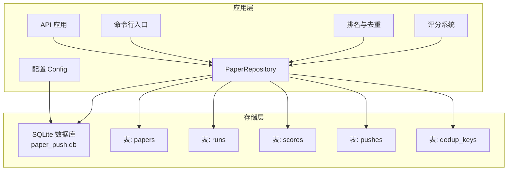
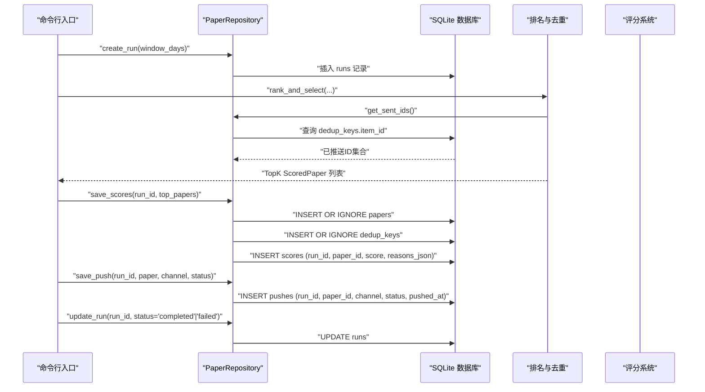
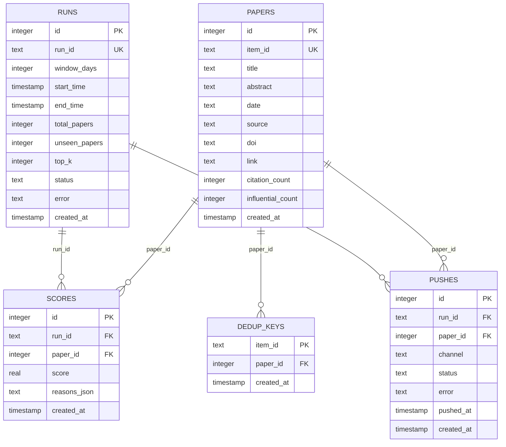
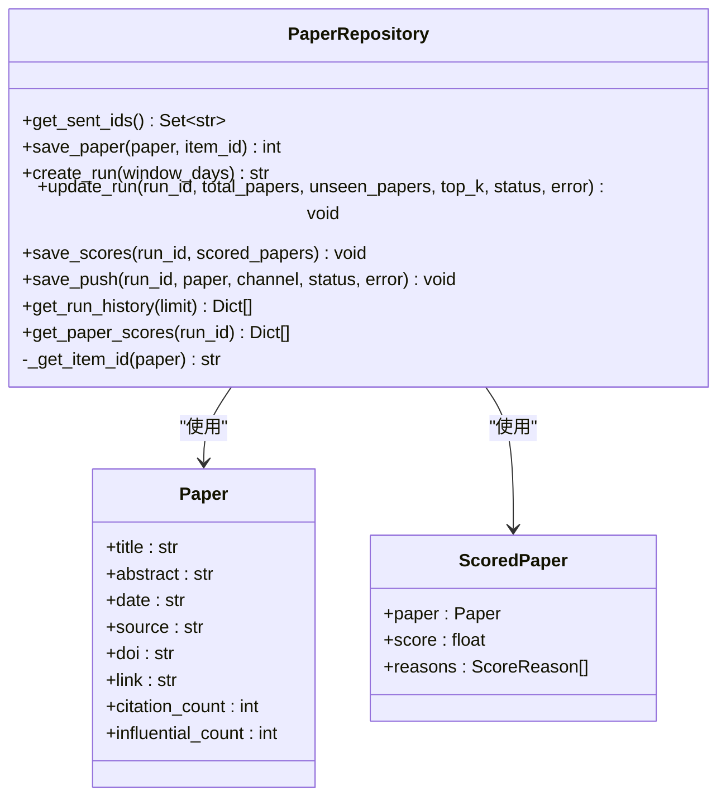
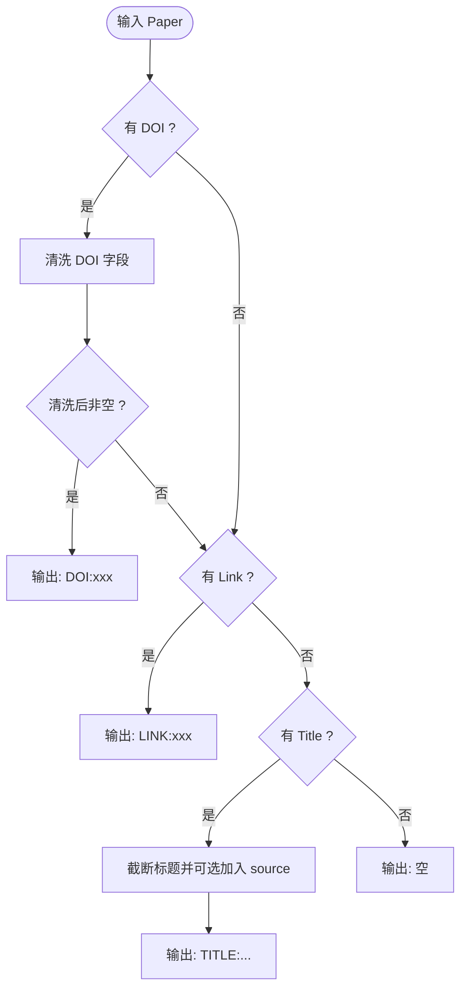
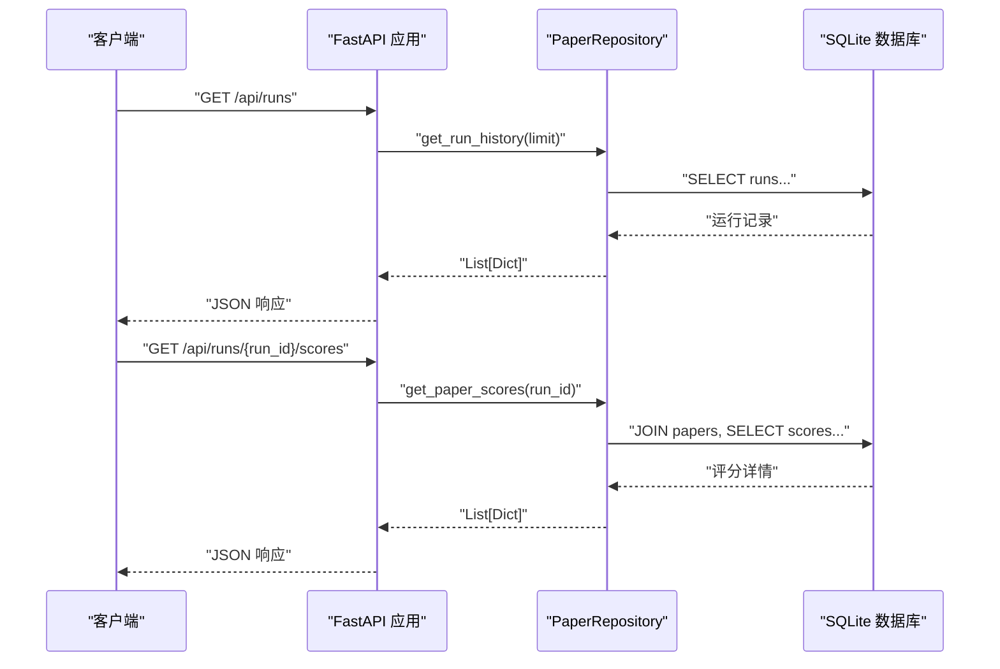
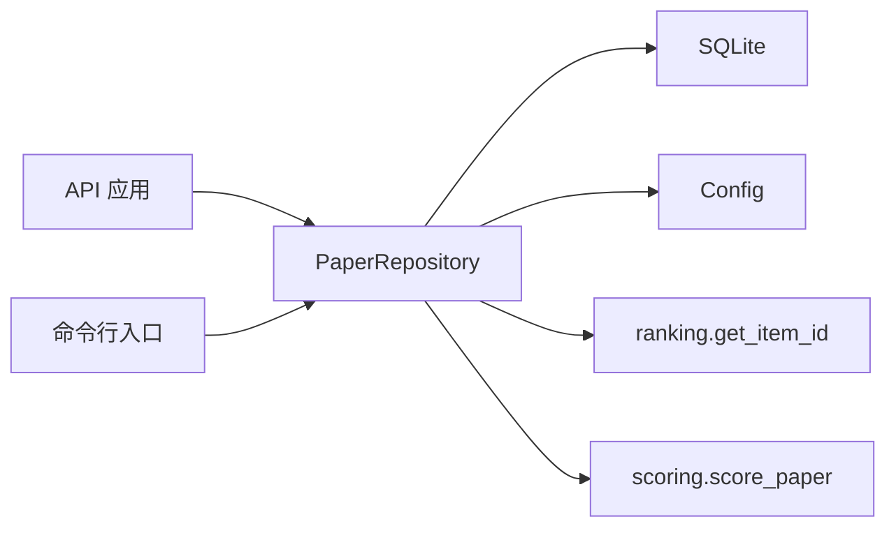

# 存储管理

<cite>
**本文引用的文件**
- [app/storage/db.py](file://app/storage/db.py)
- [app/storage/repo.py](file://app/storage/repo.py)
- [app/models.py](file://app/models.py)
- [app/config.py](file://app/config.py)
- [app/api.py](file://app/api.py)
- [app/cli.py](file://app/cli.py)
- [app/ranking.py](file://app/ranking.py)
- [app/scoring.py](file://app/scoring.py)
</cite>

## 目录
1. [简介](#简介)
2. [项目结构](#项目结构)
3. [核心组件](#核心组件)
4. [架构总览](#架构总览)
5. [详细组件分析](#详细组件分析)
6. [依赖分析](#依赖分析)
7. [性能考虑](#性能考虑)
8. [故障排查指南](#故障排查指南)
9. [结论](#结论)
10. [附录](#附录)

## 简介
本文件聚焦于存储管理模块，围绕SQLite数据库在数据持久化与系统审计中的核心作用展开。重点覆盖：
- 数据库连接与初始化：db.py中连接池与表结构定义（papers、runs、scores、pushes、dedup_keys）。
- 数据仓库PaperRepository：去重判断、运行全流程记录、API查询支持等关键方法。
- item_id生成策略：基于DOI、链接或标题哈希的跨源去重机制。
- 数据模型映射：Paper、ScoredPaper与数据库表之间的对应关系。
- 数据库文件位置、备份策略、性能优化建议与常见SQL查询示例，便于数据审查与迁移。

## 项目结构
存储管理位于app/storage目录，配合配置、API、CLI与评分/排名模块共同构成完整的数据流闭环。

图表来源
- [app/storage/db.py](file://app/storage/db.py#L40-L131)
- [app/storage/repo.py](file://app/storage/repo.py#L1-L274)
- [app/config.py](file://app/config.py#L106-L108)
- [app/api.py](file://app/api.py#L19-L88)
- [app/cli.py](file://app/cli.py#L23-L149)
- [app/ranking.py](file://app/ranking.py#L13-L29)
- [app/scoring.py](file://app/scoring.py#L10-L92)

章节来源
- [app/storage/db.py](file://app/storage/db.py#L14-L131)
- [app/storage/repo.py](file://app/storage/repo.py#L1-L274)
- [app/config.py](file://app/config.py#L106-L108)
- [app/api.py](file://app/api.py#L19-L88)
- [app/cli.py](file://app/cli.py#L23-L149)
- [app/ranking.py](file://app/ranking.py#L13-L29)
- [app/scoring.py](file://app/scoring.py#L10-L92)

## 核心组件
- 数据库初始化与连接
  - 路径解析：通过配置获取数据库文件路径，相对路径自动转绝对路径。
  - 连接管理：上下文管理器封装连接生命周期，自动提交/回滚/关闭。
  - 表结构：papers、runs、scores、pushes、dedup_keys五张表；并建立必要索引。
- 数据仓库PaperRepository
  - 去重：通过dedup_keys表维护item_id到paper_id的映射。
  - 运行记录：create_run/update_run记录每次运行的窗口、状态、计数等。
  - 评分与推送：save_scores保存评分与原因，save_push记录推送渠道与状态。
  - 查询：get_run_history、get_paper_scores支撑API。
- item_id生成策略
  - 优先级：DOI → 链接 → 标题（含来源限定）→ 空。
  - 统一格式：前缀区分来源，保证跨源一致性。
- 数据模型映射
  - Paper ↔ papers
  - ScoredPaper → scores（paper_id关联）
  - runs/pushes/dedup_keys作为运行、推送与去重索引支撑。

章节来源
- [app/storage/db.py](file://app/storage/db.py#L14-L131)
- [app/storage/repo.py](file://app/storage/repo.py#L18-L273)
- [app/models.py](file://app/models.py#L9-L77)
- [app/ranking.py](file://app/ranking.py#L13-L29)

## 架构总览
以下序列图展示从CLI触发到数据库持久化的完整流程，包括评分与推送记录。

图表来源
- [app/cli.py](file://app/cli.py#L23-L149)
- [app/ranking.py](file://app/ranking.py#L46-L109)
- [app/scoring.py](file://app/scoring.py#L10-L92)
- [app/storage/repo.py](file://app/storage/repo.py#L60-L203)
- [app/storage/db.py](file://app/storage/db.py#L40-L131)

## 详细组件分析

### 数据库初始化与连接（db.py）
- 路径解析
  - 通过配置获取DB_PATH，若为相对路径则转为绝对路径。
- 连接管理
  - 使用上下文管理器，设置行工厂为sqlite3.Row，便于字典式访问。
  - 自动commit/rollback/关闭，异常时记录日志并抛出。
- 表结构与索引
  - papers：论文元信息，包含item_id唯一键、来源、DOI、链接、引用计数等。
  - runs：运行记录，包含窗口天数、起止时间、统计量、状态、错误等。
  - scores：评分记录，包含run_id、paper_id、分数与原因JSON。
  - pushes：推送记录，包含渠道、状态、错误、推送时间等。
  - dedup_keys：去重索引，item_id→paper_id，加速去重与关联查询。
  - 索引：对papers.item_id、papers.date、scores.run_id、pushes.run_id、pushes.status建立索引。

图表来源
- [app/storage/db.py](file://app/storage/db.py#L48-L128)

章节来源
- [app/storage/db.py](file://app/storage/db.py#L14-L131)
- [app/config.py](file://app/config.py#L106-L108)

### 数据仓库PaperRepository（repo.py）
- 去重判断
  - get_sent_ids：从dedup_keys表读取全部item_id，构建集合供上游去重使用。
- 论文保存
  - save_paper：INSERT OR IGNORE写入papers，再查询paper_id；同时写入dedup_keys，保证item_id→paper_id映射。
- 运行记录
  - create_run：生成run_id并写入runs，初始状态为running。
  - update_run：按需更新字段，结束状态时自动补全end_time。
- 评分与推送
  - save_scores：在单个事务内批量保存TopK论文与评分，先确保papers存在，再防重复评分，最后写入scores。
  - save_push：根据Paper生成item_id，保存paper后写入pushes，成功时填充pushed_at。
- 查询API
  - get_run_history：按开始时间倒序返回最近N条运行记录。
  - get_paper_scores：按run_id联表查询论文标题、来源、日期与评分详情。

图表来源
- [app/storage/repo.py](file://app/storage/repo.py#L18-L273)
- [app/models.py](file://app/models.py#L9-L77)

章节来源
- [app/storage/repo.py](file://app/storage/repo.py#L18-L273)
- [app/models.py](file://app/models.py#L9-L77)

### item_id生成策略（ranking.py 与 repo.py）
- 生成规则
  - DOI优先：清洗URL与前缀后拼接“DOI:”前缀。
  - 链接次之：拼接“LINK:”前缀。
  - 标题第三：截断标题长度，可选加上source，拼接“TITLE:”前缀。
  - 无有效字段则返回空。
- 与仓库协作
  - 仓库内部也实现相同逻辑（_get_item_id），确保与排名模块一致。
- 去重效果
  - item_id唯一约束papers.item_id与dedup_keys.item_id，避免跨源重复入库。

图表来源
- [app/ranking.py](file://app/ranking.py#L13-L29)
- [app/storage/repo.py](file://app/storage/repo.py#L204-L221)

章节来源
- [app/ranking.py](file://app/ranking.py#L13-L29)
- [app/storage/repo.py](file://app/storage/repo.py#L204-L221)

### 数据模型与数据库映射（models.py）
- Paper
  - 字段：title、abstract、date、source、doi、link、citation_count、influential_count。
  - 映射：papers表字段一一对应，部分字段用于评分与去重。
- ScoredPaper
  - 字段：paper、score、reasons。
  - 映射：scores表的run_id、paper_id、score、reasons_json分别来自run_id与paper_id以及评分结构化JSON。
- 关系
  - scores.paper_id → papers.id
  - pushes.paper_id → papers.id
  - dedup_keys.item_id → papers.item_id

章节来源
- [app/models.py](file://app/models.py#L9-L77)
- [app/storage/db.py](file://app/storage/db.py#L48-L128)

### API与CLI集成（api.py、cli.py）
- API
  - /api/run：触发推送任务（异步线程池执行）。
  - /api/runs：获取运行历史。
  - /api/runs/{run_id}/scores：获取某次运行的评分详情。
- CLI
  - run_push_task：初始化数据库、创建运行、并发抓取、去重、评分、保存报告、推送、记录推送与运行状态。
  - test_sources：测试各数据源可用性。

图表来源
- [app/api.py](file://app/api.py#L46-L68)
- [app/storage/repo.py](file://app/storage/repo.py#L222-L273)

章节来源
- [app/api.py](file://app/api.py#L19-L88)
- [app/cli.py](file://app/cli.py#L23-L149)
- [app/storage/repo.py](file://app/storage/repo.py#L222-L273)

## 依赖分析
- 组件耦合
  - PaperRepository依赖db.get_db与Config.DB_PATH，直接操作SQLite表。
  - API与CLI均通过PaperRepository访问数据库，形成清晰的边界。
  - ranking与repo共享item_id生成逻辑，保证去重一致性。
- 外部依赖
  - sqlite3标准库、fastapi（API）、concurrent.futures（CLI并发）。
- 潜在循环依赖
  - 未发现循环导入；模块职责清晰，接口稳定。

图表来源
- [app/api.py](file://app/api.py#L19-L88)
- [app/cli.py](file://app/cli.py#L23-L149)
- [app/storage/repo.py](file://app/storage/repo.py#L18-L273)
- [app/ranking.py](file://app/ranking.py#L13-L29)
- [app/scoring.py](file://app/scoring.py#L10-L92)
- [app/config.py](file://app/config.py#L106-L108)

章节来源
- [app/api.py](file://app/api.py#L19-L88)
- [app/cli.py](file://app/cli.py#L23-L149)
- [app/storage/repo.py](file://app/storage/repo.py#L18-L273)
- [app/ranking.py](file://app/ranking.py#L13-L29)
- [app/scoring.py](file://app/scoring.py#L10-L92)
- [app/config.py](file://app/config.py#L106-L108)

## 性能考虑
- 索引优化
  - 已建立papers.item_id、papers.date、scores.run_id、pushes.run_id、pushes.status索引，有助于高频查询。
- 事务与批量
  - save_scores在单连接内批量处理，减少往返开销；INSERT OR IGNORE避免重复写入。
- 去重效率
  - dedup_keys表以item_id为主键，配合get_sent_ids一次性加载，降低重复扫描成本。
- I/O与并发
  - CLI使用线程池并发抓取数据源，但数据库写入集中在PaperRepository内串行化，避免锁竞争。
- 建议
  - 对大量评分场景，可考虑批量插入scores以减少事务次数。
  - 若历史数据庞大，可定期归档runs/scores至只读副本，保留近期活跃数据在主库。

[本节为通用性能建议，不直接分析具体文件]

## 故障排查指南
- 数据库连接失败
  - 检查DB_PATH是否正确，确认文件权限与父目录存在。
  - 查看日志中错误信息，定位异常点。
- 去重无效或重复入库
  - 确认item_id生成逻辑一致（ranking与repo内部逻辑一致）。
  - 检查dedup_keys是否正确写入，item_id是否唯一。
- 评分重复
  - save_scores已检查重复，若仍出现，检查run_id与paper_id组合是否唯一。
- 推送记录缺失
  - 确认save_push调用链路，成功时会写入pushed_at。
- API查询异常
  - 检查get_run_history与get_paper_scores的参数与返回结构，确保run_id有效。

章节来源
- [app/storage/db.py](file://app/storage/db.py#L23-L38)
- [app/storage/repo.py](file://app/storage/repo.py#L18-L273)
- [app/api.py](file://app/api.py#L46-L68)

## 结论
存储管理模块以SQLite为核心，通过规范的表结构、严格的去重策略与完善的运行记录，实现了可靠的数据持久化与系统审计能力。PaperRepository将业务逻辑与数据访问解耦，配合ranking与scoring模块，形成从抓取、去重、评分到推送的完整闭环。API与CLI双入口保障了系统的可运维性与可观测性。

[本节为总结性内容，不直接分析具体文件]

## 附录

### 数据库文件位置与备份策略
- 文件位置
  - 默认路径：DB_PATH（默认值为paper_push.db），相对路径将被解析为绝对路径。
- 备份建议
  - 周期性复制数据库文件；在重要运行前后手动备份。
  - 使用SQLite在线备份工具进行热备份，避免停机。

章节来源
- [app/config.py](file://app/config.py#L106-L108)
- [app/storage/db.py](file://app/storage/db.py#L14-L21)

### 常见SQL查询示例（用于数据审查与迁移）
- 查询最近N次运行
  - SELECT run_id, window_days, start_time, end_time, total_papers, unseen_papers, top_k, status, error FROM runs ORDER BY start_time DESC LIMIT N;
- 查询某次运行的评分详情
  - SELECT p.title, p.source, p.date, s.score, s.reasons_json FROM scores s JOIN papers p ON s.paper_id = p.id WHERE s.run_id = ? ORDER BY s.score DESC;
- 统计推送状态分布
  - SELECT status, COUNT(*) FROM pushes GROUP BY status;
- 查看去重索引
  - SELECT item_id, paper_id FROM dedup_keys ORDER BY created_at DESC LIMIT 100;

[本节为通用SQL示例，不直接分析具体文件]