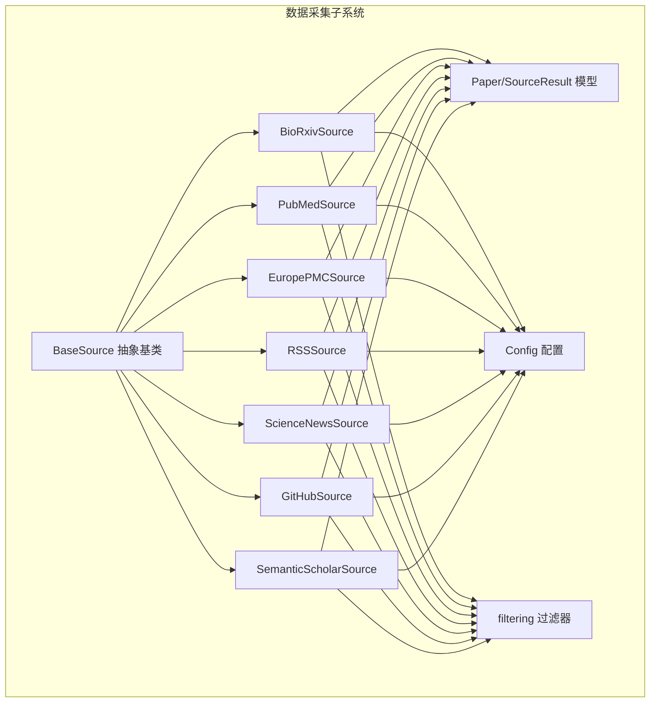
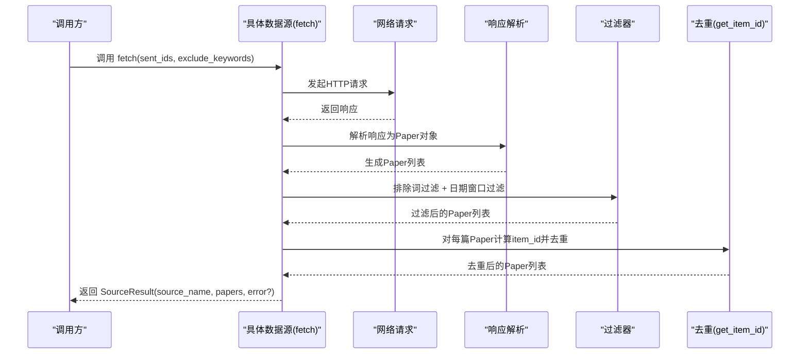
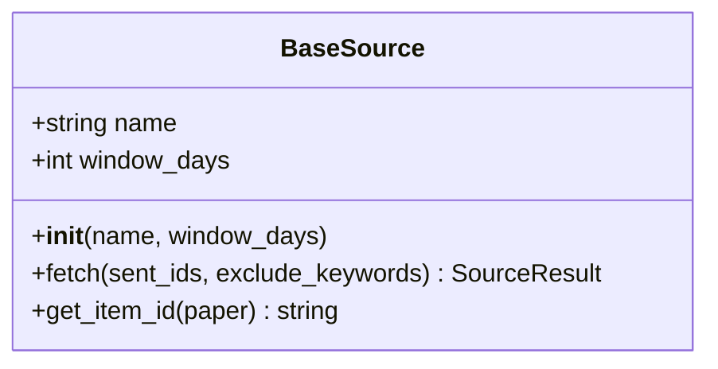
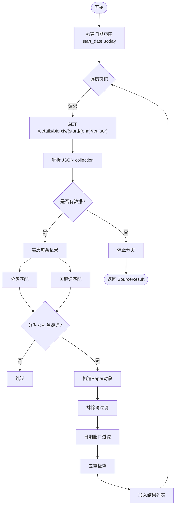
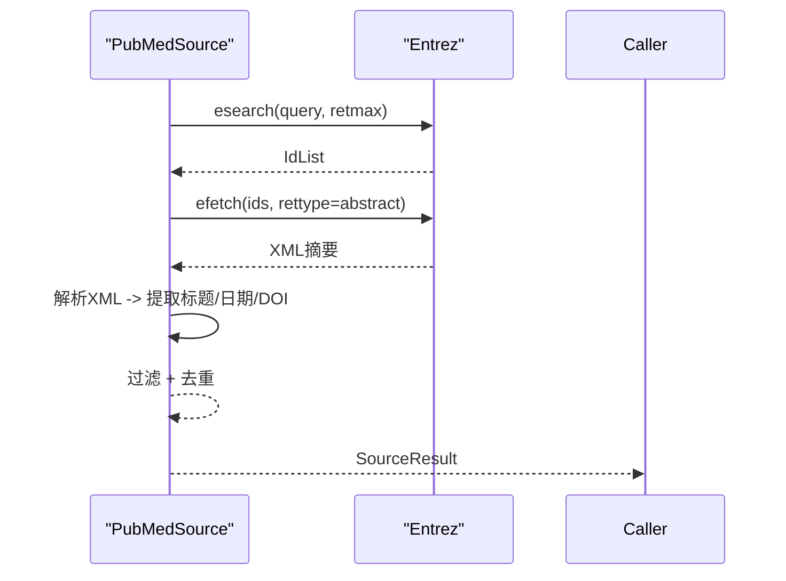
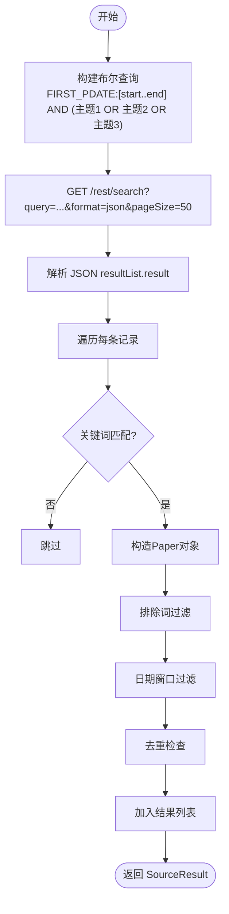
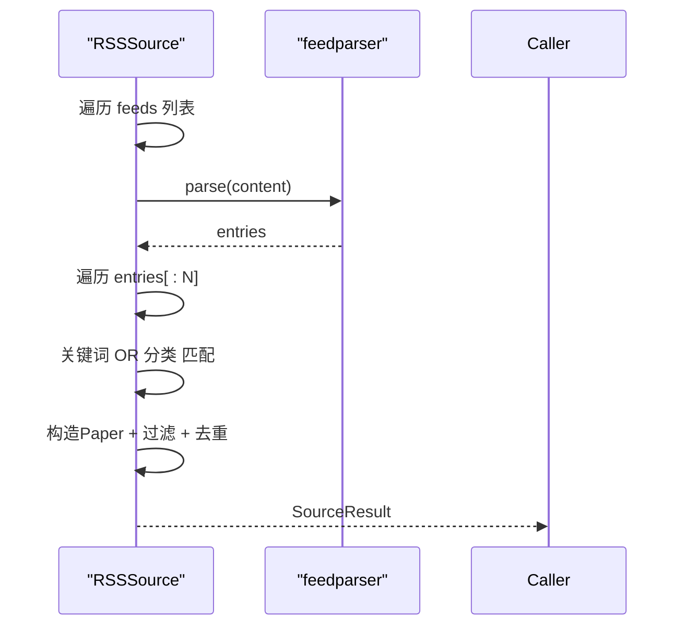
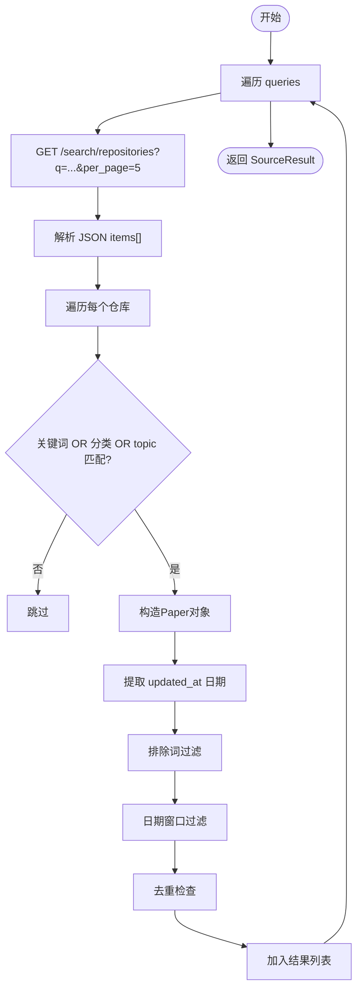
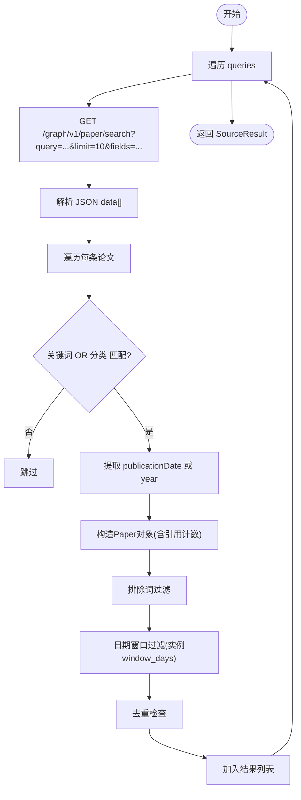
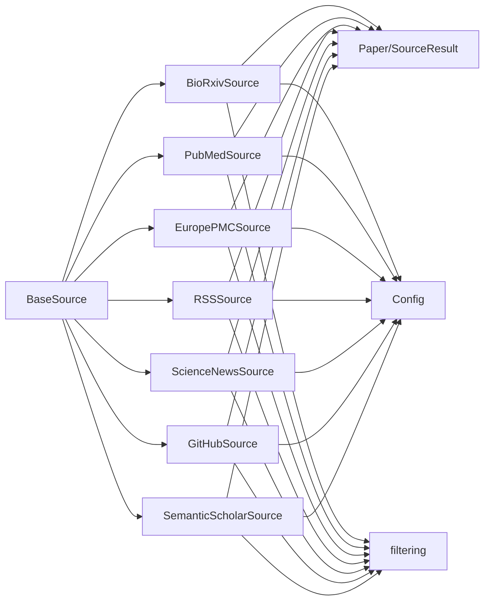

# 数据采集

<cite>
**本文引用的文件**
- [app/sources/base.py](file://app/sources/base.py)
- [app/sources/biorxiv.py](file://app/sources/biorxiv.py)
- [app/sources/pubmed.py](file://app/sources/pubmed.py)
- [app/sources/europepmc.py](file://app/sources/europepmc.py)
- [app/sources/rss.py](file://app/sources/rss.py)
- [app/sources/sciencenews.py](file://app/sources/sciencenews.py)
- [app/sources/github.py](file://app/sources/github.py)
- [app/sources/semanticscholar.py](file://app/sources/semanticscholar.py)
- [app/models.py](file://app/models.py)
- [app/config.py](file://app/config.py)
- [app/filtering.py](file://app/filtering.py)
- [app/sources/__init__.py](file://app/sources/__init__.py)
- [test_sources_now.py](file://test_sources_now.py)
</cite>

## 目录
1. [简介](#简介)
2. [项目结构](#项目结构)
3. [核心组件](#核心组件)
4. [架构总览](#架构总览)
5. [详细组件分析](#详细组件分析)
6. [依赖关系分析](#依赖关系分析)
7. [性能考量](#性能考量)
8. [故障排查指南](#故障排查指南)
9. [结论](#结论)
10. [附录](#附录)

## 简介
本文件面向“数据采集子系统”，聚焦其作为“多源学术信息抓取引擎”的架构设计与实现机制。文档以BaseSource抽象基类为核心，说明如何统一不同数据源的接口规范，确保扩展性与一致性；随后逐个解析bioRxiv、PubMed、Europe PMC、RSS、ScienceNews、GitHub与Semantic Scholar七类数据源的具体实现逻辑，涵盖HTTP请求构造、响应解析（如feedparser用于RSS、Biopython用于PubMed）、元数据提取与异常处理策略。文档还说明数据采集阶段输出的SourceResult结构及其在后续流程中的作用，并给出针对网络超时、API限流、解析失败等常见问题的排查建议。

## 项目结构
数据采集子系统位于app/sources目录下，采用“按功能域划分”的模块化组织方式：
- 抽象基类：app/sources/base.py
- 具体数据源：app/sources/biorxiv.py、pubmed.py、europepmc.py、rss.py、sciencenews.py、github.py、semanticscholar.py
- 统一模型与结果封装：app/models.py
- 配置与过滤：app/config.py、app/filtering.py
- 导出聚合：app/sources/__init__.py
- 快速测试入口：test_sources_now.py

图表来源
- [app/sources/base.py](file://app/sources/base.py#L9-L53)
- [app/sources/biorxiv.py](file://app/sources/biorxiv.py#L20-L96)
- [app/sources/pubmed.py](file://app/sources/pubmed.py#L23-L139)
- [app/sources/europepmc.py](file://app/sources/europepmc.py#L14-L72)
- [app/sources/rss.py](file://app/sources/rss.py#L20-L85)
- [app/sources/sciencenews.py](file://app/sources/sciencenews.py#L20-L70)
- [app/sources/github.py](file://app/sources/github.py#L14-L107)
- [app/sources/semanticscholar.py](file://app/sources/semanticscholar.py#L14-L99)
- [app/models.py](file://app/models.py#L9-L77)
- [app/config.py](file://app/config.py#L16-L134)
- [app/filtering.py](file://app/filtering.py#L1-L68)

章节来源
- [app/sources/__init__.py](file://app/sources/__init__.py#L1-L23)

## 核心组件
- BaseSource抽象基类：定义统一的fetch接口与通用的去重逻辑（get_item_id），确保各具体数据源遵循一致的契约。
- Paper数据模型：承载论文字段（标题、摘要、日期、来源、DOI、链接、引用计数等），并提供序列化/反序列化能力。
- SourceResult结果封装：承载单个数据源的抓取结果与错误信息，便于上层统一处理。
- Config配置中心：集中管理关键词、排除词、窗口天数、API密钥等全局参数。
- filtering过滤器：提供排除词过滤与日期窗口过滤能力。

章节来源
- [app/sources/base.py](file://app/sources/base.py#L9-L53)
- [app/models.py](file://app/models.py#L9-L77)
- [app/config.py](file://app/config.py#L16-L134)
- [app/filtering.py](file://app/filtering.py#L1-L68)

## 架构总览
数据采集子系统的控制流如下：
- 上层调用各数据源的fetch方法，传入已推送ID集合与排除关键词列表。
- 各数据源基于自身API/Feed构造请求，解析响应，提取Paper对象。
- 调用过滤器进行排除词与日期窗口过滤。
- 使用BaseSource的get_item_id进行去重判断。
- 返回SourceResult，包含papers列表与可选error信息。

图表来源
- [app/sources/base.py](file://app/sources/base.py#L16-L50)
- [app/filtering.py](file://app/filtering.py#L9-L68)
- [app/sources/biorxiv.py](file://app/sources/biorxiv.py#L26-L92)
- [app/sources/pubmed.py](file://app/sources/pubmed.py#L31-L97)
- [app/sources/europepmc.py](file://app/sources/europepmc.py#L20-L68)
- [app/sources/rss.py](file://app/sources/rss.py#L36-L81)
- [app/sources/sciencenews.py](file://app/sources/sciencenews.py#L30-L66)
- [app/sources/github.py](file://app/sources/github.py#L38-L92)
- [app/sources/semanticscholar.py](file://app/sources/semanticscholar.py#L36-L95)

## 详细组件分析

### BaseSource抽象基类
- 角色定位：统一数据源接口规范，强制实现fetch方法；提供通用的去重逻辑。
- 关键点：
  - fetch方法签名：接收sent_ids（已推送ID集合）与exclude_keywords（排除关键词列表），返回SourceResult。
  - get_item_id：优先使用DOI，其次使用链接，再其次使用标题+来源，最后回退到标题哈希；返回形如“TYPE:VALUE”的字符串用于去重。
- 设计意义：保证新增数据源只需实现fetch，即可无缝接入统一的过滤与去重流程。

图表来源
- [app/sources/base.py](file://app/sources/base.py#L9-L53)

章节来源
- [app/sources/base.py](file://app/sources/base.py#L9-L53)

### bioRxiv 数据源
- 请求构造：按时间窗口分页抓取，URL包含起止日期与游标参数，限制每页大小与最大页数。
- 响应解析：JSON中collection字段为论文数组；对空数组提前终止。
- 过滤策略：
  - 分类过滤：category字段包含目标分类之一即视为目标。
  - 关键词过滤：标题+摘要小写后与全量关键词匹配。
  - 放宽条件：分类OR关键词任一满足即可。
  - 排除词过滤与日期窗口过滤由上层调用完成。
- 异常处理：捕获异常并记录日志，返回SourceResult.error。

图表来源
- [app/sources/biorxiv.py](file://app/sources/biorxiv.py#L26-L92)

章节来源
- [app/sources/biorxiv.py](file://app/sources/biorxiv.py#L20-L96)

### PubMed 数据源
- 可选依赖：Biopython（Entrez）；若未安装则直接返回错误。
- 请求构造：组合三类主题查询（固氮、信号转导、酶结构与机制），限定出版日期范围。
- 响应解析：先esearch获取ID列表，再efetch以XML形式读取摘要；逐条提取标题、日期、DOI。
- 日期提取：优先DateCompleted，其次ArticleDate，最后回退默认日期。
- 异常处理：导入失败与运行时异常均记录日志并返回SourceResult.error。

图表来源
- [app/sources/pubmed.py](file://app/sources/pubmed.py#L31-L97)
- [app/sources/pubmed.py](file://app/sources/pubmed.py#L98-L139)

章节来源
- [app/sources/pubmed.py](file://app/sources/pubmed.py#L23-L139)

### Europe PMC 数据源
- 请求构造：使用EBI提供的REST搜索接口，query参数包含日期范围与三类主题词的布尔表达式，pageSize=50。
- 响应解析：JSON中resultList.result为论文数组；提取标题、摘要、首次发表日期或年份，DOI与PMCID。
- 过滤策略：关键词匹配（全量关键词），排除词过滤与日期窗口过滤。
- 异常处理：捕获异常并记录日志，返回SourceResult.error。

图表来源
- [app/sources/europepmc.py](file://app/sources/europepmc.py#L20-L68)

章节来源
- [app/sources/europepmc.py](file://app/sources/europepmc.py#L14-L72)

### RSS 与 ScienceNews 数据源
- 共同点：均使用feedparser解析RSS/Atom源；放宽过滤策略为“关键词匹配 OR 分类匹配”。
- RSSSource：维护多个顶级期刊RSS源，每个源取前若干条（如15条），解析标题、摘要、发布/更新日期与链接。
- ScienceNewsSource：维护EurekAlert农业与生物学RSS源，每个源取前若干条（如3条），解析标题、摘要、发布/更新日期与链接。
- 异常处理：对单个源解析失败进行警告日志，不影响其他源；最终返回合并后的SourceResult。

图表来源
- [app/sources/rss.py](file://app/sources/rss.py#L36-L81)
- [app/sources/sciencenews.py](file://app/sources/sciencenews.py#L30-L66)

章节来源
- [app/sources/rss.py](file://app/sources/rss.py#L1-L85)
- [app/sources/sciencenews.py](file://app/sources/sciencenews.py#L1-L70)

### GitHub 数据源
- 请求构造：按预设查询词（固氮、信号转导、酶结构、通用生物工具）调用GitHub Search Repositories API，per_page=5。
- 响应解析：提取仓库名与描述，小写后与全量关键词和目标分类匹配；topic也参与匹配。
- 日期提取：使用updated_at转换为YYYY-MM-DD；失败则回退至当天。
- 过滤与去重：排除词过滤、日期窗口过滤、去重检查。
- 异常处理：对单个查询失败进行警告日志，不影响其他查询；最终返回SourceResult。

图表来源
- [app/sources/github.py](file://app/sources/github.py#L38-L92)
- [app/sources/github.py](file://app/sources/github.py#L94-L107)

章节来源
- [app/sources/github.py](file://app/sources/github.py#L14-L107)

### Semantic Scholar 数据源
- 请求构造：按预设查询词调用Graph Search API，limit=10，按year排序取最新。
- 响应解析：提取标题、摘要、publicationDate或year，DOI来自externalIds，附加引用计数与高影响力引用计数。
- 日期提取：优先publicationDate（截取前10位），否则回退year；最终构造Paper对象。
- 过滤与去重：排除词过滤、日期窗口过滤（使用实例window_days）、去重检查。
- 异常处理：对单个查询失败进行警告日志；最终返回SourceResult。

图表来源
- [app/sources/semanticscholar.py](file://app/sources/semanticscholar.py#L36-L95)

章节来源
- [app/sources/semanticscholar.py](file://app/sources/semanticscholar.py#L14-L99)

### SourceResult 结构与后续流程
- 结构：包含source_name、papers列表与可选error字符串。
- 语义：fetch成功时papers非空且error为空；失败时papers为空且error包含错误信息。
- 后续流程：上层收集各SourceResult，统一进行去重（基于get_item_id）、评分与排序，再进入推送环节。

章节来源
- [app/models.py](file://app/models.py#L65-L77)
- [app/sources/base.py](file://app/sources/base.py#L30-L50)

## 依赖关系分析
- 组件耦合：
  - 各数据源强依赖BaseSource的fetch契约与get_item_id去重逻辑。
  - 共享依赖：Config（关键词、排除词、窗口天数）、filtering（排除词与日期过滤）、Paper/SourceResult（数据模型与结果封装）。
- 外部依赖：
  - RSS类：feedparser（可选依赖，缺失时返回错误）。
  - PubMed：Biopython（Entrez），缺失时返回错误。
  - 网络请求：requests，部分源使用proxies={'http': None, 'https': None}禁用代理。
- 潜在循环依赖：未发现直接循环；各数据源通过公共模块间接依赖Config与filtering。

图表来源
- [app/sources/base.py](file://app/sources/base.py#L9-L53)
- [app/sources/biorxiv.py](file://app/sources/biorxiv.py#L20-L96)
- [app/sources/pubmed.py](file://app/sources/pubmed.py#L23-L139)
- [app/sources/europepmc.py](file://app/sources/europepmc.py#L14-L72)
- [app/sources/rss.py](file://app/sources/rss.py#L20-L85)
- [app/sources/sciencenews.py](file://app/sources/sciencenews.py#L20-L70)
- [app/sources/github.py](file://app/sources/github.py#L14-L107)
- [app/sources/semanticscholar.py](file://app/sources/semanticscholar.py#L14-L99)
- [app/models.py](file://app/models.py#L9-L77)
- [app/config.py](file://app/config.py#L16-L134)
- [app/filtering.py](file://app/filtering.py#L1-L68)

章节来源
- [app/sources/__init__.py](file://app/sources/__init__.py#L1-L23)

## 性能考量
- 分页与限流：
  - bioRxiv/Europe PMC：限制每页条数与最大页数，避免一次性拉取过多导致超时或限流。
  - GitHub/Semantic Scholar：限制每查询返回条数，降低网络负载。
- 超时与代理：
  - 多数请求设置timeout；部分源显式禁用代理以稳定网络行为。
- 过滤前置：
  - 在网络层尽早筛除不相关条目（分类/关键词），减少后续解析与过滤成本。
- 去重与历史记录：
  - 通过sent_ids避免重复推送，减少下游处理压力。

[本节为通用指导，无需列出具体文件来源]

## 故障排查指南
- 网络超时/连接失败
  - 现象：请求抛出异常，SourceResult.error包含错误信息。
  - 排查：检查timeout设置、网络连通性、代理配置；对RSS类与GitHub类可考虑禁用代理。
  - 参考位置：各数据源的fetch方法中对requests的调用与异常捕获。
  - 章节来源
    - [app/sources/biorxiv.py](file://app/sources/biorxiv.py#L36-L46)
    - [app/sources/europepmc.py](file://app/sources/europepmc.py#L30-L35)
    - [app/sources/rss.py](file://app/sources/rss.py#L46-L47)
    - [app/sources/github.py](file://app/sources/github.py#L47-L53)
    - [app/sources/semanticscholar.py](file://app/sources/semanticscholar.py#L45-L47)

- API限流/返回空数据
  - 现象：返回空papers或少量数据即停止（如bioRxiv返回少于每页条数时提前结束）。
  - 排查：调整窗口天数、减少查询词数量、增加延迟或降低并发；确认API配额。
  - 章节来源
    - [app/sources/biorxiv.py](file://app/sources/biorxiv.py#L84-L87)
    - [app/sources/europepmc.py](file://app/sources/europepmc.py#L30-L35)

- 解析失败（RSS/Atom）
  - 现象：feedparser解析异常或字段缺失，记录warning日志。
  - 排查：检查RSS源可用性、编码与内容完整性；对单个源失败进行容错。
  - 章节来源
    - [app/sources/rss.py](file://app/sources/rss.py#L46-L78)
    - [app/sources/sciencenews.py](file://app/sources/sciencenews.py#L38-L64)

- 缺少可选依赖（Biopython/feedparser）
  - 现象：返回SourceResult.error提示未安装。
  - 排查：安装对应依赖包；或在配置中禁用相应数据源。
  - 章节来源
    - [app/sources/pubmed.py](file://app/sources/pubmed.py#L14-L21)
    - [app/sources/rss.py](file://app/sources/rss.py#L13-L18)
    - [app/sources/sciencenews.py](file://app/sources/sciencenews.py#L13-L18)

- 日期解析异常
  - 现象：过滤器无法识别日期格式，导致论文被剔除。
  - 排查：确认日期字符串格式（RSS/标准/年份），必要时在上游修正。
  - 章节来源
    - [app/filtering.py](file://app/filtering.py#L15-L53)

- 历史去重失效
  - 现象：重复推送。
  - 排查：确认sent_ids来源与更新频率；检查get_item_id优先级（DOI>链接>标题+来源）。
  - 章节来源
    - [app/sources/base.py](file://app/sources/base.py#L30-L50)
    - [test_sources_now.py](file://test_sources_now.py#L31-L33)

## 结论
该数据采集子系统通过BaseSource抽象基类实现了统一接口与通用去重逻辑，辅以Config与filtering模块，使各数据源能够以一致的方式完成“请求—解析—过滤—去重—结果封装”。七类数据源覆盖了预印本、数据库、期刊RSS、新闻RSS、工具仓库与学术搜索引擎，形成互补的信息来源。通过SourceResult标准化输出，为后续评分、排序与推送提供了清晰的数据通道。针对常见问题（超时、限流、解析失败、依赖缺失、日期格式）提供了可操作的排查路径。

[本节为总结性内容，无需列出具体文件来源]

## 附录

### 配置与启用/禁用数据源
- 关键配置项（示例路径）：
  - 关键词与排除词：参考 [app/config.py](file://app/config.py#L26-L87)
  - 窗口天数：参考 [app/config.py](file://app/config.py#L109-L112)
  - PubMed邮箱：参考 [app/config.py](file://app/config.py#L23-L25)
- 启用/禁用数据源：
  - 在调用侧（如测试脚本）选择性实例化所需数据源，即可实现动态启用/禁用。
  - 示例参考：[test_sources_now.py](file://test_sources_now.py#L35-L43)

章节来源
- [app/config.py](file://app/config.py#L26-L112)
- [test_sources_now.py](file://test_sources_now.py#L35-L43)