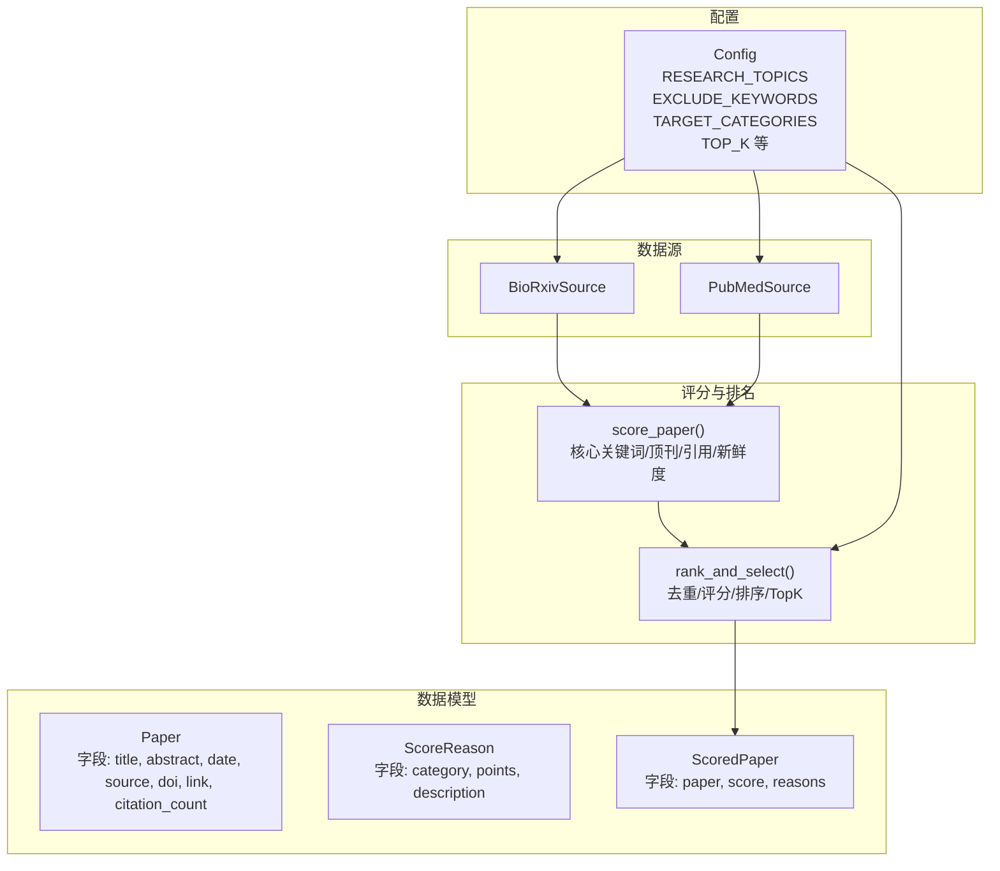
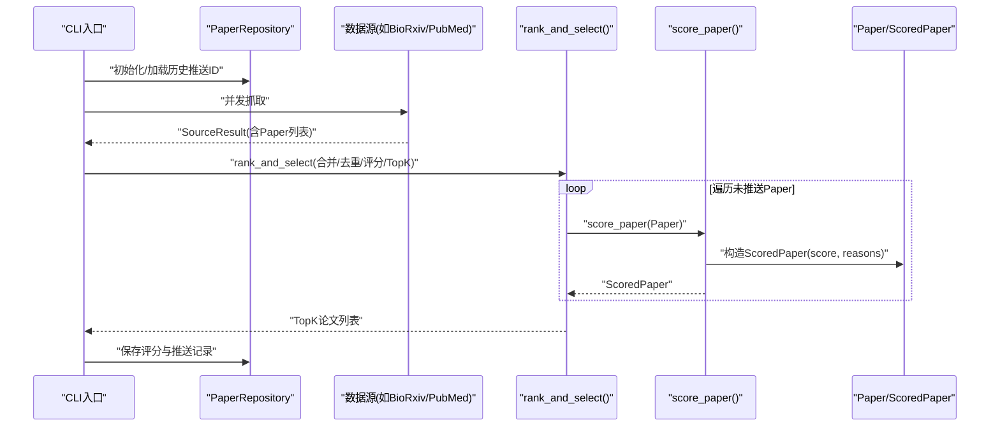
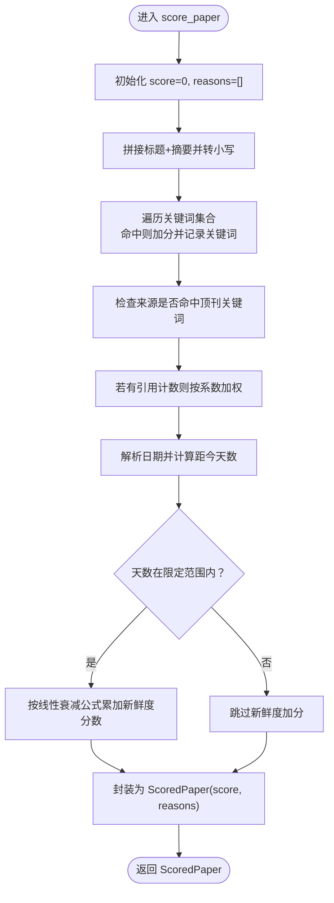
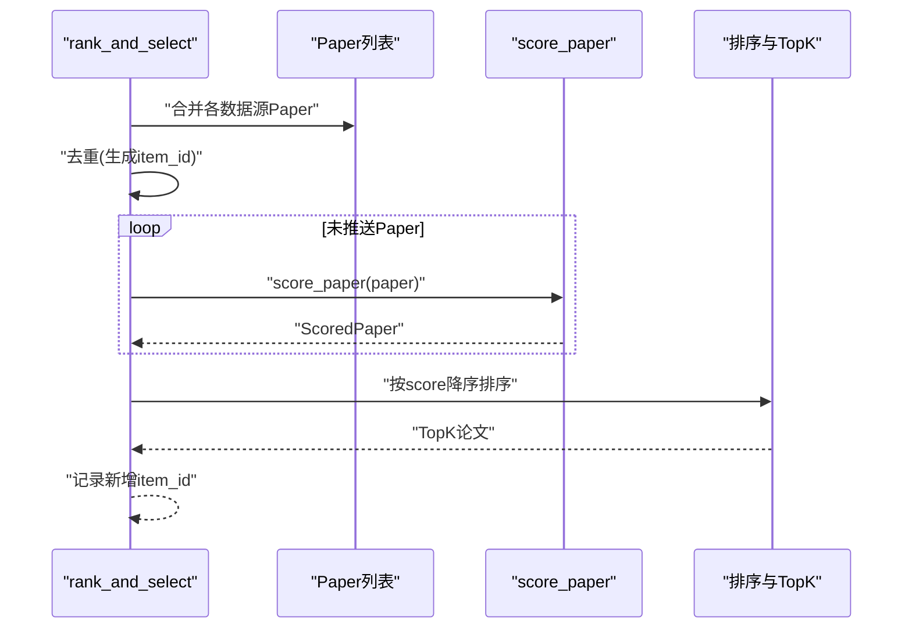
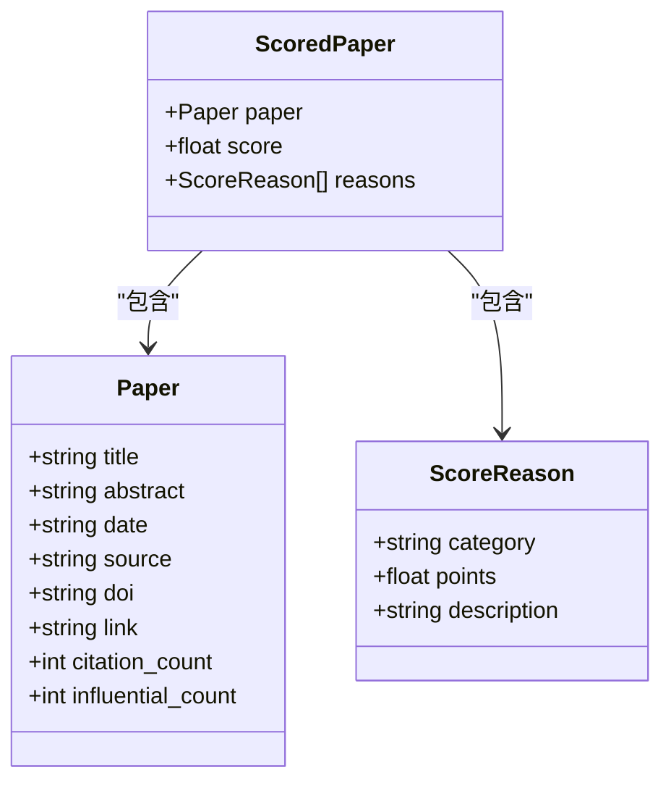
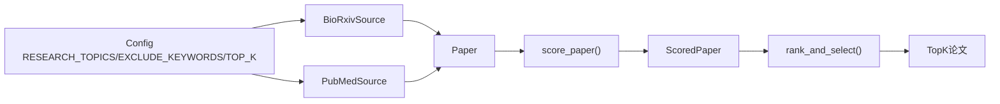

# 智能评分系统

<cite>
**本文引用的文件**
- [app/scoring.py](file://app/scoring.py)
- [app/ranking.py](file://app/ranking.py)
- [app/models.py](file://app/models.py)
- [app/config.py](file://app/config.py)
- [app/filtering.py](file://app/filtering.py)
- [app/sources/biorxiv.py](file://app/sources/biorxiv.py)
- [app/sources/pubmed.py](file://app/sources/pubmed.py)
- [app/cli.py](file://app/cli.py)
- [README.md](file://README.md)
</cite>

## 目录
1. [引言](#引言)
2. [项目结构](#项目结构)
3. [核心组件](#核心组件)
4. [架构总览](#架构总览)
5. [详细组件分析](#详细组件分析)
6. [依赖关系分析](#依赖关系分析)
7. [性能考量](#性能考量)
8. [故障排查指南](#故障排查指南)
9. [结论](#结论)
10. [附录](#附录)

## 引言
本文件围绕智能评分系统展开，重点解析 score_paper 函数中实现的可解释评分算法，涵盖以下评分维度：
- 核心关键词匹配（如 cryo-em、nitrogen fixation 等）
- 顶刊加分机制（Nature/Science/Cell 等）
- 引用数加权计算
- 基于时间的新鲜度补偿模型

同时，结合 config.py 中的 RESEARCH_TOPICS 配置项，说明评分规则的可定制性；解释评分结果如何影响最终 TopK 论文的选择；并讨论算法的局限性与优化方向。最后提供实际评分案例分析，帮助用户理解不同论文的得分构成。

## 项目结构
本项目采用模块化设计，评分系统位于 app/scoring.py，与数据模型、配置、排名与选择流程紧密协作：
- app/models.py：定义 Paper、ScoreReason、ScoredPaper 等数据模型
- app/config.py：集中管理配置，包括 RESEARCH_TOPICS 关键词集合
- app/scoring.py：实现 score_paper 可解释评分算法
- app/ranking.py：合并、去重、评分、TopK 选择
- app/filtering.py：过滤逻辑（排除词、日期范围）
- app/sources/*：各数据源抓取实现，负责构造 Paper 对象
- app/cli.py：命令行入口，驱动抓取、评分、推送全流程

图表来源
- [app/models.py](file://app/models.py#L9-L77)
- [app/config.py](file://app/config.py#L16-L134)
- [app/scoring.py](file://app/scoring.py#L10-L95)
- [app/ranking.py](file://app/ranking.py#L46-L109)
- [app/sources/biorxiv.py](file://app/sources/biorxiv.py#L20-L96)
- [app/sources/pubmed.py](file://app/sources/pubmed.py#L23-L139)

章节来源
- [README.md](file://README.md#L1-L134)
- [app/models.py](file://app/models.py#L9-L77)
- [app/config.py](file://app/config.py#L16-L134)
- [app/scoring.py](file://app/scoring.py#L10-L95)
- [app/ranking.py](file://app/ranking.py#L46-L109)
- [app/sources/biorxiv.py](file://app/sources/biorxiv.py#L20-L96)
- [app/sources/pubmed.py](file://app/sources/pubmed.py#L23-L139)

## 核心组件
- Paper：承载论文元信息，供评分与后续流程使用
- ScoreReason：记录单项得分的依据，包含类别、分数与描述
- ScoredPaper：封装带评分的论文，包含 Paper、score、reasons 列表
- Config：集中配置，其中 RESEARCH_TOPICS 提供可定制的关键词集合
- score_paper：评分主函数，按关键词、顶刊、引用、新鲜度四维计算分数并记录原因
- rank_and_select：合并去重、评分、排序与 TopK 选择

章节来源
- [app/models.py](file://app/models.py#L9-L77)
- [app/config.py](file://app/config.py#L26-L64)
- [app/scoring.py](file://app/scoring.py#L10-L95)
- [app/ranking.py](file://app/ranking.py#L46-L109)

## 架构总览
下图展示了从数据源抓取到最终 TopK 选择的端到端流程，以及评分环节在其中的位置。

图表来源
- [app/cli.py](file://app/cli.py#L23-L149)
- [app/ranking.py](file://app/ranking.py#L46-L109)
- [app/scoring.py](file://app/scoring.py#L10-L95)
- [app/models.py](file://app/models.py#L9-L77)

## 详细组件分析

### 评分算法：score_paper
score_paper 实现了四维评分与可解释性记录：
- 核心关键词匹配
  - 关键词集合来自固定列表（结构/固氮/信号三类），命中即加分
  - 每个命中的关键词加固定分值，最终将所有命中关键词的分数汇总为一项原因记录
- 顶刊加分
  - 若来源包含指定顶刊关键词，一次性加固定分值，并记录原因
- 引用数加权
  - 引用计数乘以固定系数后累加到总分，并记录原因
- 新鲜度补偿
  - 解析论文日期，计算距今天的天数，若在限定范围内，则按线性衰减公式累加分数，并记录原因

评分原因通过 ScoreReason 对象记录，最终封装进 ScoredPaper，保证评分过程透明可追溯。

图表来源
- [app/scoring.py](file://app/scoring.py#L10-L95)
- [app/models.py](file://app/models.py#L49-L77)

章节来源
- [app/scoring.py](file://app/scoring.py#L10-L95)
- [app/models.py](file://app/models.py#L49-L77)

### 排名与选择：rank_and_select
rank_and_select 负责：
- 合并各数据源返回的 Paper 列表
- 去重（基于 DOI/LINK/TITLE 组合生成唯一 ID）
- 逐篇调用 score_paper 评分
- 按分数降序排序并截取 TopK
- 记录本次推送的新增 ID，便于后续去重

图表来源
- [app/ranking.py](file://app/ranking.py#L46-L109)
- [app/scoring.py](file://app/scoring.py#L10-L95)

章节来源
- [app/ranking.py](file://app/ranking.py#L46-L109)

### 数据模型：Paper、ScoreReason、ScoredPaper
- Paper：包含标题、摘要、日期、来源、DOI、链接、引用计数等字段
- ScoreReason：记录单项得分的类别、分数与描述
- ScoredPaper：封装 Paper、score 与 reasons 列表

图表来源
- [app/models.py](file://app/models.py#L9-L77)

章节来源
- [app/models.py](file://app/models.py#L9-L77)

### 配置与可定制性：RESEARCH_TOPICS
RESEARCH_TOPICS 提供三大研究方向的关键词集合，用于：
- 数据源抓取阶段的关键词筛选（如 BioRxivSource、PubMedSource）
- 评分阶段的关键词匹配（当前 score_paper 使用固定关键词列表）

注意：当前 score_paper 的关键词列表并非直接来源于 RESEARCH_TOPICS，但可通过扩展将其改为动态加载，从而实现“按研究方向调整关键词权重”的目标。

章节来源
- [app/config.py](file://app/config.py#L26-L64)
- [app/sources/biorxiv.py](file://app/sources/biorxiv.py#L33-L57)
- [app/sources/pubmed.py](file://app/sources/pubmed.py#L41-L45)
- [app/scoring.py](file://app/scoring.py#L19-L36)

### 评分维度详解与透明化
- 核心关键词匹配
  - 评分依据：命中关键词数量与固定分值
  - 透明化：reasons 中记录“命中核心关键词: ...”及对应分数
- 顶刊加分
  - 评分依据：命中任一顶刊关键词即一次性加分
  - 透明化：reasons 中记录“顶级期刊: ...”及固定分数
- 引用数加权
  - 评分依据：引用计数 × 系数
  - 透明化：reasons 中记录“引用数: ...”及对应分数
- 新鲜度补偿
  - 评分依据：在限定天数内的论文按线性衰减公式加分
  - 透明化：reasons 中记录“新鲜度: ...”及对应分数

章节来源
- [app/scoring.py](file://app/scoring.py#L19-L91)
- [app/models.py](file://app/models.py#L49-L63)

### 评分结果对 TopK 的影响
- rank_and_select 会对所有未推送论文逐一评分并排序，然后取前 K 篇作为最终推送候选
- TopK 数量由配置决定，默认值可在配置中调整
- 评分越高，越容易进入 TopK；若候选不足，可能触发回退策略（由配置控制）

章节来源
- [app/ranking.py](file://app/ranking.py#L46-L109)
- [app/config.py](file://app/config.py#L113-L117)

### 实际评分案例分析（概念性说明）
以下为三种典型论文的得分构成示例（不展示具体代码，仅说明思路）：
- 论文A：命中固氮关键词，且发表于顶刊，引用数较多，发表日期较新
  - 得分构成：关键词加分 + 顶刊加分 + 引用加权 + 新鲜度加分
- 论文B：命中信号转导关键词，引用数为零，发表日期较久
  - 得分构成：关键词加分 + 新鲜度加分（可能较小）
- 论文C：命中酶结构关键词，引用数较多，发表日期较新
  - 得分构成：关键词加分 + 引用加权 + 新鲜度加分

通过 ScoreReason 的描述，用户可清晰看到每项加分的来源，便于理解 TopK 选择的依据。

## 依赖关系分析
- 数据源层向评分层提供 Paper 对象
- 评分层输出 ScoredPaper，供排名层使用
- 配置层贯穿数据源筛选与排名参数
- 过滤层在评分前对 Paper 进行排除与日期筛选

图表来源
- [app/config.py](file://app/config.py#L26-L64)
- [app/sources/biorxiv.py](file://app/sources/biorxiv.py#L20-L96)
- [app/sources/pubmed.py](file://app/sources/pubmed.py#L23-L139)
- [app/scoring.py](file://app/scoring.py#L10-L95)
- [app/ranking.py](file://app/ranking.py#L46-L109)

章节来源
- [app/config.py](file://app/config.py#L26-L64)
- [app/sources/biorxiv.py](file://app/sources/biorxiv.py#L20-L96)
- [app/sources/pubmed.py](file://app/sources/pubmed.py#L23-L139)
- [app/scoring.py](file://app/scoring.py#L10-L95)
- [app/ranking.py](file://app/ranking.py#L46-L109)

## 性能考量
- 评分复杂度
  - score_paper 对每个 Paper 的处理为线性扫描关键词列表与日期解析，整体复杂度较低
  - TopK 选择阶段排序复杂度受候选数量影响，建议在候选规模较大时考虑更高效的 TopK 算法
- I/O 与网络
  - 数据源抓取存在网络请求与外部 API 调用，建议在抓取阶段增加超时与重试策略
- 内存占用
  - 评分与排序均在内存中进行，建议对大规模数据分批处理或引入持久化中间结果

## 故障排查指南
- 日期解析异常
  - 新鲜度补偿依赖日期字符串解析，若格式不一致可能导致加分失败
  - 建议检查 Paper.date 字段格式一致性，或在评分前统一标准化
- 引用计数缺失
  - citation_count 为空时不会产生引用加分，需确认数据源是否提供该字段
- 顶刊识别不准确
  - 顶刊关键词匹配为子串匹配，可能存在误判
  - 建议维护更严格的顶刊清单与匹配策略
- 关键词匹配偏差
  - 当前 score_paper 使用固定关键词列表，未直接使用 RESEARCH_TOPICS
  - 建议扩展为动态加载关键词并支持权重配置，以提升灵活性

章节来源
- [app/scoring.py](file://app/scoring.py#L37-L91)
- [app/filtering.py](file://app/filtering.py#L15-L53)

## 结论
本评分系统以可解释为核心目标，通过 ScoreReason 记录每项得分依据，使评分过程透明可控。当前实现覆盖关键词、顶刊、引用与新鲜度四个维度，能够有效筛选高质量论文。为进一步提升可定制性与准确性，建议：
- 将 score_paper 的关键词来源与权重与 RESEARCH_TOPICS 对齐
- 引入权重配置与阈值调节机制
- 优化 TopK 选择算法与候选规模控制
- 加强日期与引用字段的标准化与容错处理

## 附录
- 评分维度与规则
  - 核心关键词匹配：命中关键词即加分，分数为关键词数量 × 固定系数
  - 顶刊加分：命中任一顶刊关键词即一次性加分
  - 引用数加权：引用计数 × 系数
  - 新鲜度补偿：在限定天数内按线性衰减公式加分
- 评分结果用途
  - 用于 rank_and_select 的排序与 TopK 选择，最终影响推送候选