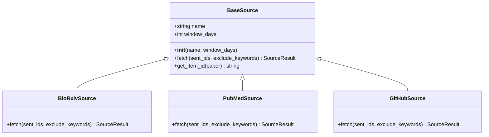
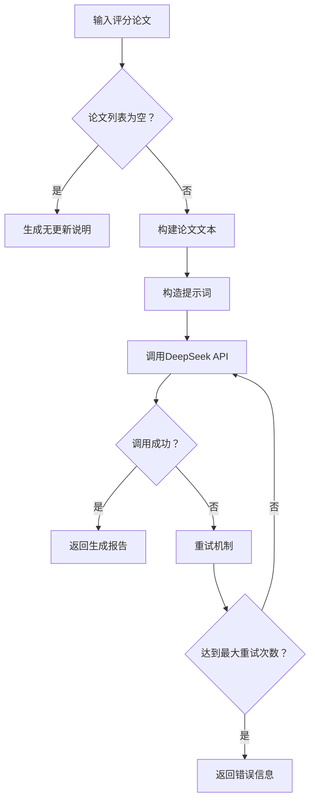
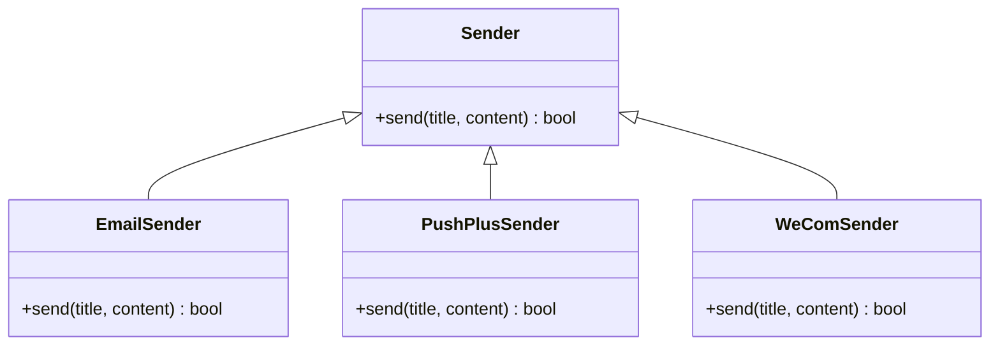
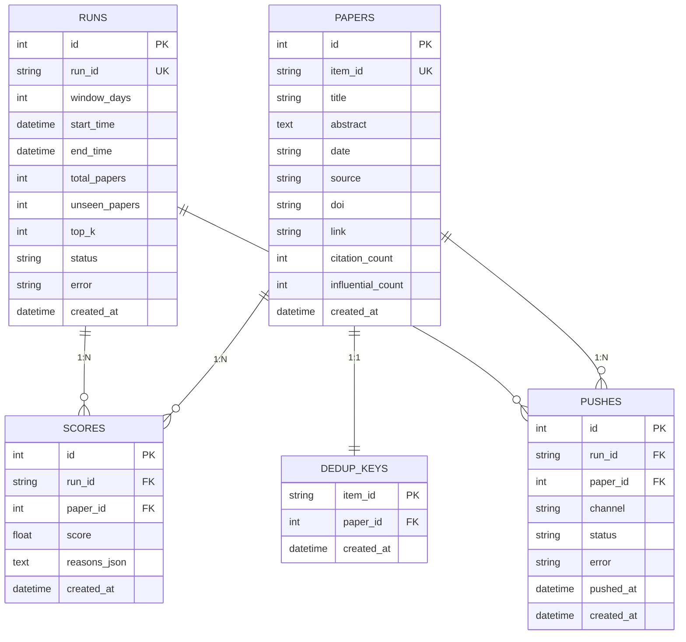

# 核心功能详解

<cite>
**本文档引用的文件**  
- [config.py](file://app/config.py)
- [models.py](file://app/models.py)
- [scoring.py](file://app/scoring.py)
- [ranking.py](file://app/ranking.py)
- [filtering.py](file://app/filtering.py)
- [generator.py](file://app/llm/generator.py)
- [email.py](file://app/push/email.py)
- [pushplus.py](file://app/push/pushplus.py)
- [wecom.py](file://app/push/wecom.py)
- [db.py](file://app/storage/db.py)
- [repo.py](file://app/storage/repo.py)
- [base.py](file://app/sources/base.py)
- [biorxiv.py](file://app/sources/biorxiv.py)
- [pubmed.py](file://app/sources/pubmed.py)
</cite>

## 目录
1. [系统架构概览](#系统架构概览)
2. [数据采集子系统](#数据采集子系统)
3. [智能评分子系统](#智能评分子系统)
4. [AI报告生成子系统](#ai报告生成子系统)
5. [多渠道推送子系统](#多渠道推送子系统)
6. [存储管理子系统](#存储管理子系统)
7. [配置可定制性说明](#配置可定制性说明)

## 系统架构概览

该系统是一个面向生物化学领域的智能论文推送系统，通过五大核心子系统协同工作，实现从多源数据采集到AI生成报告的全流程自动化。系统采用模块化设计，各子系统职责明确，通过统一的数据模型进行交互。

```mermaid
graph TD
A[数据采集] --> |原始论文| B[过滤与去重]
B --> |候选论文| C[智能评分]
C --> |评分结果| D[AI报告生成]
D --> |结构化报告| E[多渠道推送]
F[存储管理] < --> A
F < --> C
F < --> D
F < --> E
G[配置管理] --> A
G --> C
G --> D
G --> E
G --> F
```

**图示来源**  
- [config.py](file://app/config.py)
- [models.py](file://app/models.py)

## 数据采集子系统

数据采集子系统负责从多个学术数据源获取最新研究成果，包括bioRxiv、PubMed、Europe PMC、GitHub、Semantic Scholar等。该子系统采用面向对象的设计模式，通过继承统一的基类实现多源数据的标准化接入。

### 基类设计与多源统一接口

所有数据源均继承自`BaseSource`基类，该基类定义了统一的接口规范，确保各数据源实现的一致性。



**图示来源**  
- [base.py](file://app/sources/base.py)
- [biorxiv.py](file://app/sources/biorxiv.py)
- [pubmed.py](file://app/sources/pubmed.py)

`BaseSource`基类提供了`get_item_id`方法，用于生成论文的唯一标识符，其优先级顺序为：DOI > 链接 > 标题+来源。这种设计确保了跨数据源的论文去重能力。

### 具体数据源实现

各数据源根据其API特性实现具体的抓取逻辑。以bioRxiv为例，系统通过其公开API分页获取数据，并结合分类过滤和关键词匹配双重策略筛选目标论文。

**核心逻辑流程：**
1. 构建时间窗口内的查询范围
2. 分页获取数据（最多5页，每页100条）
3. 基于目标分类和研究方向关键词进行初步筛选
4. 应用排除关键词过滤
5. 检查论文发布时间是否在窗口内
6. 通过唯一标识符进行去重

**Section sources**
- [biorxiv.py](file://app/sources/biorxiv.py#L26-L92)
- [pubmed.py](file://app/sources/pubmed.py#L31-L96)

## 智能评分子系统

智能评分子系统负责对采集到的论文进行综合评分，评分结果直接影响最终推送的论文选择。评分算法设计具有可解释性，能够清晰展示每篇论文的得分构成。

### 评分维度与权重设计

评分系统采用多维度加权算法，主要包含四个评分维度：


**图示来源**  
- [scoring.py](file://app/scoring.py#L19-L87)

### 评分算法实现

评分算法通过`score_paper`函数实现，对每篇论文进行多维度评估：

1. **关键词匹配**：检测标题和摘要中是否包含预定义的核心关键词，如"nitrogenase"、"receptor kinase"、"cryo-EM"等，每匹配一个关键词加8分。
2. **顶刊加分**：检查论文来源是否为顶级期刊（如Nature、Science、Cell等），若是则加20分。
3. **引用数加权**：根据论文的引用次数进行加权，每引用一次加2分。
4. **新鲜度补偿**：根据论文发布日期计算新鲜度得分，30天内的论文可获得最高15分的新鲜度奖励。

评分结果不仅包含总分，还包含详细的评分原因，实现了评分过程的可解释性。

**Section sources**
- [scoring.py](file://app/scoring.py#L10-L91)
- [models.py](file://app/models.py#L50-L62)

## AI报告生成子系统

AI报告生成子系统利用大语言模型将评分后的论文转化为结构化的中文分析报告，提升信息的可读性和实用性。

### 提示词工程设计

系统通过精心设计的提示词（prompt）引导大语言模型生成符合需求的报告。提示词包含以下关键要素：

- **角色定义**：明确AI作为生物化学领域专家的身份
- **输入数据说明**：详细描述输入论文的来源和类型
- **研究方向限定**：严格限定在生物固氮、信号转导、酶机制三个方向
- **输出结构要求**：规定报告必须包含顶级论文、新工具、关联性挖掘、数据统计四个部分
- **格式要求**：指定标题格式、信息呈现方式等

### 报告生成流程



**图示来源**  
- [generator.py](file://app/llm/generator.py#L14-L147)

系统实现了重试机制，在API调用失败时会自动重试最多3次，每次重试间隔逐渐增加，提高了系统的鲁棒性。

**Section sources**
- [generator.py](file://app/llm/generator.py#L14-L147)

## 多渠道推送子系统

多渠道推送子系统支持通过多种方式将生成的报告推送给用户，确保信息传递的可靠性和多样性。

### 推送渠道适配

系统实现了三种推送渠道的适配器模式，每种渠道都有独立的发送器类：



**图示来源**  
- [email.py](file://app/push/email.py)
- [pushplus.py](file://app/push/pushplus.py)
- [wecom.py](file://app/push/wecom.py)

### 各渠道实现细节

- **邮件推送**：使用QQ邮箱SMTP服务，通过授权码认证发送邮件
- **PushPlus推送**：支持多个token的群发，确保至少一个推送成功
- **企业微信推送**：通过Webhook URL发送Markdown格式消息

各发送器均实现了错误处理和日志记录，确保推送过程的可追踪性。

**Section sources**
- [email.py](file://app/push/email.py#L13-L47)
- [pushplus.py](file://app/push/pushplus.py#L12-L50)
- [wecom.py](file://app/push/wecom.py#L12-L50)

## 存储管理子系统

存储管理子系统负责系统的数据持久化和审计追踪，采用SQLite数据库实现轻量级的数据存储。

### 数据库设计

系统设计了五个核心数据表，分别存储不同类型的业务数据：



**图示来源**  
- [db.py](file://app/storage/db.py#L49-L128)
- [repo.py](file://app/storage/repo.py)

### 数据仓库实现

`PaperRepository`类提供了对数据库的CRUD操作封装，实现了业务逻辑与数据访问的分离。关键功能包括：

- `get_sent_ids`：获取已推送论文ID集合，用于去重
- `save_paper`：保存论文元信息
- `create_run`：创建运行记录
- `save_scores`：保存评分结果
- `save_push`：记录推送状态

**Section sources**
- [db.py](file://app/storage/db.py)
- [repo.py](file://app/storage/repo.py#L15-L187)

## 配置可定制性说明

系统通过`config.py`文件实现了高度的可定制性，所有关键参数均可通过环境变量或默认值进行配置。

### 核心配置项

| 配置项 | 说明 | 默认值/示例 |
|-------|------|-----------|
| DEEPSEEK_API_KEY | DeepSeek API密钥 | sk-cab...6eb |
| PUBMED_EMAIL | PubMed访问邮箱 | 1606...51@qq.com |
| RESEARCH_TOPICS | 研究方向关键词 | 包含固氮、信号、酶机制三类 |
| EXCLUDE_KEYWORDS | 排除关键词 | human, mouse, cancer等 |
| PUSHPLUS_TOKENS | PushPlus推送令牌 | 多个token用逗号分隔 |
| DB_PATH | 数据库路径 | paper_push.db |
| DEFAULT_WINDOW_DAYS | 默认时间窗口 | 7天 |
| TOP_K | 推送论文数量 | 5篇 |

### 配置验证机制

系统提供了`validate`方法对关键配置进行验证，确保在启动时能够及时发现配置缺失问题，如API密钥或邮箱未设置等。

**Section sources**
- [config.py](file://app/config.py)