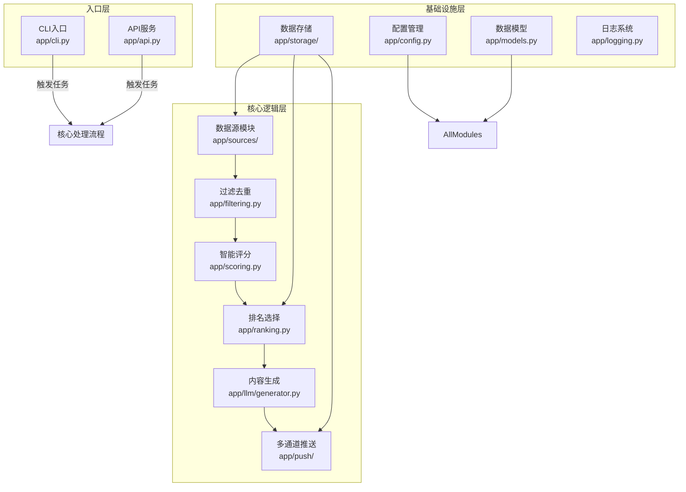
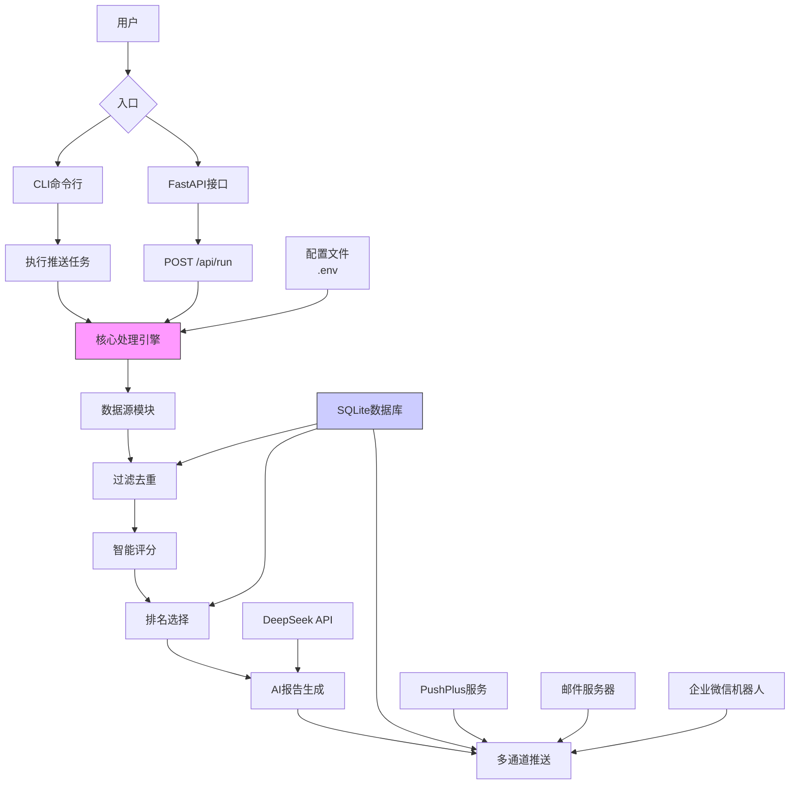
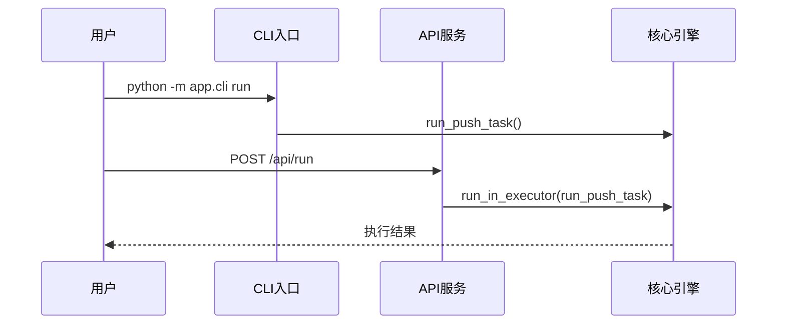
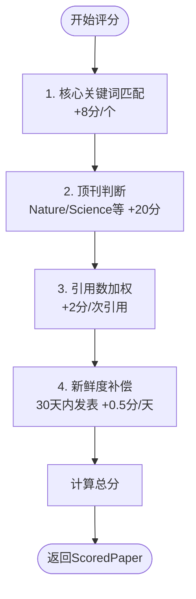
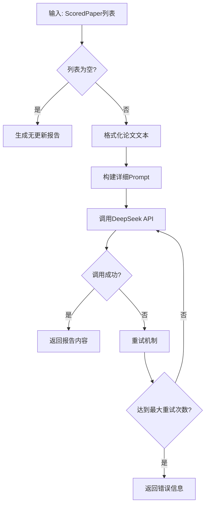
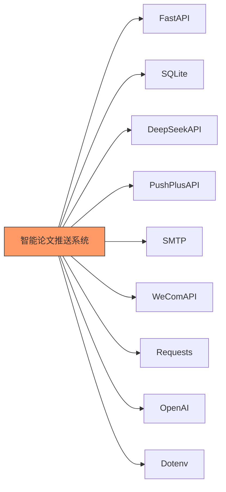

# 项目概述

<cite>
**本文档引用文件**  
- [README.md](file://README.md)
- [app/cli.py](file://app/cli.py)
- [app/api.py](file://app/api.py)
- [app/config.py](file://app/config.py)
- [app/models.py](file://app/models.py)
- [app/scoring.py](file://app/scoring.py)
- [app/llm/generator.py](file://app/llm/generator.py)
- [app/push/pushplus.py](file://app/push/pushplus.py)
- [app/push/email.py](file://app/push/email.py)
- [app/push/wecom.py](file://app/push/wecom.py)
- [app/storage/db.py](file://app/storage/db.py)
- [app/storage/repo.py](file://app/storage/repo.py)
</cite>

## 目录
1. [引言](#引言)
2. [项目结构](#项目结构)
3. [核心功能](#核心功能)
4. [系统架构](#系统架构)
5. [详细组件分析](#详细组件分析)
6. [依赖分析](#依赖分析)
7. [性能考虑](#性能考虑)
8. [故障排除指南](#故障排除指南)
9. [结论](#结论)

## 引言

智能论文推送系统（bio）是一个专为生物化学领域研究人员设计的自动化科研资讯服务。该系统通过从多个权威数据源抓取最新研究成果，利用可解释的智能评分算法筛选高质量论文，并借助大语言模型生成自然语言报告，最终通过多种渠道推送给用户。系统旨在帮助科研人员高效获取与其研究方向密切相关的前沿动态，避免信息过载，提升科研效率。

目标用户群体主要包括从事生物固氮、胞外信号感知与传递、酶的结构与作用机制等方向的生物化学研究人员及实验室团队。使用场景包括每日晨会前的科研动态速览、课题设计阶段的文献调研辅助、以及跟踪竞争对手最新研究成果。

**Section sources**
- [README.md](file://README.md#L1-L134)

## 项目结构

本项目采用模块化分层设计，代码结构清晰，各组件职责分明。核心功能被划分为独立的模块，便于维护和扩展。

**Diagram sources**
- [app/cli.py](file://app/cli.py#L1-L250)
- [app/api.py](file://app/api.py#L1-L88)
- [app/config.py](file://app/config.py#L1-L134)
- [app/models.py](file://app/models.py#L1-L77)
- [app/storage/db.py](file://app/storage/db.py#L1-L134)
- [app/storage/repo.py](file://app/storage/repo.py#L1-L258)

**Section sources**
- [README.md](file://README.md#L95-L122)

## 核心功能

智能论文推送系统的核心功能围绕“数据采集 → 过滤去重 → 智能评分 → 内容生成 → 多通道推送”这一流程展开。

### 多数据源抓取
系统支持从多个权威学术平台和开源社区抓取数据，包括：
- **学术预印本**：bioRxiv
- **文献数据库**：PubMed, Europe PMC
- **学术新闻**：EurekAlert (Science News)
- **开源代码**：GitHub
- **学术搜索引擎**：Semantic Scholar
- **自定义RSS**：支持用户添加特定期刊或机构的RSS源

### 智能评分系统
系统采用可解释的评分算法，综合多个维度对论文进行量化评估：
- **关键词匹配**：根据预设的三大研究方向（生物固氮、信号转导、酶机制）的关键词库进行匹配加分。
- **顶刊加分**：在Nature、Science、Cell等顶级期刊发表的论文获得显著加分。
- **引用数加权**：引用次数作为论文影响力的重要指标，按比例计入总分。
- **新鲜度补偿**：近期发表的论文会获得额外的新鲜度分数，确保推送内容的时效性。

### AI生成报告
系统利用DeepSeek API的大语言模型能力，将筛选出的高分论文转化为结构化的自然语言报告。报告采用“每日情报内参”形式，分为“顶级论文”、“新工具”、“关联性挖掘”和“数据统计”四个优先级部分，帮助用户快速抓住核心价值。

### 多渠道推送
系统支持通过多种渠道将生成的报告推送给用户：
- **PushPlus**：通过微信接收实时推送。
- **电子邮件**：发送详细的报告内容到指定邮箱。
- **企业微信**：集成到企业微信工作群，便于团队共享。

### 可靠存储与审计
所有抓取的论文、运行记录、评分详情和推送状态均通过SQLite数据库进行持久化存储，支持历史回溯和审计，确保系统的可靠性和可追溯性。

**Section sources**
- [README.md](file://README.md#L5-L11)

## 系统架构

系统采用分层架构设计，清晰地分离了关注点，提高了代码的可维护性和可扩展性。

**Diagram sources**
- [app/cli.py](file://app/cli.py#L23-L149)
- [app/api.py](file://app/api.py#L33-L43)
- [app/ranking.py](file://app/ranking.py#L46-L108)
- [app/llm/generator.py](file://app/llm/generator.py#L14-L136)
- [app/push/pushplus.py](file://app/push/pushplus.py#L12-L54)
- [app/push/email.py](file://app/push/email.py#L13-L51)
- [app/push/wecom.py](file://app/push/wecom.py#L12-L55)

**Section sources**
- [README.md](file://README.md#L5-L12)

## 详细组件分析

### 入口组件分析

#### CLI与API双入口
系统提供了CLI和API两种入口方式，满足不同使用场景的需求。

- **CLI方式**：适用于在本地或服务器上通过定时任务（如Windows任务计划或Linux crontab）自动执行每日推送。用户可以通过命令行参数自定义抓取窗口和推送数量。
- **API方式**：提供了`FastAPI`构建的RESTful接口，便于与其他系统集成或通过管理界面手动触发任务。API接口支持获取运行历史和评分详情，增强了系统的可观测性。

**Diagram sources**
- [app/cli.py](file://app/cli.py#L215-L249)
- [app/api.py](file://app/api.py#L33-L43)

**Section sources**
- [app/cli.py](file://app/cli.py#L1-L250)
- [app/api.py](file://app/api.py#L1-L88)

### 核心逻辑组件分析

#### 智能评分组件
`scoring.py`模块实现了可解释的评分算法。该算法不仅计算一个总分，还记录了每个加分项的具体原因（`ScoreReason`），使得评分过程透明化，用户可以理解为何某篇论文被选中。

**Diagram sources**
- [app/scoring.py](file://app/scoring.py#L10-L95)
- [app/models.py](file://app/models.py#L50-L63)

**Section sources**
- [app/scoring.py](file://app/scoring.py#L1-L95)

#### AI报告生成组件
`llm/generator.py`模块负责调用DeepSeek API生成自然语言报告。该模块精心设计了提示词（prompt），明确限定了研究方向、输出格式和内容要求，确保生成的报告专业、准确且具有启发性。

**Diagram sources**
- [app/llm/generator.py](file://app/llm/generator.py#L14-L148)

**Section sources**
- [app/llm/generator.py](file://app/llm/generator.py#L1-L151)

## 依赖分析

系统依赖关系清晰，主要依赖外部服务和Python库。

**Diagram sources**
- [requirements.txt](file://requirements.txt)
- [app/api.py](file://app/api.py#L4)
- [app/llm/generator.py](file://app/llm/generator.py#L7)
- [app/push/pushplus.py](file://app/push/pushplus.py#L4)
- [app/push/email.py](file://app/push/email.py#L4)
- [app/push/wecom.py](file://app/push/wecom.py#L4)

**Section sources**
- [requirements.txt](file://requirements.txt)

## 性能考虑

系统在设计时考虑了性能和可靠性：
- **并发抓取**：使用`ThreadPoolExecutor`并发地从多个数据源抓取数据，显著缩短了总执行时间。
- **重试机制**：在调用外部API（如DeepSeek）时实现了重试机制，提高了系统的容错能力。
- **本地存储**：使用轻量级的SQLite数据库进行本地存储，避免了复杂的数据库部署，同时保证了数据的持久化。

## 故障排除指南

当系统运行出现问题时，可参考以下步骤进行排查：

1.  **检查配置文件**：确认`.env`文件中的`DEEPSEEK_API_KEY`和`PUBMED_EMAIL`已正确配置。
2.  **查看日志文件**：检查`paper_push.log`日志文件，定位具体的错误信息。
3.  **测试数据源**：运行`python -m app.cli test-sources`命令，逐一测试各数据源的连通性。
4.  **验证推送配置**：检查PushPlus token、邮箱配置或企业微信Webhook URL是否正确。

**Section sources**
- [app/cli.py](file://app/cli.py#L170-L213)
- [app/config.py](file://app/config.py#L123-L131)

## 结论

智能论文推送系统（bio）通过模块化、分层的设计，成功地将多源数据抓取、智能筛选、AI内容生成和多通道推送整合为一个高效、可靠的自动化服务。其可解释的评分机制、配置驱动的灵活性和双入口设计，使其成为一个强大且易于使用的科研辅助工具。该系统不仅节省了研究人员筛选文献的时间，还通过AI的深度分析提供了超越简单摘要的洞察力，有效支持了科研创新。